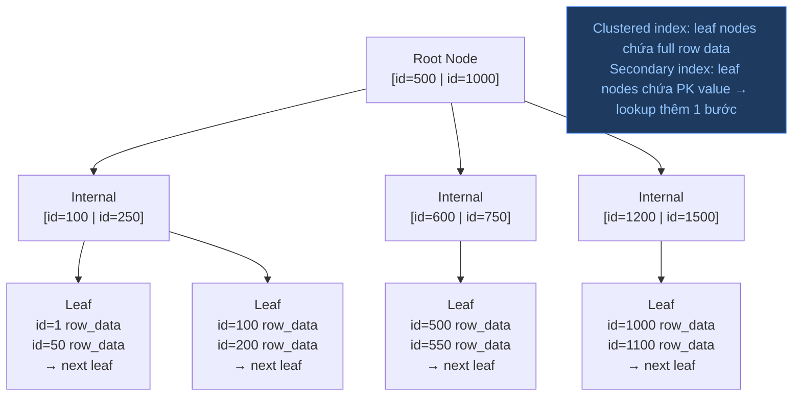

B-Tree (balanced tree) là cấu trúc index mặc định trong hầu hết DB, hỗ trợ equality và range query với O(log n) lookup bằng cách giữ key đã sắp xếp trên các page cân bằng.

## Điểm Chính

- Tất cả leaf node ở cùng độ sâu (cân bằng). Internal node là routing node.
- Hỗ trợ: <code>=</code>, <code>&lt;</code>, <code>&gt;</code>, <code>BETWEEN</code>, <code>LIKE 'prefix%'</code> (wildcard đầu phá vỡ nó).
- Thứ tự sắp xếp cho phép ORDER BY và range scan hiệu quả.
- Index page 8KB (Postgres) — hàng nghìn entry mỗi page, thường 3-4 cấp sâu cho hàng triệu hàng.
- PostgreSQL còn có: Hash (chỉ equality), GiST (geo/full-text), GIN (array/JSONB), BRIN (dữ liệu tuần tự).

## Ví Dụ Code

*B-Tree (range, prefix LIKE) + GIN/pg_trgm (fuzzy search) + BRIN (time-series) + Hash*

```sql
-- ✅ B-Tree index: supports equality AND range — default for most use cases
CREATE INDEX idx_products_price ON products(price);
-- All of these CAN use the B-Tree index:
SELECT * FROM products WHERE price = 299;                         -- equality
SELECT * FROM products WHERE price BETWEEN 100 AND 500;          -- range
SELECT * FROM products WHERE price > 1000 ORDER BY price ASC;    -- range + sort (same direction)
SELECT * FROM products WHERE name LIKE 'iPhone%';                -- prefix match (anchor left)

-- ❌ B-Tree CANNOT help with leading wildcard LIKE or regex:
SELECT * FROM products WHERE name LIKE '%phone%';    -- full table scan — B-Tree has no entry point
SELECT * FROM products WHERE name ILIKE '%Phone%';   -- case-insensitive also breaks B-Tree

-- ✅ Fix for full-text / fuzzy search: GIN index with pg_trgm extension
CREATE EXTENSION IF NOT EXISTS pg_trgm;
-- Trigram index: breaks 'iPhone' into ('iPh','Pho','hon','one') and indexes each
CREATE INDEX idx_products_name_trgm ON products USING GIN (name gin_trgm_ops);
-- Now both of these use the GIN index:
SELECT * FROM products WHERE name LIKE '%phone%';    -- uses GIN trigram scan
SELECT * FROM products WHERE name ILIKE '%Phone%';   -- also works (case-insensitive)

-- ✅ BRIN index: for append-only time-series tables (orders, events, logs)
-- Much smaller than B-Tree; works because physically adjacent rows have similar timestamps
CREATE INDEX idx_orders_created_brin ON orders USING BRIN (created_at);
-- Effective for: SELECT * FROM orders WHERE created_at BETWEEN '2024-01-01' AND '2024-02-01'
-- Not effective for: random-access by customer_id (use B-Tree there)

-- ✅ Hash index: equality-only, faster than B-Tree for pure =
CREATE INDEX idx_users_email_hash ON users USING HASH (email);
SELECT * FROM users WHERE email = 'alice@example.com';    -- uses hash index (O(1) lookup)
```

## Ứng Dụng Thực Tế

Dùng B-Tree cho hầu hết trường hợp. Chuyển sang GIN/GiST cho full-text search, JSONB query hoặc array containment. BRIN xuất sắc cho bảng time-series append-only (kích thước nhỏ, nhanh cho sequential range).

## Câu Hỏi Phỏng Vấn

<details>
<summary><strong>Clustered index và secondary index khác nhau thế nào trong InnoDB?</strong></summary>

**A:** Clustered index: B-tree sắp xếp theo PK, leaf nodes chứa **full row data**. Mỗi bảng InnoDB chỉ có một clustered index (thường là PRIMARY KEY). Secondary index: leaf nodes chứa **PK value** thay vì row data. Query qua secondary index cần thêm bước "bookmark lookup" — dùng PK để tìm row trong clustered index (trừ khi covering index). Vì vậy: query nhiều qua secondary index trên bảng lớn → double B-tree traversal → chọn PK nhỏ và sequential (BIGINT AUTO_INCREMENT).

</details>

<details>
<summary><strong>Thứ tự columns trong composite index quan trọng thế nào?</strong></summary>

**A:** Rule: Leftmost prefix. Index (a, b, c) được dùng cho: `WHERE a=?`, `WHERE a=? AND b=?`, `WHERE a=? AND b=? AND c=?`. KHÔNG được dùng cho: `WHERE b=?` hoặc `WHERE c=?` (thiếu leftmost column). Thứ tự recommend: (1) equality columns trước, range columns sau; (2) high-selectivity columns trước (nhiều unique values). Ví dụ: `WHERE status='ACTIVE' AND created_at > '2024-01'` → index (status, created_at) tốt hơn (created_at, status).

</details>

<details>
<summary><strong>Covering index là gì và benefit thế nào?</strong></summary>

**A:** Query được "covered" bởi index khi tất cả columns cần thiết (SELECT, WHERE, ORDER BY) đều nằm trong index — không cần touch data page. Benefit: chỉ traverse index B-tree (nhỏ hơn nhiều so với full table), IOPS giảm đáng kể. EXPLAIN hiển thị `Extra: Using index` (không phải "Using index condition"). Ví dụ: query `SELECT user_id, status FROM orders WHERE created_at > ?` → index (created_at, user_id, status) là covering. Đây là kỹ thuật optimization mạnh nhất cho read-heavy queries.

</details>

## Cấu Trúc B-Tree Index


