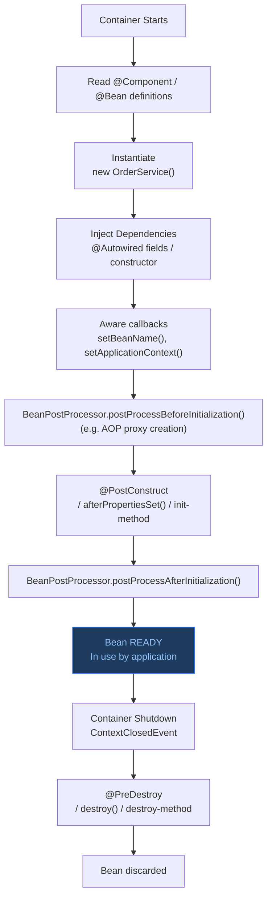

Spring bean trải qua: khởi tạo → dependency injection → initialization callback → sẵn sàng → destruction callback, với nhiều điểm hook cho logic tùy chỉnh.

## Điểm Chính

- Thứ tự vòng đời: constructor → field <code>@Autowired</code> → <code>@PostConstruct</code> → sẵn sàng → <code>@PreDestroy</code>.
- <code>@PostConstruct</code>: gọi sau tất cả injection; tốt cho validation, mở connection, caching.
- <code>@PreDestroy</code>: gọi trước khi bean bị xóa khỏi context; tốt cho cleanup, đóng tài nguyên.
- Ngoài ra implement <code>InitializingBean</code> (<code>afterPropertiesSet()</code>) và <code>DisposableBean</code>.
- <code>@Bean(initMethod="start", destroyMethod="stop")</code> cho class bên thứ ba.
- Bean prototype: Spring tạo nhưng không quản lý destruction — caller phải tự cleanup.

## Ví Dụ Code

*Bean lifecycle: @PostConstruct/@PreDestroy, InitializingBean, @Bean initMethod/destroyMethod, prototype caveat*

```java
import jakarta.annotation.PostConstruct;
import jakarta.annotation.PreDestroy;
import org.springframework.beans.factory.*;
import org.springframework.stereotype.*;
import java.util.concurrent.*;

// ---- Full bean lifecycle: constructor → @Autowired → @PostConstruct → use → @PreDestroy ----

@Component
public class ProductCatalogCache implements InitializingBean, DisposableBean {

    private final ProductRepository productRepository;   // injected by Spring
    private final ScheduledExecutorService scheduler = Executors.newSingleThreadScheduledExecutor();
    private volatile ConcurrentHashMap<String, Product> cache;

    // 1. CONSTRUCTOR — called first; dependencies NOT yet injected
    //    DO NOT call productRepository here — it's still null!
    public ProductCatalogCache(ProductRepository productRepository) {
        this.productRepository = productRepository;
        System.out.println("Step 1: Constructor called — productRepository injected via constructor");
    }

    // 2. @PostConstruct — called AFTER all @Autowired injections are complete
    //    Safe to use all dependencies here
    @PostConstruct
    public void init() {
        System.out.println("Step 2: @PostConstruct — loading cache from DB");
        cache = new ConcurrentHashMap<>();
        // All products loaded at startup for fast lookup
        productRepository.findAll().forEach(p -> cache.put(p.getId(), p));

        // Schedule periodic refresh every 5 minutes
        scheduler.scheduleAtFixedRate(this::refresh, 5, 5, TimeUnit.MINUTES);
        System.out.println("Cache initialized with " + cache.size() + " products");
    }

    // Alternative to @PostConstruct: implements InitializingBean
    @Override
    public void afterPropertiesSet() {
        // Called by Spring after @PostConstruct — avoid using both; prefer @PostConstruct
        System.out.println("Step 3: afterPropertiesSet() (InitializingBean)");
    }

    public Product getProduct(String productId) {
        // Step 4: Bean is READY — serving requests
        return cache.get(productId);
    }

    private void refresh() {
        productRepository.findAll().forEach(p -> cache.put(p.getId(), p));
    }

    // 5. @PreDestroy — called when ApplicationContext is shutting down
    @PreDestroy
    public void shutdown() {
        System.out.println("Step 5: @PreDestroy — flushing cache and stopping scheduler");
        scheduler.shutdown();   // stop background refresh
        cache.clear();          // release memory
    }

    // Alternative to @PreDestroy: implements DisposableBean
    @Override
    public void destroy() {
        System.out.println("Step 6: DisposableBean.destroy() — also called on shutdown");
    }
}

// ---- @Bean with initMethod/destroyMethod — for third-party classes ----
@Configuration
public class ThirdPartyBeanConfig {
    @Bean(initMethod = "connect", destroyMethod = "disconnect")
    public ExternalPaymentClient paymentClient() {
        ExternalPaymentClient client = new ExternalPaymentClient();
        client.setApiKey(System.getenv("PAYMENT_API_KEY"));
        return client;   // Spring calls client.connect() after creation, client.disconnect() on shutdown
    }
}

// ---- PROTOTYPE scope: Spring does NOT call @PreDestroy ----
@Component @Scope("prototype")
public class OrderReport {
    private List<String> lines = new ArrayList<>();

    @PostConstruct void init() { System.out.println("New OrderReport instance created"); }
    @PreDestroy    void done() { System.out.println("WARNING: this is NEVER called for prototype"); }
    // Caller is responsible for cleanup of prototype beans!
}
```

## Ứng Dụng Thực Tế

Dùng <code>@PostConstruct</code> cho bất kỳ startup logic nào phụ thuộc vào bean đã inject. Đừng đặt startup logic trong constructor khi cần dependency đã inject — chúng chưa sẵn sàng lúc đó. Dùng <code>@PreDestroy</code> để đóng file handle, scheduled task hoặc connection.

## Câu Hỏi Phỏng Vấn

<details>
<summary><strong>@PostConstruct, afterPropertiesSet(), và init-method khác nhau thế nào?</strong></summary>

**A:** Tất cả đều chạy sau khi bean được inject đủ dependencies nhưng thứ tự: `@PostConstruct` → `afterPropertiesSet()` → `init-method`. `@PostConstruct` (JSR-250): annotation, không cần implement interface, portable. `afterPropertiesSet()` (InitializingBean): interface Spring-specific — coupling với Spring. `init-method`: configure trong XML/Java config — loosen coupling nhất, class không biết về Spring. Best practice: `@PostConstruct` cho modern Spring apps.

</details>

<details>
<summary><strong>BeanPostProcessor là gì và dùng để làm gì?</strong></summary>

**A:** BeanPostProcessor intercept bean creation: `postProcessBeforeInitialization()` chạy trước @PostConstruct, `postProcessAfterInitialization()` chạy sau. Dùng cho: cross-cutting concerns mà không cần AOP, custom annotation processing, wrap bean trong proxy. Spring AOP tự implement bằng `AbstractAutoProxyCreator extends BeanPostProcessor` — đây là cách @Transactional, @Async, @Cacheable được apply. Custom BPP ít khi cần trực tiếp — @Aspect thường đủ.

</details>

## Sơ Đồ Spring Bean Lifecycle


