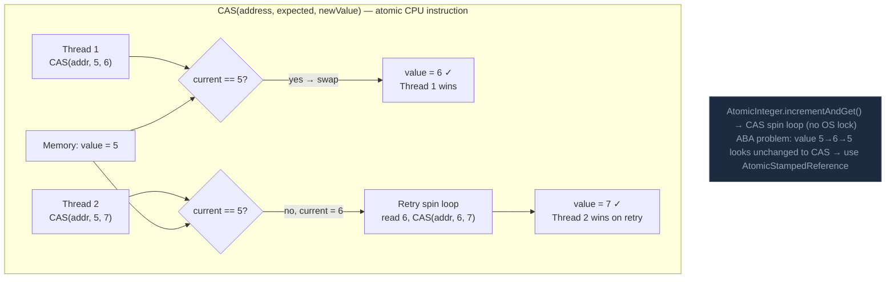

CAS là lệnh atomic cấp CPU cập nhật vị trí bộ nhớ chỉ khi giá trị hiện tại của nó khớp giá trị expected, cho phép các thuật toán lock-free.

## Điểm Chính

- Pseudocode: <code>if (mem == expected) { mem = newVal; return true; } else return false;</code> — tất cả atomic.
- Vòng lặp đến khi thành công: đọc → tính → CAS → nếu thất bại, retry (spin loop).
- Non-blocking progress: ít nhất một thread luôn tiến triển (đảm bảo lock-free).
- <strong>ABA problem</strong>: giá trị thay đổi A→B→A; CAS nghĩ không có gì thay đổi. Sửa: dùng <code>AtomicStampedReference</code> với version.
- Hỗ trợ phần cứng: lệnh x86 <code>CMPXCHG</code>, ARM <code>LDREX/STREX</code>.

## Ví Dụ Code

*CAS internals: manual loop, ABA problem, AtomicStampedReference for order state*

```java
import java.util.concurrent.atomic.*;

// ---- CAS (Compare-And-Swap) internals and patterns ----

// What CAS does at CPU level (x86 CMPXCHG instruction):
// if (mem == expected) { mem = newValue; return true; }
// else                 { return false; }          // all ATOMIC — no interrupt possible

// ---- Pattern 1: manual CAS loop — what AtomicInteger.addAndGet() does internally ----
public class OrderCreditBalance {
    private final AtomicLong balanceCents = new AtomicLong(0);

    // Deposit: thread-safe add without lock
    public long deposit(long amountCents) {
        long expected, updated;
        do {
            expected = balanceCents.get();       // read current value
            updated  = expected + amountCents;   // compute desired value
            // If another thread changed balanceCents between get() and CAS → retry
        } while (!balanceCents.compareAndSet(expected, updated));
        return updated;
    }

    // Withdraw only if sufficient balance (compound condition — needs CAS loop)
    public boolean withdraw(long amountCents) {
        long expected, updated;
        do {
            expected = balanceCents.get();
            if (expected < amountCents) return false;  // insufficient — abort
            updated  = expected - amountCents;
        } while (!balanceCents.compareAndSet(expected, updated));
        return true;
    }
}

// ---- ABA Problem ----
// Thread 1 reads value = A
// Thread 2 changes A → B → A  (two CAS ops)
// Thread 1's CAS sees A == A → succeeds, but state is NOT the same as when T1 read it!
// This matters for linked-list-based lock-free structures (node reuse)

// ---- ABA Fix: AtomicStampedReference — adds version counter ----
public class OrderStateManager {
    // Pair: (state, version) — CAS checks BOTH state AND version
    private final AtomicStampedReference<OrderStatus> statusRef =
        new AtomicStampedReference<>(OrderStatus.PENDING, 0);

    public boolean transitionStatus(OrderStatus expectedStatus, OrderStatus newStatus) {
        int[] stampHolder = new int[1];
        OrderStatus current = statusRef.get(stampHolder);  // reads both value and stamp

        if (current != expectedStatus) return false;

        // CAS on (value, stamp) pair — even if value reverts to expectedStatus,
        // the stamp will have changed → CAS fails → no false success
        return statusRef.compareAndSet(
            expectedStatus, newStatus,
            stampHolder[0], stampHolder[0] + 1   // increment version
        );
    }

    public OrderStatus getStatus() {
        return statusRef.getReference();
    }

    public int getVersion() {
        return statusRef.getStamp();
    }
}

// ---- When CAS performs poorly ----
// High contention (many threads): threads keep losing CAS → spin loops → wasted CPU
// Fix: use LongAdder (stripes) or back off with exponential sleep
```

## Ứng Dụng Thực Tế

CAS là nền tảng của ConcurrentHashMap, CopyOnWriteArrayList và hầu hết cấu trúc dữ liệu non-blocking. Hiểu nó giúp giải thích tại sao chúng là "lock-free" (không phải "wait-free") và dự đoán hành vi khi contention cao.

## Câu Hỏi Phỏng Vấn

<details>
<summary><strong>ABA problem là gì và Java giải quyết thế nào?</strong></summary>

**A:** ABA: Thread 1 đọc value A, bị suspend. Thread 2 thay A → B → A. Thread 1 resume, CAS thấy value vẫn là A → thành công, nhưng có thể bỏ qua các thay đổi trung gian. Trong linked data structures, điều này nguy hiểm (node A bị free và realloc). Java fix: `AtomicStampedReference<V>` — lưu thêm stamp (version counter) cùng value, CAS kiểm tra cả value lẫn stamp. Hoặc `AtomicMarkableReference` cho single-bit mark.

</details>

<details>
<summary><strong>Khi nào CAS tốt hơn synchronized?</strong></summary>

**A:** CAS tốt hơn khi: (1) Contention thấp — CAS spin loop nhanh, không cần OS context switch. (2) Operation ngắn — read-modify-write đơn giản như increment counter. Synchronized tốt hơn khi: (1) Contention cao — nhiều thread tranh chấp, CAS spin loop lãng phí CPU. (2) Critical section dài — spin lâu kém hơn OS sleep+wake. `AtomicInteger`, `AtomicReference` dùng CAS internaly. Biased locking trong JVM cũng tối ưu synchronized cho no-contention case.

</details>

## Sơ Đồ CAS Operation


