CI/CD tự động hóa build, test và deploy code change — Continuous Integration merge và test thường xuyên; Continuous Delivery/Deployment tự động hóa con đường đến production.

## Điểm Chính

- <strong>CI</strong>: mỗi commit trigger build + unit test + integration test. Feedback nhanh (< 10 phút).
- <strong>CD (Delivery)</strong>: artifact sẵn sàng deploy sau khi pass CI. Cổng thủ công trước prod.
- <strong>CD (Deployment)</strong>: tự động deploy lên prod khi CI green. Cần độ tin tưởng test cao.
- Tool: GitHub Actions, Jenkins, GitLab CI, CircleCI, ArgoCD (GitOps).
- GitOps: desired state declarative trong Git, ArgoCD reconcile cluster state liên tục.

## Ví Dụ Code

*GitHub Actions CI/CD pipeline*

```bash
# GitHub Actions CI/CD pipeline
name: CI/CD
on: [push, pull_request]
jobs:
  test-and-build:
    runs-on: ubuntu-latest
    steps:
    - uses: actions/checkout@v4
    - uses: actions/setup-java@v4
      with: {java-version: '21', distribution: 'temurin'}
    - uses: actions/cache@v4
      with: {path: ~/.m2, key: "${{ runner.os }}-maven-${{ hashFiles('**/pom.xml') }}"}
    - run: mvn verify  # compile + test + integration test
    - run: mvn package -DskipTests
    - name: Build & push Docker image
      run: |
        docker build -t myrepo/app:${{ github.sha }} .
        docker push myrepo/app:${{ github.sha }}
  deploy:
    needs: test-and-build
    if: github.ref == 'refs/heads/main'
    run: kubectl set image deployment/app app=myrepo/app:${{ github.sha }}
```

## Ứng Dụng Thực Tế

Giữ CI dưới 10 phút — developer sẽ không chờ pipeline chậm và bắt đầu bỏ qua. Chạy unit test song song, integration test với TestContainers (không có external dependency). Dùng ArgoCD cho GitOps-based deployment lên K8s.

## Câu Hỏi Phỏng Vấn

1. Sự khác biệt giữa CI, CD (Delivery) và CD (Deployment) là gì?
1. Làm thế nào để đảm bảo CI pipeline vẫn nhanh khi codebase tăng trưởng?
1. GitOps là gì và ArgoCD implement nó thế nào?

## Sơ Đồ CI/CD Pipeline

```mermaid
flowchart LR
    Push["git push\nfeature branch"] --> Trigger["CI Trigger\n(GitHub Actions)"]

    subgraph Pipeline["Pipeline Stages"]
        Build["Build\nmvn package -DskipTests"]
        Test["Test\nmvn test\n+ @SpringBootTest"]
        Scan["Security Scan\nSonarQube + OWASP\ndependency-check"]
        Docker["Docker Build\ndocker build -t app:SHA"]
        Registry["Push Registry\nECR / Docker Hub"]
        Staging["Deploy Staging\nkubectl set image"]
        Smoke["Smoke Test\ncurl /actuator/health"]
        Prod["Deploy Prod\n(manual approval gate)"]
    end

    Trigger --> Build --> Test --> Scan --> Docker --> Registry --> Staging --> Smoke --> Prod
    Prod --> Monitor["Monitor\nPrometheus + Grafana\nalerts on p99 / error rate"]
```


