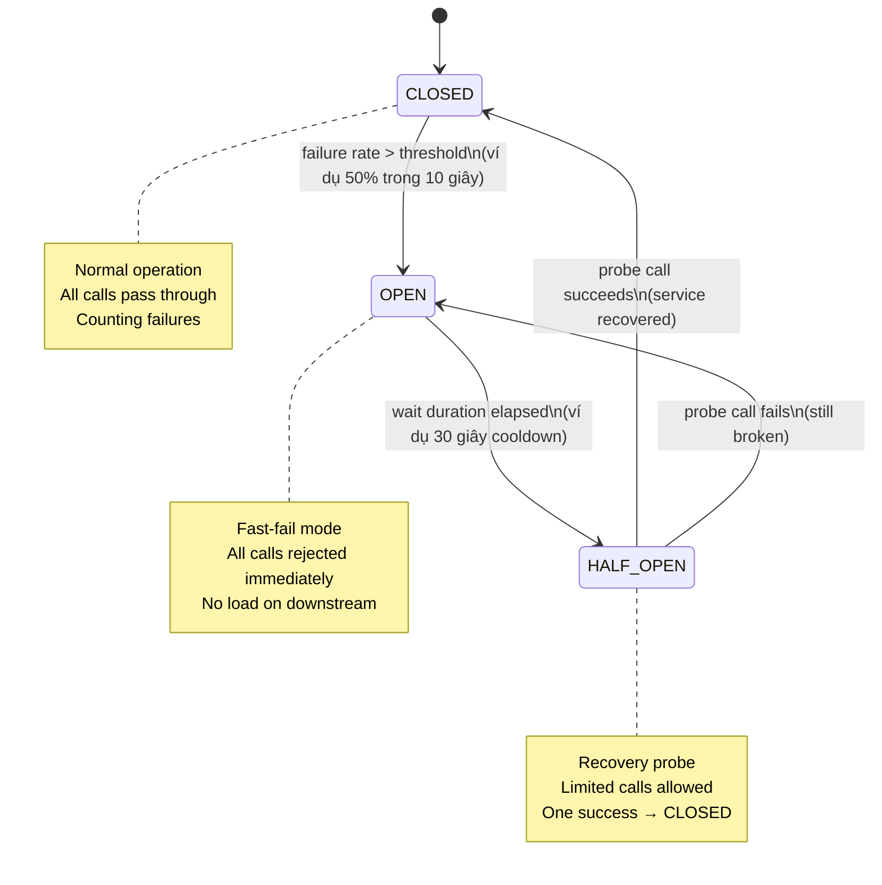

Pattern Circuit Breaker ngăn cascading failure bằng cách phát hiện lỗi downstream lặp lại và tạm thời dừng gọi đến service hỏng, cho nó thời gian phục hồi.

## Điểm Chính

- Trạng thái: <strong>CLOSED</strong> (bình thường), <strong>OPEN</strong> (đang lỗi — từ chối call nhanh), <strong>HALF_OPEN</strong> (thăm dò — cho phép call giới hạn).
- Chuyển đổi: CLOSED→OPEN khi failure rate vượt ngưỡng. OPEN→HALF_OPEN sau thời gian chờ. HALF_OPEN→CLOSED khi thành công, OPEN khi thất bại.
- Fallback: trả về dữ liệu cache, giá trị mặc định hoặc error response trong trạng thái OPEN.
- Bulkhead pattern: cô lập thread pool mỗi downstream service để ngăn một service chậm tiêu thụ tất cả thread.

## Ví Dụ Code

*Circuit Breaker + TimeLimiter + Retry: decorator order, fallback strategies, YAML config, Actuator monitoring*

```java
// ✅ Circuit Breaker in order-service calling payment-service
// Problem: if payment-service is slow/down, order-service threads pile up waiting
// Solution: Circuit Breaker detects failures and short-circuits (fails fast) after threshold

@Service
public class PaymentService {
    private final PaymentClient paymentClient;

    // Decorator order (outermost to innermost):
    // TimeLimiter → CircuitBreaker → Retry → actual call
    // TimeLimiter cancels the CompletableFuture if it exceeds timeout
    // CircuitBreaker trips after sliding-window failure rate exceeds threshold
    // Retry only retries calls that CircuitBreaker ALLOWS through
    @CircuitBreaker(name = "paymentService", fallbackMethod = "paymentFallback")
    @TimeLimiter(name = "paymentService")      // timeout: 2 seconds
    @Retry(name = "paymentService")            // retry 2x before counting as failure
    public CompletableFuture<PaymentResult> processPayment(Long orderId, BigDecimal amount) {
        return CompletableFuture.supplyAsync(() ->
            paymentClient.charge(new ChargeRequest(orderId, amount))
        );
    }

    // Fallback: called when circuit is OPEN or all retries exhausted
    // Method signature must match + add Throwable parameter
    public CompletableFuture<PaymentResult> paymentFallback(Long orderId, BigDecimal amount, Throwable t) {
        log.warn("Payment circuit OPEN for orderId={}, error={}", orderId, t.getMessage());
        // Option A: return a queued/pending result — process payment when service recovers
        return CompletableFuture.completedFuture(
            PaymentResult.pending(orderId, "Payment queued — will retry when service recovers")
        );
        // Option B: throw a business exception for caller to handle
        // throw new PaymentServiceUnavailableException("Payment service is temporarily unavailable");
    }
}

// ✅ application.yml — Circuit Breaker configuration
// resilience4j:
//   circuitbreaker:
//     instances:
//       paymentService:
//         sliding-window-type: COUNT_BASED        # or TIME_BASED
//         sliding-window-size: 10                 # last 10 calls determine state
//         failure-rate-threshold: 50              # open if >50% fail in window
//         slow-call-duration-threshold: 2s        # calls >2s count as "slow"
//         slow-call-rate-threshold: 80            # open if >80% calls are slow
//         wait-duration-in-open-state: 30s        # stay OPEN for 30s then try HALF_OPEN
//         permitted-number-of-calls-in-half-open-state: 3  # probe with 3 calls
//         minimum-number-of-calls: 5              # don't trip until at least 5 calls made
//   timelimiter:
//     instances:
//       paymentService:
//         timeout-duration: 2s
//         cancel-running-future: true
//   retry:
//     instances:
//       paymentService:
//         max-attempts: 2                         # try original + 1 retry
//         wait-duration: 200ms
//         retry-exceptions:
//           - java.io.IOException
//           - feign.FeignException.ServiceUnavailable

// ✅ Monitor circuit state via Spring Actuator
// GET /actuator/circuitbreakerevents/paymentService
// GET /actuator/health → shows circuit state per instance
// Prometheus metric: resilience4j_circuitbreaker_state{name="paymentService"} 0=CLOSED 1=OPEN 2=HALF_OPEN
```

## Ứng Dụng Thực Tế

Kết hợp Circuit Breaker + Retry + TimeLimiter. Đặt retry trên call bên trong và circuit breaker bên ngoài — circuit đếm failure qua tất cả retry. Monitor circuit state qua Actuator metrics (<code>/actuator/circuitbreakerevents</code>) và cảnh báo khi OPEN.

## Câu Hỏi Phỏng Vấn

<details>
<summary><strong>Circuit Breaker giải quyết vấn đề gì mà retry không giải quyết được?</strong></summary>

**A:** Retry: "downstream fail → wait → thử lại" — tốt cho transient failures. Nhưng khi downstream consistently down: retry tích lũy → thread pool exhausted → gây cascade failure. Circuit Breaker: sau threshold failures, OPEN circuit → **fail immediately** mà không retry, giải phóng thread pool. Downstream có thời gian recover. HALF_OPEN: probe sau cooldown. Tóm lại: Retry giải quyết transient failures, Circuit Breaker ngăn cascade failures khi service down kéo dài.

</details>

<details>
<summary><strong>Resilience4j configure Circuit Breaker thế nào?</strong></summary>

**A:** `slidingWindowType=COUNT_BASED` (N calls) hoặc `TIME_BASED` (N giây). `failureRateThreshold=50` — 50% failures trong window → OPEN. `waitDurationInOpenState=30s` — cooldown. `permittedNumberOfCallsInHalfOpenState=5` — 5 probe calls. `slowCallDurationThreshold=2s` + `slowCallRateThreshold=80` — slow calls cũng tính là failure. Combine với `@Retry` (retry trước) và `@Bulkhead` (limit concurrent calls): `@Retry → @CircuitBreaker → @Bulkhead` là full resilience stack.

</details>

## Sơ Đồ Circuit Breaker State Machine


