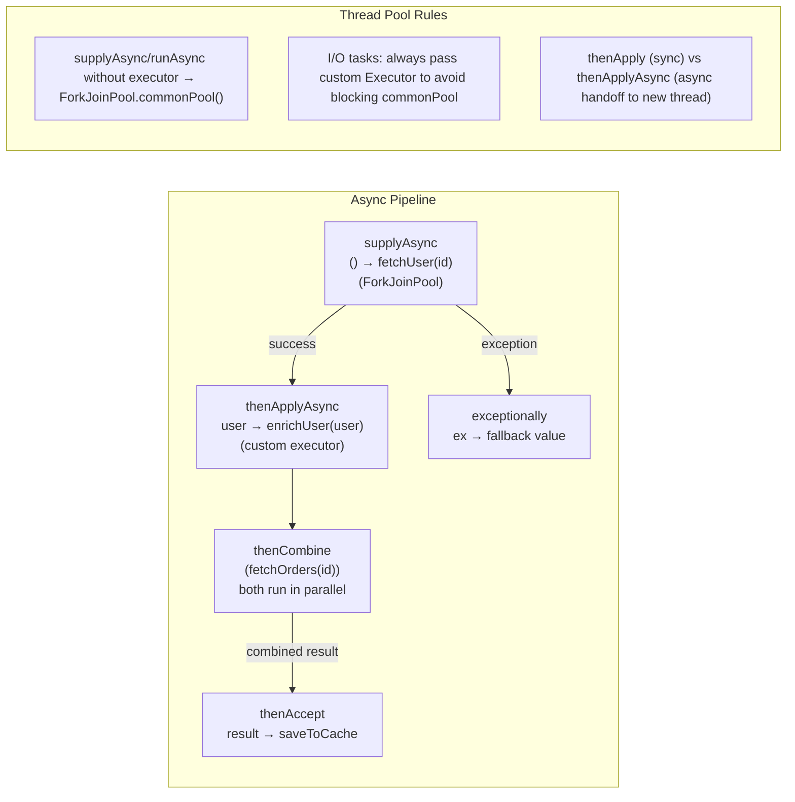

<code>CompletableFuture</code> là API async non-blocking, composable hỗ trợ chaining (<code>thenApply</code>), combining (<code>thenCombine</code>) và xử lý lỗi (<code>exceptionally</code>).

## Điểm Chính

- <code>supplyAsync(supplier)</code>: chạy trên ForkJoinPool hoặc executor cho trước, trả về kết quả.
- <code>thenApply(fn)</code>: biến đổi kết quả đồng bộ. <code>thenApplyAsync(fn)</code>: biến đổi trên thread khác.
- <code>thenCombine(other, fn)</code>: kết hợp hai future. <code>allOf(futures...)</code>: chờ tất cả.
- <code>exceptionally(fn)</code>: phục hồi từ lỗi. <code>handle(fn)</code>: xử lý cả kết quả và lỗi.
- KHÔNG ném checked exception — bọc trong <code>CompletionException</code>.

## Ví Dụ Code

*CompletableFuture: parallel fetch, pipeline chain, allOf batch, anyOf race*

```java
import java.util.concurrent.*;
import java.util.*;

// ---- CompletableFuture: async, non-blocking, composable ----
public class OrderCheckoutOrchestrator {

    private final ExecutorService ioExecutor = Executors.newFixedThreadPool(10);

    // ---- Pattern 1: parallel fetch + combine ----
    // Fetch user profile and inventory check CONCURRENTLY; combine when both done
    public CompletableFuture<CheckoutContext> buildCheckoutContext(String customerId, List<String> productIds) {
        CompletableFuture<User> userFuture =
            CompletableFuture.supplyAsync(() -> userService.findById(customerId), ioExecutor);

        CompletableFuture<Map<String, Integer>> inventoryFuture =
            CompletableFuture.supplyAsync(() -> inventoryService.checkStock(productIds), ioExecutor);

        // thenCombine: fires when BOTH futures complete — runs on ioExecutor (thenCombineAsync)
        return userFuture.thenCombineAsync(inventoryFuture,
            (user, inventory) -> new CheckoutContext(user, inventory),
            ioExecutor);
    }

    // ---- Pattern 2: chaining (pipeline) ----
    public CompletableFuture<OrderConfirmation> placeOrder(CheckoutRequest request) {
        return CompletableFuture
            .supplyAsync(() -> validateOrder(request), ioExecutor)
            // thenApply: sync transform (same thread as previous stage)
            .thenApply(validatedOrder -> applyDiscounts(validatedOrder))
            // thenCompose: flatMap — when the fn itself returns a CompletableFuture
            .thenCompose(discountedOrder -> paymentService.chargeAsync(discountedOrder))
            // thenApplyAsync: transform on a DIFFERENT thread from ioExecutor
            .thenApplyAsync(paymentResult -> {
                Order savedOrder = orderRepository.save(paymentResult.getOrder());
                notificationService.sendConfirmation(savedOrder);
                return new OrderConfirmation(savedOrder);
            }, ioExecutor)
            // Error handling: recover from payment failure with a fallback
            .exceptionally(ex -> {
                if (ex.getCause() instanceof PaymentFailedException pfe) {
                    log.warn("Payment failed for request {}: {}", request.getId(), pfe.getMessage());
                    return OrderConfirmation.failed(request.getId(), pfe.getMessage());
                }
                log.error("Unexpected checkout error", ex);
                throw new CompletionException(ex);  // re-throw unrecoverable errors
            });
    }

    // ---- Pattern 3: allOf — wait for N independent tasks ----
    public CompletableFuture<List<OrderSummary>> fetchOrderSummaries(List<Long> orderIds) {
        List<CompletableFuture<OrderSummary>> futures = orderIds.stream()
            .map(id -> CompletableFuture.supplyAsync(() -> orderService.getSummary(id), ioExecutor))
            .toList();

        // allOf: completes when ALL complete (Void return → collect manually)
        return CompletableFuture.allOf(futures.toArray(new CompletableFuture[0]))
            .thenApply(v -> futures.stream()
                .map(CompletableFuture::join)   // join: like get() but throws unchecked
                .toList());
    }

    // ---- Pattern 4: anyOf — first to complete wins (race) ----
    public CompletableFuture<ShippingQuote> getBestShippingQuote(Order order) {
        CompletableFuture<ShippingQuote> fedex = CompletableFuture.supplyAsync(
            () -> fedexClient.quote(order), ioExecutor);
        CompletableFuture<ShippingQuote> ups   = CompletableFuture.supplyAsync(
            () -> upsClient.quote(order),   ioExecutor);

        // anyOf: completes as soon as the FIRST future completes
        return CompletableFuture.anyOf(fedex, ups)
            .thenApply(result -> (ShippingQuote) result);
    }
}
```

## Ứng Dụng Thực Tế

Dùng CompletableFuture để song song hóa I/O call độc lập (ví dụ: fetch user + fetch order đồng thời). Trong Spring WebFlux, ưu tiên reactive Mono/Flux tích hợp với event loop, nhưng CompletableFuture hoạt động tốt trong Spring MVC truyền thống cho async path ngắn.

## Câu Hỏi Phỏng Vấn

<details>
<summary><strong>thenApply() và thenApplyAsync() khác nhau thế nào?</strong></summary>

**A:** `thenApply(fn)`: execute function trên thread hoàn thành stage trước — có thể là caller thread hoặc thread pool thread. `thenApplyAsync(fn)`: luôn submit function vào ForkJoinPool.commonPool() (hoặc Executor nếu specify). Không có Async suffix → có thể synchronous nếu stage đã complete. Với Async suffix → guaranteed async. Trong practice: dùng Async variant cho I/O operations để không block thread đang xử lý; non-Async cho simple transformation.

</details>

<details>
<summary><strong>Tại sao không nên dùng ForkJoinPool.commonPool() cho I/O tasks?</strong></summary>

**A:** commonPool thread count = CPU cores - 1 (default). I/O task blocking trên commonPool thread khiến ForkJoinPool thiếu thread cho CPU-bound computation — toàn hệ thống chậm lại. Luôn truyền custom Executor cho I/O operations: `CompletableFuture.supplyAsync(() -> callExternalAPI(), ioExecutor)`. Tạo dedicated pool: `Executors.newFixedThreadPool(20, namedThreadFactory("io"))`. Đây là lỗi phổ biến gây mysterious slowdown trong microservice.

</details>

<details>
<summary><strong>Handle error trong CompletableFuture chain thế nào?</strong></summary>

**A:** `exceptionally(fn)`: catch exception, return fallback value — chỉ trigger khi có exception. `handle(fn)`: luôn execute với (result, exception) — handle cả success lẫn failure. `whenComplete(fn)`: side effect (logging), không transform result. `exceptionallyCompose(fn)`: fallback trả về CompletableFuture khác (asynchronous fallback). Best practice: `exceptionally` ở cuối chain cho fallback, `handle` nếu cần transform cả hai trường hợp. Không để exception propagate silently — CompletableFuture swallow exceptions nếu không attach handler.

</details>

## Sơ Đồ CompletableFuture Chain


