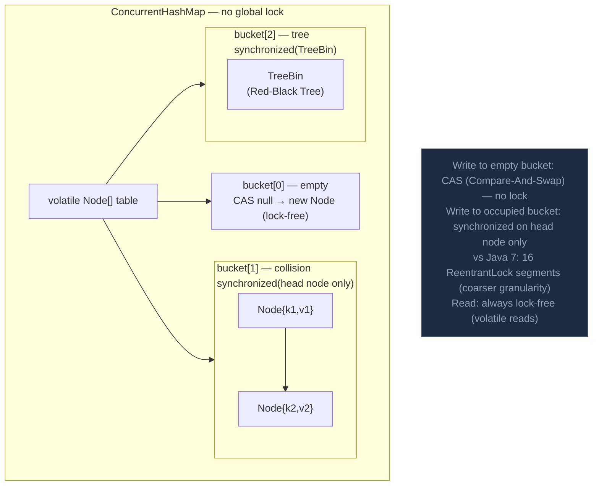

ConcurrentHashMap cung cấp thao tác map thread-safe mà không cần đồng bộ hóa toàn bộ — dùng segment-level (Java 7) hoặc CAS+bucket-level (Java 8+) locking cho concurrency cao.

## Điểm Chính

- Java 8+: dùng CAS cho insert bucket rỗng và <code>synchronized</code> trên từng bucket head cho ghi.
- Đọc không blocking và luôn nhất quán (không stale read như volatile HashMap).
- <code>putIfAbsent</code>, <code>computeIfAbsent</code>, <code>merge</code>, <code>compute</code> là thao tác atomic.
- <strong>Không cho phép null key hoặc null value</strong> (ném NullPointerException).
- <code>size()</code> là xấp xỉ; dùng <code>mappingCount()</code> cho map lớn.
- So với <code>Collections.synchronizedMap()</code>: synchronized bọc toàn bộ map với một lock — concurrency thấp hơn.

## Ví Dụ Code

*ConcurrentHashMap: request counter, session cache, aggregator — atomic ops*

```java
import java.util.concurrent.*;
import java.util.*;

// ---- ConcurrentHashMap Java 8+ internals ----
// - Empty bucket: CAS to insert Node (no lock)
// - Non-empty bucket: synchronized on bucket head node only (fine-grained lock)
// - Reads: never blocked (volatile Node references)
// - No null keys or null values (unlike HashMap)

// ---- Use case 1: concurrent request counter per customer ----
public class CustomerRequestTracker {
    // Thread-safe: concurrent increments from multiple request-handling threads
    private final ConcurrentHashMap<String, Long> requestCounts = new ConcurrentHashMap<>();

    public void recordRequest(String customerId) {
        // merge is ATOMIC: read current, apply (Long::sum), write back — no race
        requestCounts.merge(customerId, 1L, Long::sum);
    }

    public long getCount(String customerId) {
        return requestCounts.getOrDefault(customerId, 0L);
    }
}

// ---- Use case 2: lazy-initialized session cache ----
public class SessionCache {
    private final ConcurrentHashMap<String, UserSession> sessions = new ConcurrentHashMap<>();

    public UserSession getOrCreate(String sessionId, String userId) {
        // computeIfAbsent is ATOMIC: only one thread executes the lambda per key
        // even if 100 threads request the same sessionId simultaneously
        return sessions.computeIfAbsent(sessionId,
            id -> new UserSession(id, userId, Instant.now()));
    }

    public void invalidate(String sessionId) {
        sessions.remove(sessionId);
    }
}

// ---- Use case 3: order status aggregation across threads ----
public class OrderStatusAggregator {
    private final ConcurrentHashMap<OrderStatus, List<String>> statusIndex
        = new ConcurrentHashMap<>();

    public void index(Order order) {
        // computeIfAbsent + CopyOnWriteArrayList = concurrent safe indexing
        statusIndex
            .computeIfAbsent(order.getStatus(), k -> new CopyOnWriteArrayList<>())
            .add(order.getId());
    }

    public List<String> getOrderIds(OrderStatus status) {
        return statusIndex.getOrDefault(status, List.of());
    }
}

// ---- size() vs mappingCount() ----
ConcurrentHashMap<String, Order> orderMap = new ConcurrentHashMap<>();
// size() returns int — may overflow for very large maps
// mappingCount() returns long — use for maps potentially > Integer.MAX_VALUE
long count = orderMap.mappingCount();
```

## Ứng Dụng Thực Tế

Ưu tiên <code>ConcurrentHashMap.computeIfAbsent()</code> thay vì pattern double-checked locking cho lazy initialization. Dùng <code>merge()</code> cho counter/aggregator trong concurrent stream.

## Câu Hỏi Phỏng Vấn

<details>
<summary><strong>ConcurrentHashMap Java 8 khác Java 7 thế nào?</strong></summary>

**A:** Java 7: Segment-based locking — 16 ReentrantLock segments, mỗi segment bảo vệ một phần của table. Java 8: Loại bỏ segments hoàn toàn. Write vào empty bucket: dùng CAS (lock-free). Write vào occupied bucket: `synchronized(headNode)` — granularity đến từng bucket thay vì 1/16 table. Read: luôn lock-free (volatile reads). Kết quả: Java 8 có throughput cao hơn đáng kể ở high concurrency, đặc biệt khi nhiều bucket khác nhau được access đồng thời.

</details>

<details>
<summary><strong>Tại sao ConcurrentHashMap không cho phép null key/value?</strong></summary>

**A:** Trong multi-threaded context, `map.get(key)` trả về null có thể là: (a) key không tồn tại, hoặc (b) key tồn tại với value là null. Không thể phân biệt hai trường hợp mà không dùng `containsKey()` trong cùng atomic operation. Với HashMap (single-threaded), bạn có thể check `containsKey()` ngay sau. Nhưng với ConcurrentHashMap, giữa `get()` và `containsKey()` thread khác có thể modify map — race condition. Doug Lea (designer) quyết định cấm null để tránh ambiguity này.

</details>

## Sơ Đồ ConcurrentHashMap (Java 8+)


