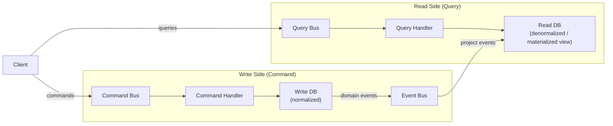

CQRS tách biệt write model (Command) khỏi read model (Query), cho phép mỗi cái được tối ưu, scale và thậm chí lưu trữ khác nhau — thường kết hợp với Event Sourcing.

## Điểm Chính

- Command side: xử lý mutation, enforce business rule, emit event. Relational DB chuẩn hóa.
- Query side: xử lý read, denormalized/tối ưu cho query pattern. Có thể là ES index, Redis, read replica.
- Sync: event từ command side cập nhật read model phía query side (eventually consistent).
- Lợi ích: tối ưu read và write độc lập, chiến lược scaling khác nhau.
- Chi phí: eventual consistency giữa read và write side, phức tạp vận hành.

## Ví Dụ Code

*CQRS: Command (normalized + business rules) → Event → Query (denormalized view + ES); eventual consistency*

```java
// CQRS: Command side writes normalized domain model; Query side reads denormalized view
// Sync between them via domain events (eventually consistent)

// ---- COMMAND SIDE: normalized, enforces business rules ----
@Service @RequiredArgsConstructor
public class OrderCommandService {

    @Transactional
    public String placeOrder(PlaceOrderCommand cmd) {
        // Business rule validation on write side
        cmd.getItems().forEach(item ->
            inventoryService.assertStock(item.getProductId(), item.getQuantity()));

        Order order = new Order(cmd.getUserId(), cmd.getItems());
        orderRepo.save(order); // normalized: orders table + order_items table

        // Publish domain event → Query side updates its read model
        eventPublisher.publishEvent(new OrderPlacedEvent(
            order.getId(), cmd.getUserId(), order.getTotal(), cmd.getItems()));
        return order.getId();
    }
}

// ---- QUERY SIDE: denormalized view, optimized for specific UI needs ----
@Service @RequiredArgsConstructor
public class OrderQueryService {

    @Transactional(readOnly = true)
    public OrderDashboardView getOrderDashboard(String userId) {
        // Single optimized query on denormalized view table — no JOINs needed
        return orderViewRepo.findDashboardByUserId(userId);
        // view table has: order_id, status, total, item_count, customer_name — all pre-joined
    }

    @Transactional(readOnly = true)
    public Page<OrderSummary> searchOrders(OrderSearchRequest req, Pageable page) {
        // Query side can use different storage: Elasticsearch for full-text search
        return elasticsearchOrderRepo.search(req.getKeyword(), req.getStatus(), page);
    }
}

// ---- EVENT HANDLER: updates Query read model when Command side writes ----
@Component @RequiredArgsConstructor
public class OrderViewUpdater {

    @EventListener  // or @KafkaListener if event is published to Kafka
    @Transactional
    public void onOrderPlaced(OrderPlacedEvent event) {
        // Build denormalized view for dashboard query
        OrderDashboardView view = OrderDashboardView.builder()
            .orderId(event.getOrderId())
            .userId(event.getUserId())
            .total(event.getTotal())
            .itemCount(event.getItems().size())
            .status(OrderStatus.PENDING)
            .placedAt(Instant.now())
            .build();
        orderViewRepo.save(view);

        // Also update Elasticsearch index for search
        elasticsearchOrderRepo.index(OrderSearchDocument.from(event));
    }
}

// Trade-off: read model may lag behind write model (eventual consistency)
// After placeOrder() returns, getOrderDashboard() may not yet show the new order
// Mitigation: return order ID immediately; UI polls or uses WebSocket for update
```

## Ứng Dụng Thực Tế

Bắt đầu không có CQRS. Thêm nó khi: read pattern rất khác write pattern, cần scaling khác nhau cho read và write, hoặc đang xây dựng hệ thống audit log. Event Sourcing + CQRS mạnh nhưng thêm độ phức tạp đáng kể.

## Câu Hỏi Phỏng Vấn

<details>
<summary><strong>CQRS khác CQS (Command Query Separation) thế nào?</strong></summary>

**A:** CQS (Bertrand Meyer): method level — method hoặc là command (modify state, return void) hoặc query (return data, no side effect). CQRS: architecture level — separate models, separate handlers, thường separate storage cho reads và writes. CQS là lightweight principle áp dụng cho mọi class. CQRS là architectural pattern nặng hơn, phù hợp cho complex domain với read/write workload asymmetric (read nhiều hơn write nhiều lần). Không cần CQRS cho CRUD đơn giản.

</details>

<details>
<summary><strong>Read model trong CQRS sync từ write model thế nào?</strong></summary>

**A:** Event-driven sync: write side publish domain events (OrderCreated, ItemAdded); event handler project events vào read model (denormalized view table, Elasticsearch index, Redis cache). Eventual consistency: read model có thể lag vài ms đến giây sau write. Query handler đọc từ read model. Nếu user cần read-your-writes: sau write, redirect đến URL có timestamp, query check timestamp để serve từ write DB cho request đó. Event sourcing complement CQRS — write side lưu events, rebuild read model bất cứ lúc nào bằng replay.

</details>

## Sơ Đồ CQRS Flow


