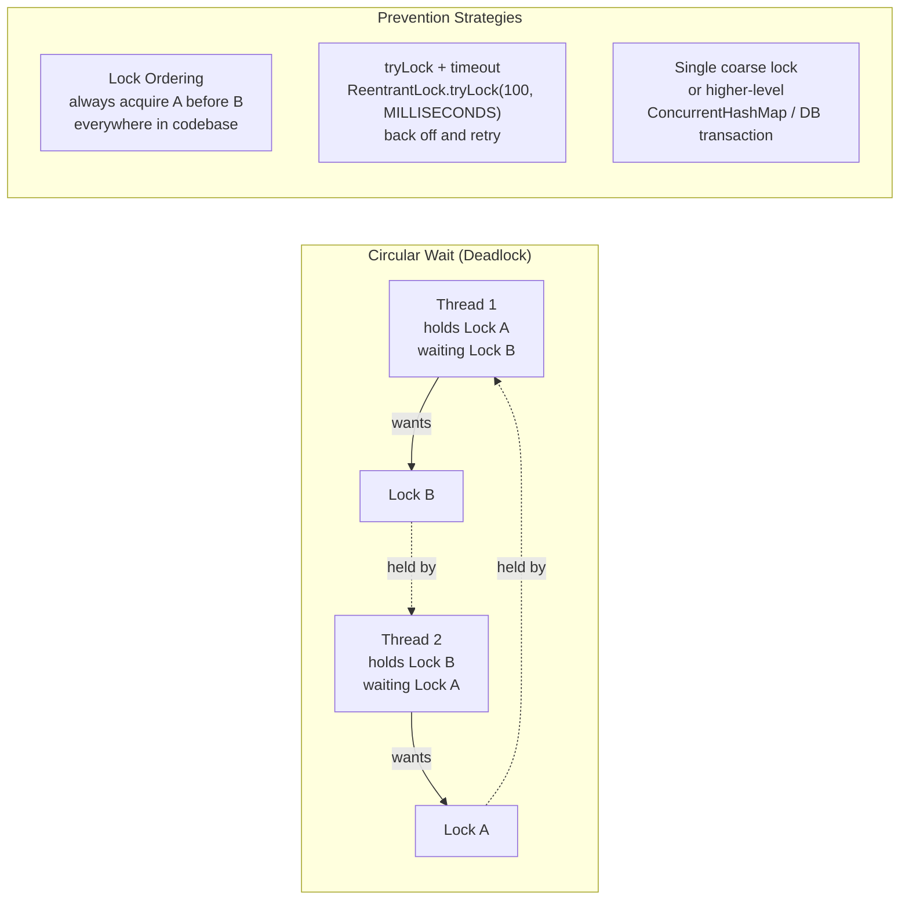

Deadlock xảy ra khi hai hoặc nhiều thread mỗi cái giữ tài nguyên mà cái kia cần và không ai có thể tiến triển — yêu cầu đồng thời cả bốn điều kiện Coffman.

## Điểm Chính

- Điều kiện Coffman: <strong>Mutual Exclusion</strong>, <strong>Hold & Wait</strong>, <strong>No Preemption</strong>, <strong>Circular Wait</strong>.
- Phòng ngừa: luôn lấy lock theo thứ tự global nhất quán trên tất cả code path.
- Phát hiện: <code>jstack &lt;pid&gt;</code> báo cáo thread deadlocked với thông tin lock.
- <code>ReentrantLock.tryLock(timeout)</code>: phá deadlock bằng cách bỏ qua nếu lock không có sẵn.
- Database deadlock: DB phát hiện và rollback một transaction; cần retry logic.

## Ví Dụ Code

*Deadlock: account transfer scenario + 2 fixes (lock ordering, tryLock timeout) + detection*

```java
import java.util.concurrent.*;
import java.util.concurrent.locks.*;

// ---- Deadlock scenario: transferring between two Order accounts ----
// Thread 1: locks Alice's account, tries to lock Bob's
// Thread 2: locks Bob's account, tries to lock Alice's
// → circular wait → deadlock

public class DeadlockDemo {

    // BAD: lock order depends on which account is "from" and "to" → can deadlock
    public void transferBad(Account from, Account to, BigDecimal amount) {
        synchronized (from) {         // T1 locks Alice; T2 locks Bob
            pause(50);                // give other thread time to acquire its lock
            synchronized (to) {       // T1 waits for Bob (held by T2); T2 waits for Alice (held by T1)
                from.debit(amount);
                to.credit(amount);
            }
        }
    }

    // FIX 1: consistent lock ordering — always lock the lower-ID account first
    public void transferFixed(Account from, Account to, BigDecimal amount) {
        // Canonical order: lock account with smaller ID first, globally consistent
        Account first  = from.getId() < to.getId() ? from : to;
        Account second = from.getId() < to.getId() ? to   : from;

        synchronized (first) {
            synchronized (second) {
                from.debit(amount);
                to.credit(amount);
            }
        }
    }

    // FIX 2: tryLock with timeout — backs off if cannot acquire both locks
    private final ReentrantLock lockA = new ReentrantLock();
    private final ReentrantLock lockB = new ReentrantLock();

    public boolean transferWithTimeout(Account from, Account to, BigDecimal amount)
            throws InterruptedException {
        ReentrantLock fromLock = getLock(from);
        ReentrantLock toLock   = getLock(to);

        // Try to acquire both locks within 500ms — if timeout → abort, retry later
        if (fromLock.tryLock(500, TimeUnit.MILLISECONDS)) {
            try {
                if (toLock.tryLock(500, TimeUnit.MILLISECONDS)) {
                    try {
                        from.debit(amount);
                        to.credit(amount);
                        return true;          // success
                    } finally { toLock.unlock(); }
                }
            } finally { fromLock.unlock(); }
        }
        log.warn("Could not acquire locks for transfer from {} to {} — will retry", from.getId(), to.getId());
        return false;  // caller should retry with backoff
    }

    // ---- Detecting deadlock at runtime ----
    public static void detectDeadlocks() {
        ThreadMXBean bean = ManagementFactory.getThreadMXBean();
        long[] deadlockedIds = bean.findDeadlockedThreads();
        if (deadlockedIds != null) {
            ThreadInfo[] infos = bean.getThreadInfo(deadlockedIds, true, true);
            for (ThreadInfo info : infos) {
                System.err.printf("DEADLOCK: thread '%s' waiting on lock held by '%s'%n",
                    info.getThreadName(), info.getLockOwnerName());
            }
        }
    }
}
```

## Ứng Dụng Thực Tế

Kiểm tra code cho nested synchronized block hoặc nested database row lock. Nếu phải lấy nhiều lock, định nghĩa thứ tự canonical global (ví dụ: theo object ID tăng dần). Dùng <code>tryLock</code> với timeout làm fallback trong tình huống lock phức tạp.

## Câu Hỏi Phỏng Vấn

<details>
<summary><strong>Bốn điều kiện cần thiết để deadlock xảy ra là gì?</strong></summary>

**A:** (1) **Mutual exclusion**: resource chỉ được giữ bởi một thread tại một thời điểm. (2) **Hold and wait**: thread giữ resource và đang chờ thêm resource. (3) **No preemption**: resource không thể bị lấy đi forcibly. (4) **Circular wait**: thread A chờ resource của B, B chờ resource của C, C chờ resource của A. Phá vỡ bất kỳ điều kiện nào là đủ để ngăn deadlock. Thực tế: hay dùng lock ordering (phá circular wait) hoặc tryLock với timeout (phá hold-and-wait).

</details>

<details>
<summary><strong>Detect deadlock trong production Java app thế nào?</strong></summary>

**A:** Thread dump: `jstack <pid>` — JVM tự report "Found one Java-level deadlock" và liệt kê thread cùng lock chain. ThreadMXBean programmatically: `ManagementFactory.getThreadMXBean().findDeadlockedThreads()` — có thể schedule check định kỳ và alert. APM tools (Datadog, Dynatrace) tự detect deadlock từ thread dump. Phòng ngừa: enforce lock ordering nhất quán toàn codebase, prefer higher-level concurrent structures (ConcurrentHashMap) thay vì raw lock.

</details>

## Sơ Đồ Deadlock & Prevention


