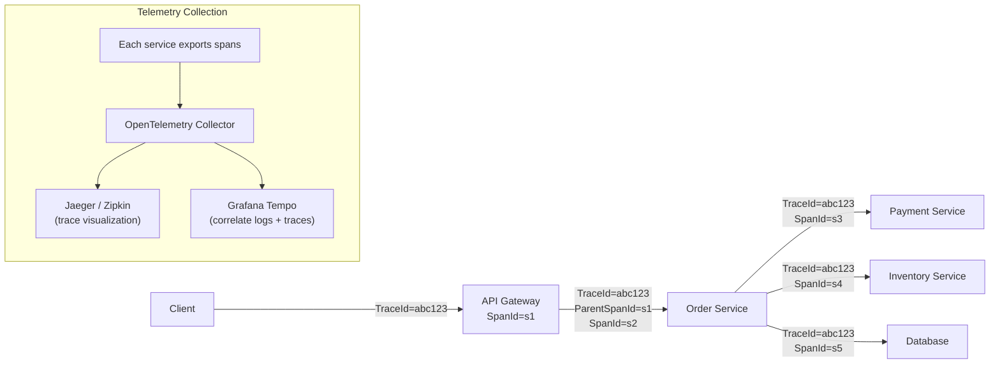

Distributed tracing theo dõi request qua nhiều microservice bằng cách truyền trace context, cho phép phân tích nguyên nhân gốc của latency và lỗi trong service graph phức tạp.

## Điểm Chính

- <strong>Trace</strong>: toàn bộ hành trình request. <strong>Span</strong>: một thao tác (HTTP call, DB query). Span có quan hệ parent-child.
- Trace context được truyền qua HTTP header: <code>traceparent</code> (chuẩn W3C), hoặc <code>X-B3-TraceId</code> (Zipkin).
- Tool: Jaeger, Zipkin, AWS X-Ray, OpenTelemetry (protocol chuẩn).
- Spring: Micrometer Tracing (thay thế Sleuth trong Boot 3). Auto-instrument HTTP và Kafka.
- Sampling: đừng trace 100% — dùng probabilistic (1-10%) hoặc adaptive sampling.

## Ví Dụ Code

*Micrometer Tracing với Zipkin và manual span*

```bash
# Spring Boot 3 + Micrometer Tracing + Zipkin
# pom.xml:
# spring-boot-starter-actuator
# micrometer-tracing-bridge-brave
# zipkin-reporter-brave

# application.yml
management:
  tracing:
    sampling:
      probability: 0.1  # trace 10% of requests

# Auto-instrumented: RestTemplate, WebClient, @Async, Kafka
# Manual span:
@Autowired Tracer tracer;
Span span = tracer.nextSpan().name("db-query").start();
try (Tracer.SpanInScope ws = tracer.withSpan(span.start())) {
    return repo.findAll();
} catch(Exception e){
    span.error(e); throw e;
} finally { span.end(); }
```

## Ứng Dụng Thực Tế

Thêm tracing trước khi cần — sau incident thì quá muộn. Sample ở 1-10% trong production để kiểm soát chi phí storage. Dùng trace ID trong log (MDC) để bạn có thể correlate trace ID từ Jaeger với log line trong Loki/Elasticsearch.

## Câu Hỏi Phỏng Vấn

1. Sự khác biệt giữa trace và span là gì?
1. Trace context được truyền qua HTTP boundary thế nào?
1. Sampling là gì và tại sao 100% sampling problematic trong production?

## Sơ Đồ Distributed Tracing


