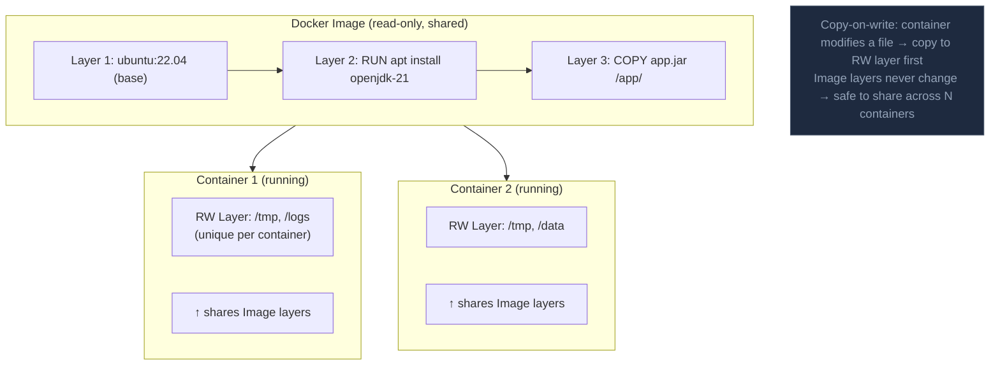

Docker đóng gói ứng dụng và dependency vào container portable chạy nhất quán qua các môi trường, dùng image (snapshot bất biến) và container (instance đang chạy).

## Điểm Chính

- <strong>Image</strong>: template read-only bất biến được build từ Dockerfile. Layer được cache để hiệu quả.
- <strong>Container</strong>: instance đang chạy của image. Cô lập qua Linux namespace và cgroup.
- <strong>Registry</strong>: lưu trữ và phân phối image. DockerHub, ECR, GCR, Nexus.
- Dockerfile: hướng dẫn build image (<code>FROM</code>, <code>RUN</code>, <code>COPY</code>, <code>CMD</code>, <code>EXPOSE</code>).
- Multi-stage build: tách biệt môi trường build khỏi runtime, giảm kích thước image cuối cùng đáng kể.

## Ví Dụ Code

*Multi-stage Dockerfile: build stage (Maven+JDK) → runtime stage (Alpine JRE), non-root user, HEALTHCHECK, container-aware JVM flags*

```bash
# ── Multi-stage Dockerfile: order-service (Spring Boot 3, Java 21) ──

# Stage 1: BUILD — Maven + full JDK (~600 MB); never shipped to prod
FROM maven:3.9-eclipse-temurin-21 AS build
WORKDIR /app

# Copy pom.xml FIRST so dependency layer is cached separately from source.
# If only src/ changes, Docker reuses this layer → faster CI builds.
COPY pom.xml .
RUN mvn dependency:go-offline -q       # pre-download all deps into ~/.m2

COPY src ./src
# -DskipTests: tests run as a separate CI step, not inside Docker build
RUN mvn package -DskipTests -q

# Stage 2: RUNTIME — Alpine JRE only (~120 MB); minimal attack surface
FROM eclipse-temurin:21.0.3_9-jre-alpine AS runtime
WORKDIR /app

# Security: never run as root in production containers
RUN apk add --no-cache curl  && addgroup -S appgroup  && adduser  -S appuser -G appgroup

USER appuser

# Only the fat-jar from the build stage — no source, no Maven cache
COPY --from=build --chown=appuser:appgroup /app/target/order-service-*.jar app.jar

# HEALTHCHECK mirrors K8s liveness probe; both target Spring Actuator
HEALTHCHECK --interval=30s --timeout=5s --retries=3   CMD curl -sf http://localhost:8080/actuator/health/liveness || exit 1

EXPOSE 8080

# -XX:+UseContainerSupport  → JVM reads cgroup memory limit, not host RAM
# -XX:MaxRAMPercentage=75   → leaves 25 % headroom for OS + off-heap memory
ENTRYPOINT ["java",   "-XX:+UseContainerSupport",   "-XX:MaxRAMPercentage=75.0",   "-Djava.security.egd=file:/dev/./urandom",   "-jar", "app.jar"]
```

## Ứng Dụng Thực Tế

Luôn dùng multi-stage build để giữ runtime image nhỏ (Alpine JRE ~100MB vs Maven build image ~500MB). Chạy với non-root user trong production. Đặt <code>-XX:+UseContainerSupport</code> để JVM tôn trọng giới hạn memory container.

## Câu Hỏi Phỏng Vấn

<details>
<summary><strong>Docker layer caching hoạt động thế nào? Optimize Dockerfile thế nào?</strong></summary>

**A:** Mỗi instruction trong Dockerfile tạo một layer. Nếu instruction và context không thay đổi → Docker reuse cached layer (không rebuild). Principle: đặt ít thay đổi trước, nhiều thay đổi sau. Tối ưu Java Dockerfile: COPY pom.xml trước → RUN mvn dependency:go-offline (cache dependencies) → COPY src/ → RUN mvn package. Khi chỉ thay đổi source code: chỉ rebuild 2 layers cuối, không re-download dependencies. `COPY . .` ở đầu là anti-pattern — bất kỳ file nào thay đổi đều invalidate cache.

</details>

<details>
<summary><strong>.dockerignore và tại sao quan trọng?</strong></summary>

**A:** `.dockerignore` list files/directories không copy vào build context. Build context = tất cả files Docker daemon nhận trước khi build. Không có .dockerignore: `COPY . .` copy cả `target/`, `.git/`, `node_modules/` → build context hàng GB, slow build, layer thừa trong image. Nên ignore: `target/`, `.git`, `*.log`, `.env`, `node_modules`. Giữ image nhỏ: chỉ copy artifacts cần thiết (multi-stage build: build stage → copy .jar sang runtime stage).

</details>

## Sơ Đồ Docker Image Layers & Containers


