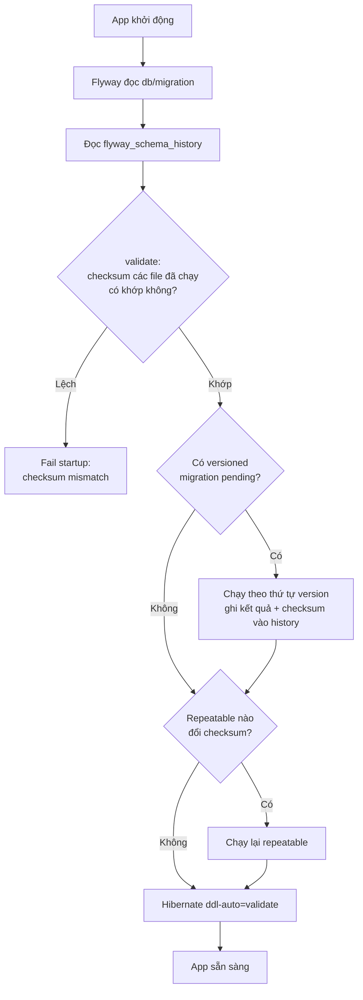

Schema database phải được version hóa giống code: mỗi thay đổi là một file migration trong Git, chạy theo thứ tự, đúng một lần trên mọi môi trường. Không dùng `spring.jpa.hibernate.ddl-auto=update` ở production — nó không có lịch sử, không review được, không rollback được và có thể thay đổi schema theo cách bạn không lường trước.

## Điểm Chính

- <strong>Versioned migration</strong> <code>V&lt;version&gt;__&lt;mô_tả&gt;.sql</code> (2 dấu gạch dưới): chạy đúng một lần, theo thứ tự version. Version dùng dấu `_` hoặc `.` để tách: `V1__init.sql`, `V2_1__add_index.sql`.
- <strong>Bảng `flyway_schema_history`</strong> ghi lại migration nào đã chạy, lúc nào, thành công hay không, và <strong>checksum</strong> (CRC32 với file SQL) của từng file.
- <strong>Không bao giờ sửa file đã apply</strong>: `validate` (tự chạy trước `migrate`) so checksum → lệch là fail startup với lỗi <em>checksum mismatch</em>. Muốn đổi schema → viết migration mới. `repair` chỉ dùng để "chấp nhận" checksum mới hoặc xóa bản ghi migration lỗi, không phải để lách review.
- <strong>Repeatable migration</strong> `R__mô_tả.sql`: không có version, chạy lại mỗi khi checksum đổi, luôn chạy sau các versioned migration trong cùng một lần migrate. Dùng cho view, function, stored procedure.
- <strong>Undo</strong> (`U` migration) chỉ có ở bản Teams trả phí; bản Community không có rollback tự động → chiến lược thực tế là <em>roll forward</em>: viết migration mới để sửa.
- <strong>Baseline</strong>: đưa Flyway vào một DB đã có sẵn schema — đánh dấu DB "đã ở version N" (`baselineOnMigrate`) để Flyway chỉ chạy migration sau N.
- <strong>Spring Boot</strong> tự chạy migration lúc startup từ `classpath:db/migration`. Từ Spring Boot 4, phải dùng `spring-boot-starter-flyway` (hoặc `spring-boot-starter-liquibase`) — chỉ thêm `flyway-core` như trước không còn đủ. Với PostgreSQL còn cần module `flyway-database-postgresql`.

## Ví Dụ Code

*Cấu trúc thư mục và file migration*

```text
src/main/resources/db/migration/
├── V1__create_customer_table.sql
├── V2__create_order_table.sql
├── V3__add_email_index_to_customer.sql
├── V4__add_status_to_order.sql
└── R__order_summary_view.sql        ← repeatable: sửa thoải mái, tự chạy lại
```

```sql
-- V1__create_customer_table.sql
CREATE TABLE customer (
    id         BIGSERIAL PRIMARY KEY,
    email      VARCHAR(255) NOT NULL,
    full_name  VARCHAR(255) NOT NULL,
    created_at TIMESTAMPTZ  NOT NULL DEFAULT now()
);

-- V3__add_email_index_to_customer.sql
CREATE UNIQUE INDEX ux_customer_email ON customer (email);

-- R__order_summary_view.sql — CREATE OR REPLACE để chạy lại an toàn
CREATE OR REPLACE VIEW order_summary AS
SELECT c.id AS customer_id, count(o.id) AS order_count, sum(o.total) AS lifetime_value
FROM customer c LEFT JOIN customer_order o ON o.customer_id = c.id
GROUP BY c.id;
```

*Spring Boot 4 — dependency và cấu hình*

```xml
<dependency>
    <groupId>org.springframework.boot</groupId>
    <artifactId>spring-boot-starter-flyway</artifactId>   <!-- Boot 4: bắt buộc dùng starter -->
</dependency>
<dependency>
    <groupId>org.flywaydb</groupId>
    <artifactId>flyway-database-postgresql</artifactId>   <!-- module hỗ trợ PostgreSQL -->
</dependency>
```

```yaml
spring:
  jpa:
    hibernate:
      ddl-auto: validate       # Hibernate chỉ KIỂM TRA entity khớp schema, không tự sửa
  flyway:
    locations: classpath:db/migration   # mặc định; hỗ trợ {vendor} → db/migration/postgresql
    baseline-on-migrate: false          # chỉ bật khi đưa Flyway vào DB có sẵn schema
```

*Lệnh CLI hay dùng*

```bash
flyway info       # trạng thái từng migration: Success / Pending / Failed / Outdated
flyway validate   # so checksum file local với flyway_schema_history
flyway migrate    # chạy các migration pending
flyway repair     # xóa bản ghi migration FAILED, cập nhật checksum khớp file hiện tại
flyway baseline   # đánh dấu DB có sẵn là ở version baseline
```

*Zero-downtime: đổi tên cột bằng expand → migrate → contract*

```sql
-- ❌ Một bước: rolling deploy có lúc version cũ và mới chạy song song
--    → pod cũ vẫn đọc cột `name` đã bị đổi tên → lỗi 500
ALTER TABLE customer RENAME COLUMN name TO full_name;

-- ✅ Release 1 — EXPAND: thêm cột mới, code ghi cả 2 cột, đọc cột cũ
-- V10__add_full_name.sql
ALTER TABLE customer ADD COLUMN full_name VARCHAR(255);
UPDATE customer SET full_name = name WHERE full_name IS NULL;   -- bảng lớn: backfill theo batch

-- ✅ Release 2 — code chuyển sang đọc/ghi full_name (pod cũ đã hết)

-- ✅ Release 3 — CONTRACT: xóa cột cũ khi không còn code nào dùng
-- V12__drop_name.sql
ALTER TABLE customer DROP COLUMN name;
```

*Liquibase — cùng mục tiêu, định dạng changelog*

```yaml
# src/main/resources/db/changelog/db.changelog-master.yaml (vị trí mặc định trong Spring Boot)
databaseChangeLog:
  - changeSet:
      id: 1
      author: nhan
      changes:
        - createTable:
            tableName: customer
            columns:
              - column: { name: id, type: BIGINT, autoIncrement: true, constraints: { primaryKey: true } }
              - column: { name: email, type: VARCHAR(255), constraints: { nullable: false } }
      rollback:
        - dropTable: { tableName: customer }
```

## Ứng Dụng Thực Tế

**Chọn Flyway hay Liquibase**: Flyway đơn giản — viết SQL thuần, dễ review, đủ cho phần lớn team dùng một loại DB. Liquibase mạnh hơn khi cần changelog độc lập với DB (YAML/XML sinh SQL cho nhiều vendor), khai báo `rollback` ngay trong changeSet, hoặc preconditions. Nguyên tắc chung giống nhau: file đã chạy là bất biến.

**Chạy migration ở đâu**: để app tự migrate lúc startup là tiện nhưng khi có nhiều pod, nhiều instance cùng khởi động sẽ tranh nhau — Flyway dùng lock trên schema history nên chỉ một instance chạy, các instance khác chờ. Với migration chậm (tạo index trên bảng lớn), startup có thể quá thời gian readiness probe. Nhiều team tách migration thành một bước riêng trong pipeline (Kubernetes Job hoặc init container) chạy trước khi deploy app.

**Migration trên bảng lớn**: `ALTER TABLE ... ADD COLUMN ... NOT NULL DEFAULT` hoặc tạo index có thể khóa bảng lâu. Trên PostgreSQL dùng `CREATE INDEX CONCURRENTLY` (không chạy được bên trong transaction — phải cấu hình migration đó không dùng transaction); trên MySQL xem ONLINE DDL. Luôn thử migration trên bản sao dữ liệu production trước.

**MySQL và DDL**: PostgreSQL chạy DDL trong transaction nên migration lỗi được rollback sạch. MySQL tự commit ngầm sau mỗi câu DDL → migration lỗi giữa chừng để lại schema dở dang; phải sửa tay trạng thái DB rồi mới chạy `repair`. Vì vậy trên MySQL nên để mỗi migration chỉ chứa một thay đổi DDL.

## Câu Hỏi Phỏng Vấn

<details>
<summary><strong>Tại sao không dùng ddl-auto=update ở production?</strong></summary>

**A:** (1) Không có lịch sử: không biết schema đổi lúc nào, bởi ai, không review được. (2) Không an toàn: Hibernate chỉ thêm, không xóa/đổi tên cột, không tạo được migration dữ liệu (backfill), và không xử lý rename — đổi tên field trong entity sẽ tạo cột mới và để cột cũ mồ côi. (3) Không lặp lại được: schema phụ thuộc vào entity lúc chạy, các môi trường có thể lệch nhau. (4) Không kiểm soát được khóa bảng trên bảng lớn. Thay vào đó: migration tool (Flyway/Liquibase) + `ddl-auto=validate` để Hibernate chỉ kiểm tra entity khớp schema lúc startup.

</details>

<details>
<summary><strong>Lỡ sửa một file migration đã chạy trên production thì chuyện gì xảy ra và xử lý thế nào?</strong></summary>

**A:** Lần startup kế tiếp, `validate` so checksum file local với checksum lưu trong `flyway_schema_history` → lệch → Flyway báo *checksum mismatch* và app không start. Xử lý đúng: revert file về đúng nội dung đã chạy, rồi đưa thay đổi mong muốn vào một migration **mới**. Chỉ dùng `flyway repair` (cập nhật checksum trong bảng history cho khớp file) khi thay đổi không ảnh hưởng schema — ví dụ sửa comment, format — và cả team hiểu rõ việc đó, vì repair không chạy lại SQL.

</details>

<details>
<summary><strong>Làm sao đổi schema mà không downtime khi deploy kiểu rolling?</strong></summary>

**A:** Trong rolling deploy, version cũ và mới của app chạy song song một khoảng thời gian, nên mỗi migration phải tương thích với **cả hai** version code. Dùng pattern expand/contract: (1) Expand — chỉ thêm (cột mới nullable, bảng mới), code mới ghi cả cũ lẫn mới; (2) backfill dữ liệu theo batch; (3) chuyển code sang đọc cột mới; (4) Contract — xóa cột cũ ở một release sau, khi chắc chắn không còn pod nào dùng. Không bao giờ rename/drop cột trong cùng release với code dừng dùng nó.

</details>

<details>
<summary><strong>Versioned migration khác repeatable migration thế nào?</strong></summary>

**A:** Versioned (`V1__...`) có version, chạy đúng một lần theo thứ tự, không được sửa sau khi chạy — dùng cho mọi thay đổi cấu trúc (bảng, cột, index) và migrate dữ liệu. Repeatable (`R__...`) không có version, chạy lại mỗi khi nội dung (checksum) đổi, và luôn chạy sau các versioned migration trong cùng một lần migrate — dùng cho object có thể tạo lại toàn bộ như view, function, procedure; file phải idempotent (`CREATE OR REPLACE`).

</details>

<details>
<summary><strong>Flyway có rollback migration được không?</strong></summary>

**A:** Lệnh `undo` (file `U1__...`) chỉ có ở bản Teams/Enterprise, bản Community không có. Và kể cả có undo, rollback schema thường không hoàn tác được dữ liệu (cột đã drop thì dữ liệu mất). Thực tế production dùng **roll forward**: phát hiện lỗi → viết migration mới để sửa; kết hợp expand/contract để mỗi bước đều an toàn khi rollback phiên bản app. Liquibase cho khai báo `rollback` trong changeSet, nhưng giới hạn về dữ liệu vẫn vậy.

</details>

## Sơ Đồ Luồng Migrate Lúc Startup


