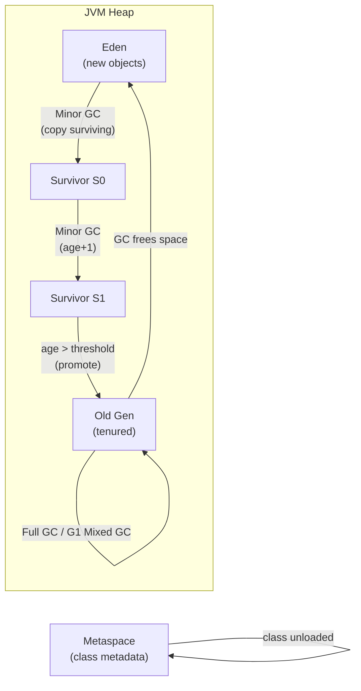

GC tự động thu hồi bộ nhớ heap của các object không còn được tham chiếu, sử dụng các collector khác nhau (G1, ZGC, Shenandoah) với đánh đổi throughput/latency khác nhau.

## Điểm Chính

- <strong>G1GC</strong> (mặc định Java 9+): region-based, mục tiêu pause dự đoán được, lựa chọn tốt cho mục đích chung.
- <strong>ZGC</strong> (Java 15+ production): pause dưới mili-giây, scale đến heap hàng TB.
- <strong>Shenandoah</strong>: pause cực thấp, dự án open-source của Red Hat.
- Serial/Parallel GC: đơn giản, tập trung throughput, tốt cho batch job.
- GC roots: thread stack, static field, JNI reference — object có thể reach từ root là còn sống.
- Tránh finalizer; dùng <code>Cleaner</code> hoặc <code>try-with-resources</code> để dọn tài nguyên.

## Ví Dụ Code

*GC algorithm selection + runtime metrics + GC roots + avoiding churn*

```java
// ---- GC Algorithm Decision Tree ----
//
// Throughput first (batch ETL, analytics)?    → ParallelGC
//   -XX:+UseParallelGC
//
// Balanced latency + throughput (REST API)?  → G1GC (default Java 9+)
//   -XX:+UseG1GC -XX:MaxGCPauseMillis=200 -XX:G1HeapRegionSize=16m
//
// Sub-millisecond pauses (payment, trading)? → ZGC (Java 15+ production)
//   -XX:+UseZGC -XX:SoftMaxHeapSize=4g
//
// Red Hat / low-latency alternative?         → Shenandoah
//   -XX:+UseShenandoahGC

// ---- Enable GC logging — mandatory in production ----
// java -Xlog:gc*:file=/var/log/app/gc.log:time,uptime,pid:filecount=5,filesize=20m

// ---- Monitoring GC impact at runtime ----
public static void printGcStats() {
    for (GarbageCollectorMXBean gc : ManagementFactory.getGarbageCollectorMXBeans()) {
        System.out.printf("GC [%-30s]  count=%4d  totalTimeMs=%6d%n",
            gc.getName(), gc.getCollectionCount(), gc.getCollectionTime());
    }
    // Output (G1GC example):
    // GC [G1 Young Generation         ]  count=  42  totalTimeMs=   380
    // GC [G1 Old Generation           ]  count=   1  totalTimeMs=   210
}

// ---- GC root categories — objects reachable from these are NEVER collected ----
// 1. Active thread stacks (local variables & method parameters)
// 2. Static fields of loaded classes
// 3. JNI global references
// 4. Synchronized monitor references

// ---- Practical: avoid premature promotion (object churn in Old Gen) ----
public class OrderBatchProcessor {
    // BAD: allocates large arrays in a tight loop → Eden overflow → premature promotion
    public void processBad(List<Order> orders) {
        for (Order o : orders) {
            BigDecimal[] prices = new BigDecimal[o.getItems().size()]; // new array per order
            // ... populate, use once, discard — creates GC pressure
        }
    }

    // BETTER: collect via stream — JIT can scalar-replace short-lived intermediates
    public void processBetter(List<Order> orders) {
        orders.forEach(o -> {
            BigDecimal total = o.getItems().stream()
                .map(OrderItem::totalPrice)
                .reduce(BigDecimal.ZERO, BigDecimal::add);
            recordTotal(o.getId(), total);
        });
    }
}
```

## Ứng Dụng Thực Tế

Với microservice có SLA latency nghiêm ngặt, dùng ZGC hoặc Shenandoah. Với batch ETL job, dùng ParallelGC để tối đa throughput. Monitor GC với Prometheus JMX exporter + Grafana dashboard hiển thị pause time và heap usage.

## Câu Hỏi Phỏng Vấn

<details>
<summary><strong>Minor GC và Full GC khác nhau thế nào?</strong></summary>

**A:** Minor GC (Young GC) chỉ thu gom Young Generation (Eden + Survivor), thường dưới 50ms và xảy ra thường xuyên. Full GC thu gom toàn bộ Heap (Young + Old + Metaspace), là Stop-The-World và có thể mất vài giây — gây latency spike nghiêm trọng trong production. G1GC giảm thiểu Full GC bằng Mixed GC — thu gom Young + một phần Old region theo incremental, giữ pause time dự đoán được. Mục tiêu: giữ Full GC dưới 1 lần/ngày trong production.

</details>

<details>
<summary><strong>Khi nào chọn ZGC thay vì G1GC?</strong></summary>

**A:** Chọn ZGC (Java 17+) khi service yêu cầu pause time dưới 1ms bất kể heap size — ví dụ: trading, gaming, real-time streaming. G1GC đủ tốt cho hầu hết microservice với mục tiêu 200ms pause. ZGC dùng colored pointers và load barriers để thực hiện concurrent marking và compaction mà không cần dừng app thread lâu. Trade-off: ZGC tốn CPU nhiều hơn G1GC một chút cho concurrent work.

</details>

<details>
<summary><strong>Memory leak trong Java xảy ra như thế nào nếu GC tự quản lý bộ nhớ?</strong></summary>

**A:** GC chỉ thu gom object không còn *reachable* từ GC root. Leak xảy ra khi object vẫn có reference nhưng không còn cần thiết về mặt logic — ví dụ: static Map cache tăng không giới hạn, ThreadLocal không gọi `remove()` trong thread pool tái sử dụng, listener đăng ký nhưng không deregister. Kết quả: heap tăng dần đến OOM. Phát hiện bằng heap dump + Eclipse MAT: nhìn Dominator Tree để tìm object nào đang giữ retention heap lớn nhất.

</details>

<details>
<summary><strong>Tại sao đặt -Xms bằng -Xmx trong production?</strong></summary>

**A:** Khi `-Xms < -Xmx`, JVM phải resize heap khi app tăng tải — resize là Stop-The-World và tốn thời gian. Đặt cả hai bằng nhau (ví dụ `-Xms2g -Xmx2g`) khiến JVM cấp phát toàn bộ heap ngay từ đầu: không overhead resize, memory footprint predictable, phù hợp Kubernetes resource limits. Nhược điểm: container luôn chiếm memory ngay cả khi idle, nhưng trong production điều này thường được chấp nhận để đổi lấy stability.

</details>

<details>
<summary><strong>Giải thích quá trình promotion từ Young sang Old Generation.</strong></summary>

**A:** Object mới cấp phát vào Eden. Minor GC: copy object còn sống từ Eden + Survivor active sang Survivor passive, tăng age counter 1. Mỗi lần sống sót qua Minor GC = +1 age. Khi age đạt `MaxTenuringThreshold` (default 15) hoặc Survivor space đầy → object được promoted sang Old Gen. Object lớn hơn `-XX:PretenureSizeThreshold` được cấp phát thẳng vào Old Gen, bỏ qua Young hoàn toàn.

</details>

## Sơ Đồ GC Lifecycle


