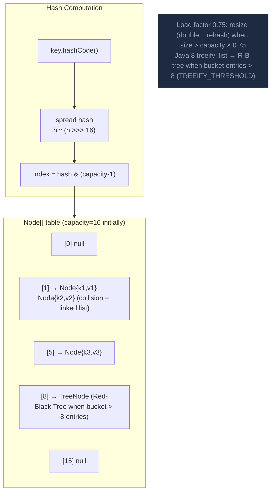

HashMap lưu cặp key-value trong mảng bucket, dùng hashCode() để tính index và equals() để giải quyết collision, với treeification (Java 8+) cho chain dài.

## Điểm Chính

- Mảng bucket <code>Node&lt;K,V&gt;</code>. Bucket index = <code>hash(key) & (capacity-1)</code>.
- Collision: node cùng bucket tạo thành linked list. Khi chain length ≥ 8 VÀ capacity ≥ 64, chuyển thành <code>TreeNode</code> (red-black tree) — worst case O(log n).
- Load factor mặc định 0.75; khi size > capacity×0.75, bảng được nhân đôi (rehashing, O(n)).
- <code>hashCode()</code> và <code>equals()</code> phải nhất quán — vi phạm gây mất entry.
- <strong>Không thread-safe</strong>. Dưới concurrent modification, có thể rơi vào vòng lặp vô hạn (Java 7) hoặc ConcurrentModificationException.
- Dùng <code>LinkedHashMap</code> để iterate theo thứ tự insertion, <code>TreeMap</code> cho key có thứ tự.

## Ví Dụ Code

*HashMap internals: equals/hashCode contract, pre-sizing, mutable key danger*

```java
import java.util.*;

// ---- HashMap internals ----
// 1. put(key, value): hash = key.hashCode() spread via (h ^ h>>>16)
//                     bucket index = hash & (capacity - 1)
// 2. Collision: bucket stores a linked list of Node<K,V>
// 3. When chain length >= 8 AND capacity >= 64: list → TreeNode (red-black tree) O(log n)
// 4. Load factor = 0.75: when size > capacity * 0.75, table doubles (rehash all entries)

// ---- Correct equals/hashCode for a domain key ----
// ProductKey represents a (category, sku) composite key used in catalog maps
public final class ProductKey {
    private final String categoryId;
    private final String sku;

    public ProductKey(String categoryId, String sku) {
        this.categoryId = Objects.requireNonNull(categoryId);
        this.sku        = Objects.requireNonNull(sku);
    }

    // hashCode must be consistent with equals:
    // if a.equals(b) then a.hashCode() == b.hashCode()
    @Override
    public int hashCode() {
        return Objects.hash(categoryId, sku);  // combines both fields
    }

    // equals must be reflexive, symmetric, transitive, consistent, null-safe
    @Override
    public boolean equals(Object o) {
        if (this == o) return true;                  // same reference
        if (!(o instanceof ProductKey other)) return false;
        return categoryId.equals(other.categoryId) && sku.equals(other.sku);
    }

    @Override public String toString() { return categoryId + "/" + sku; }
}

// ---- Using ProductKey as HashMap key ----
public class ProductCatalog {
    private final Map<ProductKey, Product> catalog = new HashMap<>();

    public void addProduct(Product product) {
        ProductKey key = new ProductKey(product.getCategoryId(), product.getSku());
        catalog.put(key, product);
    }

    public Optional<Product> findProduct(String categoryId, String sku) {
        // Works correctly because equals/hashCode are defined
        return Optional.ofNullable(catalog.get(new ProductKey(categoryId, sku)));
    }
}

// ---- Pre-size HashMap to avoid rehashing ----
// Expected 1000 entries, load factor 0.75 → initialCapacity = 1000 / 0.75 ≈ 1334
Map<ProductKey, Product> sizedMap = new HashMap<>(1334);

// ---- Common bug: mutable key ----
// NEVER mutate a key object after putting it in HashMap!
// Mutation changes hashCode → get() can no longer find the entry
```

## Ứng Dụng Thực Tế

Trong JPA entity, đừng bao giờ dùng ID tự generate làm cơ sở cho equals/hashCode trong entity được Hibernate quản lý — ID là null cho đến khi persist lần đầu. Dùng business key (UUID hoặc natural key) hoặc dùng surrogate ID một cách thận trọng.

## Câu Hỏi Phỏng Vấn

<details>
<summary><strong>HashMap hoạt động thế nào? Giải thích put() và get().</strong></summary>

**A:** `put(key, value)`: tính `hash = key.hashCode() ^ (hash >>> 16)` (spread bits), tính `index = hash & (capacity-1)`. Nếu bucket[index] trống → tạo Node mới. Nếu có collision → thêm vào linked list hoặc Red-Black tree (khi bucket > 8 entries). `get(key)`: tính index tương tự, traverse bucket chain so sánh bằng `equals()`. Độ phức tạp trung bình O(1), worst case O(log n) với tree bucket.

</details>

<details>
<summary><strong>HashMap không thread-safe vì sao? Chứng minh bằng ví dụ.</strong></summary>

**A:** Vì không có synchronization: (1) Resize race — hai thread cùng trigger resize, có thể tạo circular linked list (Java 7) gây infinite loop. (2) Visibility — một thread put() không đảm bảo thread khác thấy value mới (không có memory barrier). (3) Check-then-act race — `if(!map.containsKey(k)) map.put(k,v)` không atomic. Fix: `ConcurrentHashMap` cho concurrent access, `Collections.synchronizedMap()` cho synchronization thủ công (kém hơn), hoặc đảm bảo chỉ một thread access.

</details>

<details>
<summary><strong>Tại sao HashMap yêu cầu key phải implement equals() và hashCode() nhất quán?</strong></summary>

**A:** Contract: nếu `a.equals(b)` thì `a.hashCode() == b.hashCode()`. Nếu vi phạm: `put("key", v1)` và `get("key")` có thể return null vì hash khác nhau dẫn đến bucket khác nhau. Ngược lại không bắt buộc: hai object khác nhau có thể cùng hashCode (collision) — HashMap xử lý bằng equals() so sánh. Java record tự generate equals/hashCode nhất quán. IDE cũng có thể generate, nhưng nếu manually implement cần test kỹ.

</details>

<details>
<summary><strong>Treeify threshold (8) và untreeify threshold (6) tồn tại để làm gì?</strong></summary>

**A:** Khi bucket có > 8 entries → convert linked list sang Red-Black Tree: get() từ O(n) → O(log n). Khi entries giảm xuống < 6 (sau remove) → convert ngược lại sang linked list: tree có overhead memory lớn hơn (TreeNode vs Node). Hysteresis (8 và 6, không phải cùng threshold) tránh thrashing — liên tục convert qua lại khi size dao động quanh ngưỡng. Trong practice, nếu hash function tốt, bucket hầu như không bao giờ có > 8 entries.

</details>

## Sơ Đồ HashMap Internal Structure


