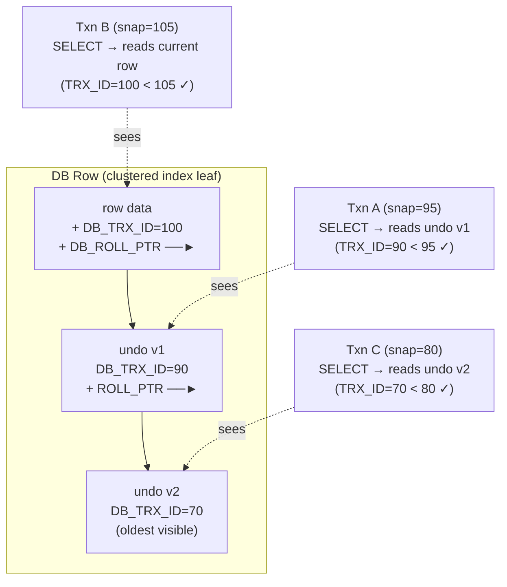

InnoDB tổ chức data trong clustered index (row lưu theo thứ tự PK trên disk), dùng MVCC cho read đồng thời mà không block writer, và duy trì redo/undo log cho crash recovery và read consistency.

## Điểm Chính

- <strong>Clustered index</strong>: InnoDB lưu row theo B-tree sắp xếp theo primary key. Secondary index lưu giá trị PK, không phải row pointer.
- <strong>MVCC</strong>: mỗi row có hidden version column (transaction ID, rollback pointer). Reader thấy snapshot nhất quán mà không block writer.
- <strong>Undo log</strong>: lưu version cũ của row cho MVCC snapshot read và rollback. Transaction dài tạo undo log lớn.
- <strong>Redo log</strong> (iblogfile): Write-Ahead Log cho crash recovery. Change bền vững khi ghi vào đây, trước khi flush page.
- Row locking trong InnoDB thực ra là <em>index-entry locking</em> — query không dùng index sẽ lock cả bảng.
- <strong>Next-key lock</strong> (gap lock + row lock): ngăn phantom read ở REPEATABLE READ (default isolation MySQL).
- UUID làm PK là anti-pattern: insert ngẫu nhiên gây B-tree page split và I/O disk cao. Ưu tiên BIGINT AUTO_INCREMENT.

## Ví Dụ Code

*Clustered index design và MVCC concurrency*

```sql
-- Tốt: BIGINT AUTO_INCREMENT PK — insert sequential, ít page split
CREATE TABLE orders (
    id          BIGINT AUTO_INCREMENT PRIMARY KEY,
    user_id     BIGINT       NOT NULL,
    status      VARCHAR(20)  NOT NULL DEFAULT 'PENDING',
    total       DECIMAL(12,2),
    created_at  DATETIME     DEFAULT CURRENT_TIMESTAMP,
    INDEX idx_user_id (user_id),
    INDEX idx_status_created (status, created_at)
);

-- MVCC: read và write đồng thời, không block nhau
-- Session A (đọc lâu)
START TRANSACTION;
SELECT COUNT(*) FROM orders WHERE status='PENDING'; -- snapshot lúc txn bắt đầu

-- Session B (ghi đồng thời — KHÔNG block Session A)
INSERT INTO orders(user_id, status, total) VALUES(42, 'PENDING', 99.9);
COMMIT;

-- Session A vẫn thấy count cũ (MVCC snapshot)
SELECT COUNT(*) FROM orders WHERE status='PENDING'; -- kết quả như cũ!
COMMIT;

-- Xem InnoDB status và lock info
SHOW ENGINE INNODB STATUS;
SELECT * FROM information_schema.INNODB_TRX;
SELECT * FROM performance_schema.data_locks;
```

## Ứng Dụng Thực Tế

Lỗi phổ biến nhất InnoDB: dùng UUID (v4) làm primary key. UUID ngẫu nhiên insert khắp B-tree, gây page split và IOPS disk tăng vọt. Nếu cần ID unique toàn cầu, dùng UUIDv7 (có thứ tự) hoặc Snowflake-style BIGINT. REPEATABLE READ của InnoDB dùng MVCC cho SELECT nhưng dùng next-key lock cho UPDATE/DELETE — cân nhắc khi thiết kế transaction.

## Câu Hỏi Phỏng Vấn

<details>
<summary><strong>MVCC cho phép reader và writer không block nhau thế nào?</strong></summary>

**A:** Mỗi row InnoDB có hidden: DB_TRX_ID (transaction ID tạo/modify version này) và DB_ROLL_PTR (pointer đến undo log version cũ). Khi transaction bắt đầu, JVM ghi lại "read view" — snapshot của active transactions. Reader tìm row version có DB_TRX_ID < min active transaction ID (đã committed trước snapshot). Writer tạo version mới và append vào undo log chain, không overwrite. Kết quả: reader thấy consistent snapshot, writer không block reader và ngược lại.

</details>

<details>
<summary><strong>Tại sao transaction dài gây vấn đề với undo log?</strong></summary>

**A:** Undo log lưu tất cả version cũ cho MVCC. Transaction dài (chạy hàng giờ) giữ read view tại thời điểm bắt đầu — MySQL không thể purge undo log của các version cũ hơn read view này. Kết quả: undo log tăng không giới hạn, ibdata1 (tablespace) phình to, query chậm hơn do phải traverse undo chain dài. InnoDB metrics: `SHOW ENGINE INNODB STATUS` — check "History list length". Rule: giữ transaction ngắn, không để open transaction qua user interaction.

</details>

## Sơ Đồ MVCC Version Chain


