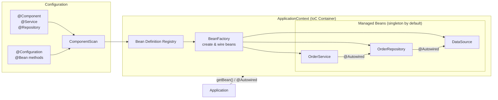

IoC container đọc configuration metadata, khởi tạo bean, wiring dependency và quản lý vòng đời — tách rời việc tạo object khỏi business logic.

## Điểm Chính

- <code>BeanFactory</code>: lazy-load bean, tối giản; dùng trong môi trường hạn chế tài nguyên.
- <code>ApplicationContext</code>: mở rộng BeanFactory với event, i18n, tích hợp AOP, eager singleton instantiation.
- Nguồn cấu hình: annotation (<code>@Component</code>), Java config (<code>@Configuration</code>), hoặc XML.
- <code>@ComponentScan</code>: chỉ Spring quét package nào để tìm component có annotation.
- Bean mặc định là singleton; các scope khác: prototype, request, session.

## Ví Dụ Code

*ApplicationContext: programmatic access, ComponentScan, BeanFactory vs ApplicationContext, circular dep fix*

```java
import org.springframework.context.*;
import org.springframework.context.annotation.*;
import org.springframework.boot.SpringApplication;
import org.springframework.boot.autoconfigure.SpringBootApplication;

// ---- ApplicationContext: the IoC container that manages all beans ----
@SpringBootApplication   // = @Configuration + @EnableAutoConfiguration + @ComponentScan
public class OrderApp {
    public static void main(String[] args) {
        // Boot creates ApplicationContext, scans components, wires all beans
        ApplicationContext ctx = SpringApplication.run(OrderApp.class, args);

        // --- Accessing beans programmatically (for demo; avoid in production) ---
        // By type — preferred, type-safe
        OrderService orderService = ctx.getBean(OrderService.class);

        // By name — use when multiple beans of same type exist
        PaymentGateway stripeGateway = (PaymentGateway) ctx.getBean("stripePaymentGateway");

        // Check if bean exists before fetching (avoids NoSuchBeanDefinitionException)
        if (ctx.containsBean("featureFlagService")) {
            ctx.getBean("featureFlagService");
        }

        // List all registered bean names (useful for debugging what's in the context)
        System.out.println("=== Registered beans ===");
        Arrays.stream(ctx.getBeanDefinitionNames())
              .sorted()
              .forEach(System.out::println);
    }
}

// ---- ApplicationContext vs BeanFactory ----
// BeanFactory: lazy instantiation, minimal feature set — for constrained environments
// ApplicationContext: eager singleton init + events + i18n + AOP + env abstraction
// In practice: always use ApplicationContext (SpringApplication creates one automatically)

// ---- @ComponentScan: tells Spring which packages to scan for @Component classes ----
@Configuration
@ComponentScan(basePackages = {
    "com.example.order.service",    // scans @Service classes
    "com.example.order.repository", // scans @Repository classes
    "com.example.order.web"         // scans @Controller / @RestController classes
})
public class ScanConfig {
    // Manual config — not needed in @SpringBootApplication (it scans from main class package)
}

// ---- Circular dependency resolution ----
// Constructor injection causes BeanCurrentlyInCreationException for circular deps.
// Solution: break the cycle with @Lazy on one injection point
@Service
public class NotificationService {
    private final OrderService orderService;
    // @Lazy defers proxy creation — avoids circular init error
    public NotificationService(@Lazy OrderService orderService) {
        this.orderService = orderService;
    }
}
```

## Ứng Dụng Thực Tế

Đừng bao giờ inject <code>ApplicationContext</code> vào bean để tra cứu bean khác (Service Locator anti-pattern). Thay vào đó, khai báo dependency trực tiếp và để container inject chúng.

## Câu Hỏi Phỏng Vấn

<details>
<summary><strong>IoC và Dependency Injection khác nhau thế nào?</strong></summary>

**A:** IoC (Inversion of Control) là principle: control flow được đảo ngược — framework gọi code bạn, không phải bạn gọi framework. DI (Dependency Injection) là một implementation pattern của IoC: dependencies được "inject" từ bên ngoài vào object thay vì object tự tạo. Trong Spring: IoC Container quản lý object lifecycle và wiring. DI là cơ chế container dùng để wire dependencies (`@Autowired`, constructor injection). IoC có thể implement theo cách khác (Template Method, Event listener) không phải DI.

</details>

<details>
<summary><strong>BeanFactory và ApplicationContext khác nhau thế nào?</strong></summary>

**A:** BeanFactory: lazy initialization (bean chỉ tạo khi getBean() được gọi), lightweight, chỉ cung cấp basic DI. ApplicationContext: extends BeanFactory, eager initialization (singleton beans tạo ngay khi container start), hỗ trợ thêm: i18n (MessageSource), event publishing (ApplicationEvent), AOP auto-proxy, @PropertySource. Trong production luôn dùng ApplicationContext (AnnotationConfigApplicationContext, SpringApplication). BeanFactory hiếm khi cần trực tiếp — chỉ cho extremely memory-constrained environment.

</details>

<details>
<summary><strong>@Component, @Service, @Repository khác nhau gì ngoài tên?</strong></summary>

**A:** Về function: đều là stereotype annotation đánh dấu class là Spring-managed bean. Khác nhau: @Repository tự động translate persistence exception (DataAccessException) — SQLException, Hibernate exception → Spring's DataAccessException hierarchy. @Service: semantic label cho business logic layer. @Component: generic stereotype. @Controller: thêm request mapping capability. Dùng đúng stereotype cho: (1) exception translation tự động với @Repository, (2) code readability và layer separation.

</details>

## Sơ Đồ IoC Container & Dependency Injection


