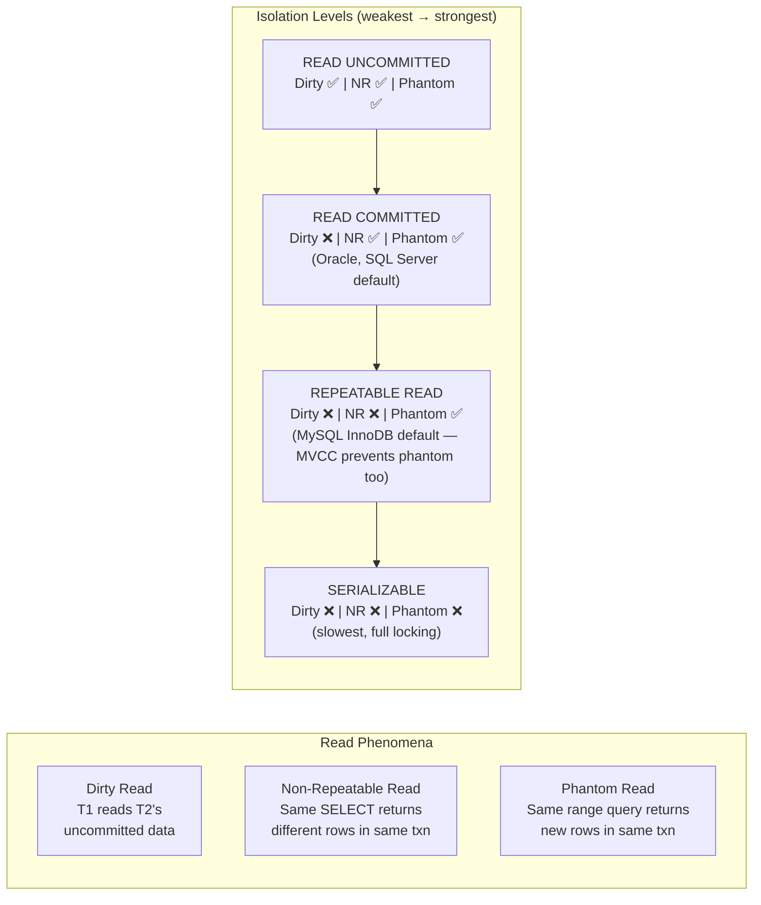

Isolation level đánh đổi consistency lấy concurrency — isolation cao hơn ngăn nhiều anomaly hơn nhưng giảm throughput qua locking tăng hoặc MVCC overhead.

## Điểm Chính

- <strong>READ UNCOMMITTED</strong>: cho phép dirty read (thấy thay đổi chưa commit của transaction khác). Hiếm dùng.
- <strong>READ COMMITTED</strong> (mặc định PostgreSQL): không dirty read; non-repeatable read có thể xảy ra.
- <strong>REPEATABLE READ</strong>: cùng hàng trả về cùng giá trị trong transaction; phantom read có thể (MySQL) hoặc không (PostgreSQL với MVCC).
- <strong>SERIALIZABLE</strong>: transaction xuất hiện như thực thi tuần tự; ngăn tất cả anomaly. Chi phí cao nhất.
- Anomaly: <em>Dirty read</em> (đọc uncommitted), <em>Non-repeatable read</em> (hàng thay đổi giữa hai lần đọc), <em>Phantom read</em> (hàng mới xuất hiện).

## Ví Dụ Code

*Tất cả 4 isolation levels: anomaly matrix + SQL examples + Spring @Transactional*

```sql
-- ✅ Anomaly reference: what each isolation level prevents
-- Level              | Dirty Read | Non-Repeatable Read | Phantom Read
-- READ UNCOMMITTED   |     ❌     |         ❌          |      ❌
-- READ COMMITTED     |     ✅     |         ❌          |      ❌   ← PostgreSQL default
-- REPEATABLE READ    |     ✅     |         ✅          |  ✅ (PG MVCC) / ❌ (MySQL)
-- SERIALIZABLE       |     ✅     |         ✅          |      ✅   ← strictest

-- ✅ READ COMMITTED (default): each statement sees freshly committed data
-- Suitable for: most CRUD operations, order placement
BEGIN TRANSACTION ISOLATION LEVEL READ COMMITTED;
  SELECT stock FROM products WHERE id = 99;  -- reads committed value at this moment
  -- Another transaction commits a stock change here
  SELECT stock FROM products WHERE id = 99;  -- may return DIFFERENT value (non-repeatable read)
COMMIT;

-- ✅ REPEATABLE READ: snapshot taken at transaction start — reads are stable
-- Suitable for: checkout flow that reads then updates based on the same data
BEGIN TRANSACTION ISOLATION LEVEL REPEATABLE READ;
  SELECT stock FROM products WHERE id = 99;  -- snapshot: 10
  -- Another transaction commits stock = 8 here
  SELECT stock FROM products WHERE id = 99;  -- still 10 (PostgreSQL MVCC snapshot)
  UPDATE products SET stock = stock - 2 WHERE id = 99 AND stock >= 2;
COMMIT;

-- ✅ SERIALIZABLE: strictest — transactions appear to run one-at-a-time
-- Suitable for: financial aggregates, balance sheets, concurrent booking
BEGIN TRANSACTION ISOLATION LEVEL SERIALIZABLE;
  SELECT SUM(total) FROM orders WHERE customer_id = 42;   -- consistent aggregate
  -- No phantom rows can appear mid-transaction
  INSERT INTO order_summary(customer_id, lifetime_value) VALUES (42, (SELECT SUM(total)...));
COMMIT;  -- if conflict detected → ERROR: could not serialize access → retry

-- ✅ Spring: per-method isolation
@Transactional(isolation = Isolation.REPEATABLE_READ)
public CheckoutResult checkout(Long orderId) { /* reads + updates in one snapshot */ }

@Transactional(isolation = Isolation.SERIALIZABLE)
public FinancialReport generateReport(Long customerId) { /* consistent across all reads */ }
```

## Ứng Dụng Thực Tế

Dùng READ COMMITTED (mặc định) cho hầu hết thao tác. Dùng REPEATABLE READ cho báo cáo đọc cùng dữ liệu nhiều lần. Dùng SERIALIZABLE cho thao tác tài chính quan trọng nơi phantom read gây không nhất quán. Monitor lỗi serialization và implement retry logic.

## Câu Hỏi Phỏng Vấn

<details>
<summary><strong>Dirty read, non-repeatable read, phantom read là gì? Ví dụ cụ thể.</strong></summary>

**A:** **Dirty read**: T1 đọc data chưa commit của T2. T2 rollback → T1 đã dùng data không bao giờ tồn tại. **Non-repeatable read**: T1 SELECT row → T2 UPDATE và COMMIT → T1 SELECT lại cùng row → giá trị khác. **Phantom read**: T1 SELECT COUNT WHERE age>18 → T2 INSERT user mới age=20 và COMMIT → T1 SELECT lại → count khác. InnoDB REPEATABLE READ ngăn cả phantom read bằng next-key lock — khác với SQL standard chỉ ngăn non-repeatable read.

</details>

<details>
<summary><strong>Tại sao MySQL REPEATABLE READ là default thay vì READ COMMITTED?</strong></summary>

**A:** REPEATABLE READ là default trong MySQL InnoDB vì lý do lịch sử liên quan đến binlog-based replication. Với STATEMENT-based replication, READ COMMITTED có thể gây inconsistency giữa master và replica trong một số pattern. ROW-based replication (default MySQL 8) không có vấn đề này, nên nhiều app có thể safely dùng READ COMMITTED để giảm lock contention. PostgreSQL default là READ COMMITTED. Trong Spring: `@Transactional(isolation = Isolation.READ_COMMITTED)` để override.

</details>

## Sơ Đồ Isolation Levels & Read Phenomena


