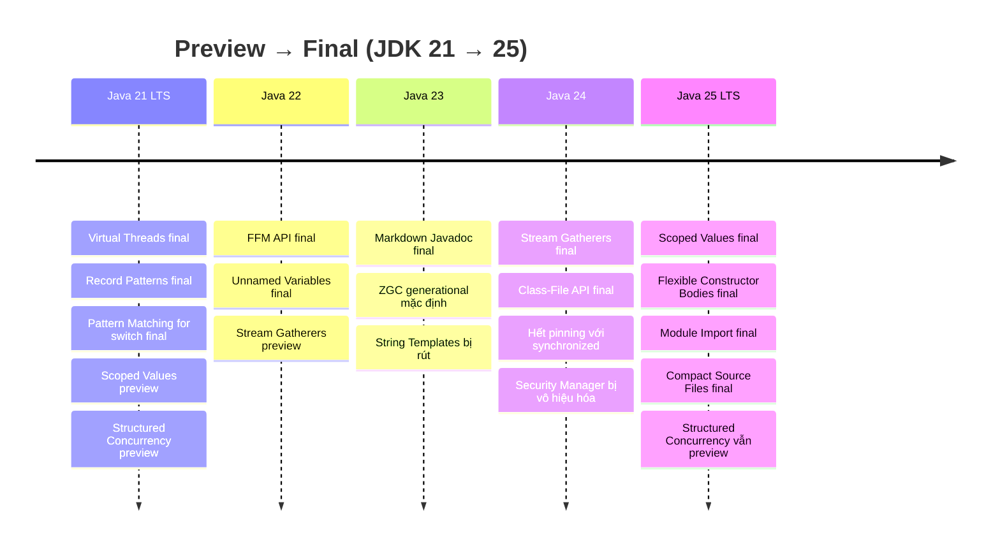

Java 22–25 finalize dần các feature từ thời preview của Java 21 và cải thiện runtime (virtual thread, GC, startup). Java 25 (GA 16/09/2025) là LTS tiếp theo sau Java 21. Lưu ý quan trọng khi đọc tài liệu: rất nhiều feature đi qua **3–5 vòng preview** — chỉ những mục ghi *final* dưới đây mới dùng được mà không cần `--enable-preview`.

## Điểm Chính

**Java 22 (03/2024)**
- <strong>Final</strong>: Foreign Function & Memory API (JEP 454) — thay JNI; Unnamed Variables & Patterns `_` (JEP 456); Launch Multi-File Source-Code Programs (JEP 458); Region Pinning cho G1 (JEP 423).
- Preview: Statements before `super(...)` (447), Stream Gatherers (461), Class-File API (457), String Templates lần 2 (459), Structured Concurrency lần 2 (462), Scoped Values lần 2 (464).

**Java 23 (09/2024)**
- <strong>Final</strong>: Markdown Documentation Comments `///` (JEP 467); <strong>ZGC chạy generational mode mặc định</strong> (JEP 474).
- Preview: Primitive Types in Patterns (455), Module Import Declarations (476), Stream Gatherers lần 2 (473), Flexible Constructor Bodies lần 2 (482), Structured Concurrency lần 3 (480), Scoped Values lần 3 (481).
- <strong>String Templates bị rút</strong> — không còn xuất hiện từ JDK 23.

**Java 24 (03/2025)**
- <strong>Final</strong>: Stream Gatherers (JEP 485); Class-File API (JEP 484); <strong>Synchronize Virtual Threads without Pinning</strong> (JEP 491) — `synchronized` không còn pin virtual thread; Ahead-of-Time Class Loading & Linking (JEP 483); ZGC bỏ hẳn non-generational mode (JEP 490); <strong>Security Manager bị vô hiệu hóa vĩnh viễn</strong> (JEP 486); crypto kháng lượng tử ML-KEM (496) và ML-DSA (497).
- Preview: Structured Concurrency lần 4 (499), Scoped Values lần 4 (487), Flexible Constructor Bodies lần 3 (492), Module Import Declarations lần 2 (494), Primitive Types in Patterns lần 2 (488).
- Experimental: Compact Object Headers (450), Generational Shenandoah (404).

**Java 25 — LTS (09/2025)**
- <strong>Final</strong>: Scoped Values (JEP 506); Flexible Constructor Bodies (JEP 513); Module Import Declarations (JEP 511); Compact Source Files & Instance Main Methods (JEP 512); Key Derivation Function API (JEP 510); Compact Object Headers thành tính năng chính thức (JEP 519); Generational Shenandoah (JEP 521); AOT Command-Line Ergonomics (514) và AOT Method Profiling (515).
- <strong>Vẫn là preview</strong>: Structured Concurrency lần 5 (JEP 505 — API đổi sang `StructuredTaskScope.open()`), Primitive Types in Patterns lần 3 (507), Stable Values (502).
- Bỏ hẳn port 32-bit x86 (JEP 503).

## Ví Dụ Code

*Các feature đã final — chạy được trên Java 25 không cần flag*

```java
// ── Unnamed Variables & Patterns _ (Java 22, JEP 456) ────────
try {
    riskyOperation();
} catch (IOException _) {               // không cần đặt tên biến exception
    log.error("IO error occurred");
}

BiFunction<String, Integer, String> fn = (s, _) -> s.toUpperCase();

if (obj instanceof Point(var x, _)) {  // bỏ qua component không dùng
    System.out.println("X = " + x);
}

// ── Stream Gatherers (Java 24, JEP 485) ──────────────────────
import java.util.stream.Gatherers;

Stream.of(1, 2, 3, 4, 5, 6, 7)
    .gather(Gatherers.windowFixed(3))
    .toList();                           // [[1,2,3], [4,5,6], [7]]

Stream.of(1, 2, 3, 4, 5)
    .gather(Gatherers.windowSliding(3))
    .toList();                           // [[1,2,3], [2,3,4], [3,4,5]]

Stream.of(1, 2, 3, 4, 5)
    .gather(Gatherers.scan(() -> 0, Integer::sum))
    .toList();                           // [1, 3, 6, 10, 15] — running sum

// Custom Gatherer: loại trùng, giữ thứ tự xuất hiện đầu tiên
Gatherer<String, ?, String> dedup = Gatherer.ofSequential(
    HashSet<String>::new,
    Gatherer.Integrator.ofGreedy((seen, element, downstream) -> {
        if (seen.add(element)) downstream.push(element);
        return true;
    })
);
Stream.of("a", "b", "a", "c", "b").gather(dedup).toList(); // [a, b, c]

// ── Scoped Values (Java 25, JEP 506) ─────────────────────────
// Thay ThreadLocal cho dữ liệu "theo request": immutable, tự hết hạn khi ra khỏi scope,
// rẻ khi dùng với hàng triệu virtual thread
static final ScopedValue<User> CURRENT_USER = ScopedValue.newInstance();

void handle(Request req) {
    ScopedValue.where(CURRENT_USER, authenticate(req))
               .run(() -> orderService.placeOrder(req.body()));
}

void audit() {
    User user = CURRENT_USER.get();      // đọc được ở mọi tầng bên dưới, không cần truyền tham số
}

// ── Flexible Constructor Bodies (Java 25, JEP 513) ───────────
class Child extends Base {
    Child(String s) {
        // Được phép validate / tính toán TRƯỚC super(...)
        // (không được đọc field của this trước khi super chạy xong)
        var value = Integer.parseInt(Objects.requireNonNull(s));
        super(value);
    }
}

// ── Module Import Declarations (Java 25, JEP 511) ────────────
import module java.base;   // import mọi package mà module java.base export

// ── Compact Source Files & Instance Main (Java 25, JEP 512) ──
// File Hello.java — không cần class, không cần static, không cần String[] args
void main() {
    IO.println("Hello, World!");         // java.lang.IO — không cần import
}
```

*Structured Concurrency — vẫn là preview ở Java 25 (JEP 505), API đã đổi so với Java 21–24*

```java
// Java 25 preview (javac --release 25 --enable-preview): mở scope bằng static factory
Response handle() throws InterruptedException {
    try (var scope = StructuredTaskScope.open()) {
        Subtask<String>  user  = scope.fork(() -> findUser());
        Subtask<Integer> order = scope.fork(() -> fetchOrder());
        scope.join();                    // mặc định: 1 subtask fail → cancel phần còn lại, join ném exception
        return new Response(user.get(), order.get());
    }
}

// Java 21–24 preview (API CŨ, không còn dùng được trên Java 25):
// try (var scope = new StructuredTaskScope.ShutdownOnFailure()) { ... scope.join().throwIfFailed(); }
```

## Ứng Dụng Thực Tế

**Nâng cấp từ Java 21 lên 25** đáng giá nhất vì 3 thay đổi runtime không cần sửa code: JEP 491 (hết pinning với `synchronized` — không còn phải thay `synchronized` bằng `ReentrantLock` khi dùng virtual thread), Compact Object Headers (JEP 519, bật bằng `-XX:+UseCompactObjectHeaders`, giảm kích thước header object → giảm heap), và AOT cache (JEP 483/514/515) giảm thời gian startup.

**Scoped Values** là cách truyền context (user, tenant, trace id) được khuyến nghị cho code dùng virtual thread — ThreadLocal vẫn chạy nhưng mutable và tốn bộ nhớ khi có hàng triệu thread.

**Không dùng preview feature trong production code** (Structured Concurrency, Primitive Types in Patterns trên Java 25): API có thể đổi giữa các bản — Structured Concurrency đã đổi hẳn cách mở scope ở Java 25.

**Java 25 LTS** là target hợp lý cho project mới; Spring Boot 4 chạy trên Java 17 trở lên và tương thích tới Java 26 (theo system requirements chính thức) — baseline tối thiểu không đổi so với Boot 3.

## Câu Hỏi Phỏng Vấn

<details>
<summary><strong>Tại sao String Templates bị rút sau nhiều vòng preview?</strong></summary>

**A:** String Templates preview ở JDK 21 (JEP 430) và JDK 22 (JEP 459), rồi bị rút hoàn toàn — không xuất hiện ở JDK 23. Lý do: cú pháp `STR."Hello \{name}"` dựa trên template processor gây tranh cãi về thiết kế và khả năng mở rộng, nên team Java chọn rút lại để thiết kế lại thay vì finalize một API chưa ổn. Đây là minh chứng rõ nhất cho việc preview feature có thể thay đổi hoặc biến mất — lý do không dùng preview trong production. Thay thế hiện tại: `String.formatted()`, `MessageFormat`, hoặc `StringBuilder`.

</details>

<details>
<summary><strong>Stream Gatherer khác map/filter/flatMap thế nào?</strong></summary>

**A:** `map`/`filter`/`flatMap` là intermediate operation stateless — mỗi phần tử xử lý độc lập. Gatherer (final ở Java 24, JEP 485) là intermediate operation **có state** và linh hoạt: (1) giữ state qua nhiều phần tử (sliding window, running sum, dedup), (2) một input sinh 0, 1 hoặc nhiều output, (3) dừng sớm (short-circuit), (4) hỗ trợ chạy song song nếu cung cấp combiner. Trước đây muốn chunk hay window phải `collect()` rồi stream lại, hoặc tự viết `Spliterator`.

</details>

<details>
<summary><strong>Security Manager ở Java 24 bị xóa hay bị vô hiệu hóa?</strong></summary>

**A:** Bị **vô hiệu hóa vĩnh viễn** (JEP 486), không phải xóa API. Deprecated for removal từ Java 17 (JEP 411). Từ Java 24: không thể bật Security Manager khi khởi động (`-Djava.security.manager` báo lỗi) và không thể cài lúc runtime (`System.setSecurityManager` ném `UnsupportedOperationException`); các class API vẫn còn để code cũ compile được và sẽ bị gỡ ở bản sau. Lý do: chi phí bảo trì cao, rất ít ứng dụng dùng, và cơ chế cô lập hiện đại nằm ở tầng OS/container (cgroups, seccomp) thay vì trong JVM.

</details>

<details>
<summary><strong>Dùng virtual thread trên Java 21 và Java 25 khác nhau gì?</strong></summary>

**A:** Trên Java 21–23, virtual thread bị **pin** vào carrier thread khi block bên trong `synchronized` → nếu nhiều request cùng block trong `synchronized` (ví dụ JDBC driver cũ, thư viện dùng `synchronized` quanh I/O), carrier pool cạn và throughput tụt. Cách xử lý khi đó: thay bằng `ReentrantLock`, theo dõi bằng `-Djdk.tracePinnedThreads`. Từ Java 24 (JEP 491), monitor được implement lại để virtual thread unmount được khi block trong `synchronized`; chỉ còn pin ở trường hợp hiếm (class loading, class initializer, native frame). Trên Java 25, Scoped Values cũng đã final — nên đây là bản "hoàn chỉnh" hơn để chạy virtual thread ở production.

</details>

<details>
<summary><strong>Làm sao biết một feature Java đã final hay còn preview?</strong></summary>

**A:** Nguồn chuẩn là trang release của OpenJDK (`openjdk.org/projects/jdk/<version>/`) — tiêu đề JEP ghi rõ "(Preview)", "(Second Preview)", "(Incubator)" hoặc "(Experimental)"; không có hậu tố nghĩa là final. Khi compile, dùng preview feature mà thiếu `--enable-preview --release <N>` sẽ báo lỗi. Đừng dựa vào blog hay tổng hợp, vì feature thường mất 3–5 bản mới final (ví dụ Structured Concurrency preview từ Java 21 đến 25 vẫn chưa final).

</details>

## Sơ Đồ Timeline Feature


