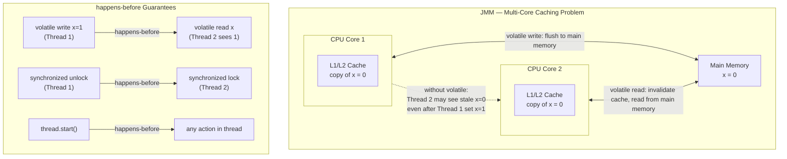

JMM định nghĩa cách thread tương tác qua memory — cụ thể giá trị nào một lần đọc được phép thấy — qua quan hệ happens-before và synchronization action.

## Điểm Chính

- JMM cho phép CPU/compiler sắp xếp lại lệnh để tối ưu, trừ khi bị ràng buộc bởi happens-before.
- <strong>happens-before</strong>: nếu A happens-before B, thì ghi của A hiển thị với B.
- Nguồn của happens-before: release/acquire <code>synchronized</code>, ghi/đọc <code>volatile</code>, <code>Thread.start()</code>/<code>join()</code>.
- Không có synchronization, thread có thể thấy object cũ hoặc chưa được khởi tạo đầy đủ.
- Safe publication: object được publish an toàn khi tham chiếu của nó được chia sẻ qua cơ chế đồng bộ hóa.

## Ví Dụ Code

*JMM: partial construction hazard, volatile for config + safe publication via final*

```java
// ---- Java Memory Model: why shared mutable state is dangerous ----
//
// JMM allows CPU and compiler to:
//  1. Cache variable values in CPU registers / L1-L2 cache (visibility problem)
//  2. Reorder instructions for performance (ordering problem)
//
// Without explicit synchronization, threads CAN see stale or partially-written state.

// ---- Example 1: partially constructed Order ----
// Thread A (writer):         Thread B (reader):
// order = new Order(...);    if (order != null) {
//                                process(order.getTotal()); // MAY crash!
//                            }
//
// Why: CPU may publish 'order' reference BEFORE fully constructing the object.
// Thread B sees non-null reference but reads uninitialized fields → NPE or corrupt data.

// FIX 1: volatile reference ensures full construction is visible before reference is published
public class OrderPublisher {
    private volatile Order latestOrder = null;    // volatile: write barriers around assignment

    public void publishOrder(Order order) {
        // All writes to 'order' fields happen-before the volatile write of 'latestOrder'
        this.latestOrder = order;   // volatile write — flushes all previous writes to main memory
    }

    public Order getLatestOrder() {
        return latestOrder;         // volatile read — sees the fully constructed order
    }
}

// ---- Example 2: configuration reload — stale read ----
public class OrderConfig {
    // Without volatile: worker threads may cache this in CPU register
    // and never see the updated value even after admin thread writes it
    private volatile double taxRate = 0.1;

    // Admin thread: called once when config changes
    public void setTaxRate(double rate) {
        this.taxRate = rate;   // volatile write: visible to ALL threads immediately
    }

    // Worker threads: called for every order calculation
    public double getTaxRate() {
        return taxRate;        // volatile read: always reads from main memory
    }
}

// ---- Example 3: initialization published unsafely (BROKEN) ----
class UnsafeOrderCache {
    private List<Order> cache;                     // NOT volatile

    public void init() {
        cache = loadAllOrders();                   // Thread A writes
    }

    public List<Order> getCache() {
        return cache;                              // Thread B may see null or partial list!
    }
}

// FIX 2: final field — JMM guarantees final fields are fully visible after constructor
class SafeOrderCache {
    private final List<Order> cache;               // final: safe publication guarantee

    public SafeOrderCache() {
        this.cache = loadAllOrders();              // written once in constructor
    }                                              // all writes visible to any reader after construction

    public List<Order> getCache() { return cache; }
}
```

## Ứng Dụng Thực Tế

JMM là lý do bạn cần <code>volatile</code> hoặc synchronization ngay cả cho flag đơn giản. Khi nghi ngờ, dùng cấu trúc cấp cao (<code>AtomicReference</code>, <code>ConcurrentHashMap</code>) vốn đã có đảm bảo JMM theo thiết kế.

## Câu Hỏi Phỏng Vấn

<details>
<summary><strong>happens-before relationship là gì?</strong></summary>

**A:** Nếu action A happens-before action B, thì tất cả write của A visible cho B và ordered trước B. Các quy tắc chính: volatile write happens-before volatile read trên cùng variable; synchronized unlock happens-before lock tiếp theo trên cùng monitor; `Thread.start()` happens-before mọi action trong thread đó; mọi action trong thread happens-before `thread.join()` return. Là nền tảng lý thuyết để biết khi nào code thread-safe mà không cần synchronization thêm.

</details>

<details>
<summary><strong>Tại sao double-checked locking với singleton cần volatile?</strong></summary>

**A:** Không có volatile: `instance = new Singleton()` có thể được JVM reorder thành: (1) allocate memory, (2) assign reference, (3) call constructor — thay vì thứ tự (1)(3)(2) mà lý trí mong đợi. Nếu thread khác thấy non-null reference trước khi constructor hoàn thành → sử dụng object chưa initialized. volatile đảm bảo assignment chỉ visible sau khi constructor hoàn thành. Java 5+ memory model (JSR-133) fix vấn đề này với volatile. Holder pattern (static inner class) là cách khác tránh vấn đề này.

</details>

## Sơ Đồ Java Memory Model


