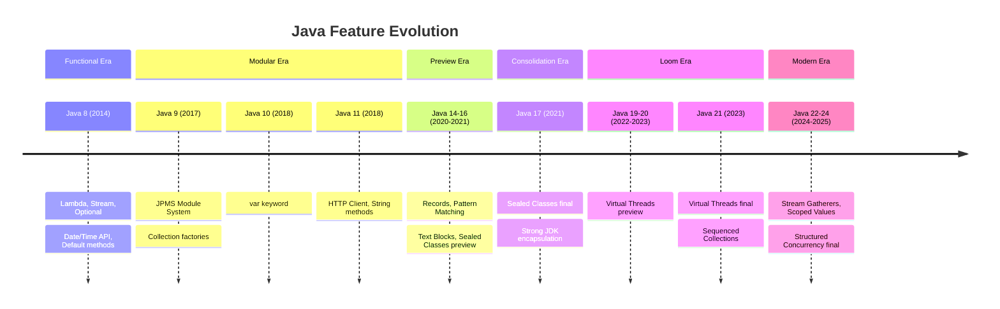

Tổng quan lịch sử phát hành Java từ Java 7 đến nay, tập trung vào các LTS release quan trọng nhất trong interview và production.

## Điểm Chính

- Java release cadence: từ 2017 (Java 9) chuyển sang **6 tháng/version** thay vì vài năm/version
- **LTS (Long-Term Support)**: được Oracle hỗ trợ 8+ năm — Java 8, 11, 17, 21, **25 (Sep 2025)**
- Non-LTS: hỗ trợ 6 tháng, chủ yếu dùng để preview feature trước khi vào LTS
- Hầu hết production dùng **Java 11, 17, hoặc 21**; Java 8 vẫn còn nhiều legacy

## Timeline Tổng Quan

| Version | Tháng phát hành | LTS? | Highlight |
|---------|-----------------|------|-----------|
| **Java 7** | Jul 2011 | ❌ | Diamond `<>`, try-with-resources, Fork/Join |
| **Java 8** | Mar 2014 | ✅ | Lambda, Stream, Optional, Date/Time API |
| Java 9 | Sep 2017 | ❌ | Module System (JPMS), JShell, `List.of()` |
| Java 10 | Mar 2018 | ❌ | `var` keyword |
| **Java 11** | Sep 2018 | ✅ | HTTP Client, String methods, remove Nashorn |
| Java 12 | Mar 2019 | ❌ | Switch expression (preview) |
| Java 13 | Sep 2019 | ❌ | Text Blocks (preview) |
| Java 14 | Mar 2020 | ❌ | Records (preview), Pattern instanceof (preview) |
| Java 15 | Sep 2020 | ❌ | Text Blocks (final), Sealed Classes (preview) |
| Java 16 | Mar 2021 | ❌ | Records (final), Pattern instanceof (final) |
| **Java 17** | Sep 2021 | ✅ | Sealed Classes (final), strong encapsulation |
| Java 18 | Mar 2022 | ❌ | UTF-8 default, Simple Web Server |
| Java 19 | Sep 2022 | ❌ | Virtual Threads (preview), Structured Concurrency |
| Java 20 | Mar 2023 | ❌ | Virtual Threads (second preview) |
| **Java 21** | Sep 2023 | ✅ | **Virtual Threads (final)**, Sequenced Collections, Record Patterns |
| Java 22 | Mar 2024 | ❌ | Unnamed Variables `_`, FFM API (final) |
| Java 23 | Sep 2024 | ❌ | Stream Gatherers (preview), Markdown Javadoc |
| Java 24 | Mar 2025 | ❌ | Stream Gatherers (final), Scoped Values (final) |
| **Java 25** | Sep 2025 | ✅ | Primitive Patterns, Module Imports |

## LTS Strategy

```
Java 8 ──────────────────────────────────────────▶ Extended Support
Java 11 ─────────────────────────────────▶ Extended Support
Java 17 ──────────────────────────▶
Java 21 ──────────────────▶
Java 25 ──────────▶
                   ↑ Đây là target cho greenfield project 2025+
```

**Recommendation theo năm:**
- Greenfield 2025: **Java 21** hoặc **Java 25**
- Enterprise legacy: Java 17 (ổn định, ecosystem trưởng thành)
- EOL sắp tới: Java 8 Oracle Extended Support kết thúc 2030

## Feature Evolution Summary



## Câu Hỏi Phỏng Vấn

<details>
<summary><strong>Tại sao nhiều công ty vẫn dùng Java 8 dù đã có Java 21?</strong></summary>

**A:** Java 8 có hệ sinh thái cực kỳ trưởng thành — frameworks, libraries, build tools đều stable. Migration cost cao: cần test toàn bộ, xử lý deprecated APIs, đặc biệt Java 9 JPMS breaking changes ảnh hưởng nhiều internal API dùng reflection. Rủi ro zero-day trong migration đối với enterprise là không chấp nhận được. Ngoài ra, Oracle Extended Support cho Java 8 vẫn còn đến 2030 nên không có áp lực khẩn cấp.

</details>

<details>
<summary><strong>Sự khác biệt giữa Java LTS và non-LTS là gì?</strong></summary>

**A:** LTS (Long-Term Support): Oracle cung cấp security patch và bug fix ít nhất 8 năm. Production-grade. Non-LTS: chỉ nhận update đến khi version tiếp theo ra (6 tháng). Non-LTS dùng để preview và finalize features trước khi vào LTS — nhiều feature được preview 2-3 version trước khi standard. Trong production, luôn chọn LTS trừ khi có lý do đặc biệt cần feature mới nhất.

</details>

<details>
<summary><strong>Tại sao Java chuyển sang 6-month release cadence từ Java 9?</strong></summary>

**A:** Trước Java 9, release theo feature-driven — khi nào project lớn (như JPMS) xong mới release, có thể mất 3-5 năm. Kết quả: features tích lũy nhiều, migration shock lớn (Java 8 → 9 rất breaking). Từ Java 9: time-based release 6 tháng cố định — feature ready thì vào, không ready thì chờ version sau. Benefit: release nhỏ hơn, incremental adoption, preview mechanism để community feedback trước khi finalize.

</details>
