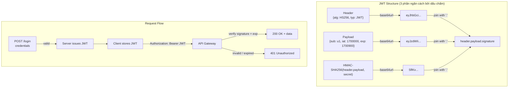

JWT là định dạng token compact, self-contained cho stateless authentication — payload JSON đã ký mà client đưa vào header Authorization.

## Điểm Chính

- Cấu trúc: <code>Header.Payload.Signature</code> (Base64URL-encoded, ngăn cách bằng dấu chấm).
- Header: thuật toán (<code>HS256</code>, <code>RS256</code>). Payload: claim (<code>sub</code>, <code>exp</code>, <code>roles</code>). Signature: chứng minh tính xác thực.
- <strong>HS256</strong>: symmetric — cùng secret để ký và xác minh. <strong>RS256</strong>: asymmetric — private key ký, public key xác minh.
- Stateless: server không lưu session; xác minh token mỗi request.
- Expiry: access token ngắn hạn (15 phút) + refresh token dài hạn (7 ngày).
- Không thể vô hiệu hóa token riêng lẻ đến khi hết hạn — dùng blocklist/Redis cho logout.

## Ví Dụ Code

*JWT: JwtAuthenticationFilter (OncePerRequestFilter) + JwtTokenProvider (generate/validate HS256) + AuthController login endpoint*

```java
import io.jsonwebtoken.*;
import io.jsonwebtoken.security.Keys;
import org.springframework.beans.factory.annotation.Value;
import org.springframework.security.core.userdetails.*;
import org.springframework.security.web.authentication.WebAuthenticationDetailsSource;
import org.springframework.web.filter.OncePerRequestFilter;

// ---- JWT Filter: validates token on every request ----
@Component
public class JwtAuthenticationFilter extends OncePerRequestFilter {

    private final JwtTokenProvider tokenProvider;
    private final UserDetailsService userDetailsService;

    public JwtAuthenticationFilter(JwtTokenProvider tokenProvider,
                                    UserDetailsService userDetailsService) {
        this.tokenProvider    = tokenProvider;
        this.userDetailsService = userDetailsService;
    }

    @Override
    protected void doFilterInternal(HttpServletRequest request,
                                    HttpServletResponse response,
                                    FilterChain filterChain) throws ServletException, IOException {
        String token = extractToken(request);

        // Only process if token exists and SecurityContext has no authentication yet
        if (token != null && SecurityContextHolder.getContext().getAuthentication() == null) {
            if (tokenProvider.validateToken(token)) {
                String username = tokenProvider.getUsername(token);
                UserDetails userDetails = userDetailsService.loadUserByUsername(username);

                UsernamePasswordAuthenticationToken auth =
                    new UsernamePasswordAuthenticationToken(
                        userDetails, null, userDetails.getAuthorities());
                // Attach request details (IP, session) to the authentication object
                auth.setDetails(new WebAuthenticationDetailsSource().buildDetails(request));

                // Store in SecurityContext — downstream controllers can call
                // SecurityContextHolder.getContext().getAuthentication() to get this
                SecurityContextHolder.getContext().setAuthentication(auth);
            }
            // If validateToken() fails: token is expired/tampered → no auth set → 401 from SecurityConfig
        }
        filterChain.doFilter(request, response);
    }

    // Extract "Bearer <token>" from Authorization header
    private String extractToken(HttpServletRequest request) {
        String header = request.getHeader("Authorization");
        return (header != null && header.startsWith("Bearer ")) ? header.substring(7) : null;
    }
}

// ---- JWT Token Provider: generate and validate tokens ----
@Component
public class JwtTokenProvider {

    @Value("${jwt.secret}")
    private String secret;                // 256-bit secret from env var / secrets manager

    @Value("${jwt.access-token-expiry-ms:900000}")   // 15 minutes default
    private long accessTokenExpiryMs;

    @Value("${jwt.refresh-token-expiry-ms:604800000}") // 7 days default
    private long refreshTokenExpiryMs;

    // Generate access token (short-lived — 15 min)
    public String generateAccessToken(UserDetails user) {
        return buildToken(user, accessTokenExpiryMs, "access");
    }

    // Generate refresh token (long-lived — 7 days)
    public String generateRefreshToken(UserDetails user) {
        return buildToken(user, refreshTokenExpiryMs, "refresh");
    }

    private String buildToken(UserDetails user, long expiryMs, String tokenType) {
        return Jwts.builder()
            .setSubject(user.getUsername())
            .claim("roles", user.getAuthorities().stream()
                .map(a -> a.getAuthority()).toList())
            .claim("type", tokenType)
            .setIssuedAt(new Date())
            .setExpiration(new Date(System.currentTimeMillis() + expiryMs))
            // HS256: symmetric — same secret signs and verifies (single-service setup)
            // For microservices: use RS256 — private key signs, public key verifies
            .signWith(Keys.hmacShaKeyFor(secret.getBytes()))
            .compact();
        // Result: "eyJhbGci....eyJzdWIi....SflKxwRJSMeKKF2Q"
        //          HEADER    PAYLOAD  SIGNATURE (Base64URL-encoded)
    }

    public String getUsername(String token) {
        return parseClaims(token).getSubject();
    }

    public boolean validateToken(String token) {
        try {
            parseClaims(token);
            return true;
        } catch (ExpiredJwtException e) {
            log.warn("JWT expired: {}", e.getMessage());
        } catch (JwtException e) {
            log.warn("Invalid JWT: {}", e.getMessage());
        }
        return false;
    }

    private Claims parseClaims(String token) {
        return Jwts.parserBuilder()
            .setSigningKey(Keys.hmacShaKeyFor(secret.getBytes()))
            .build()
            .parseClaimsJws(token)
            .getBody();
    }
}

// ---- AuthController: login endpoint that issues JWT ----
@RestController
@RequestMapping("/api/v1/auth")
public class AuthController {
    private final AuthenticationManager authManager;
    private final JwtTokenProvider      tokenProvider;
    private final UserDetailsService    userDetailsService;

    @PostMapping("/login")
    public ResponseEntity<TokenResponse> login(@RequestBody @Valid LoginRequest request) {
        // Throws BadCredentialsException if username/password don't match
        authManager.authenticate(
            new UsernamePasswordAuthenticationToken(request.email(), request.password()));

        UserDetails user = userDetailsService.loadUserByUsername(request.email());
        return ResponseEntity.ok(new TokenResponse(
            tokenProvider.generateAccessToken(user),
            tokenProvider.generateRefreshToken(user)
        ));
    }
}

record LoginRequest(@NotBlank String email, @NotBlank String password) {}
record TokenResponse(String accessToken, String refreshToken) {}
```

## Ứng Dụng Thực Tế

Lưu JWT secret trong env var hoặc AWS Secrets Manager, đừng bao giờ trong source code. Dùng RS256 trong microservice để service có thể xác minh token với public key mà không cần private key.

## Câu Hỏi Phỏng Vấn

<details>
<summary><strong>JWT stateless có nghĩa gì và ảnh hưởng gì đến security?</strong></summary>

**A:** Server không lưu session — mọi thông tin xác thực nằm trong token. Ưu điểm: horizontal scale dễ (không cần sticky session hay shared session store). Nhược điểm: không thể revoke token trước khi hết hạn — nếu token bị leak, valid đến hết exp. Mitigation: (1) Access token TTL ngắn (15 phút), refresh token dài hơn. (2) Refresh token rotation — mỗi lần refresh tạo pair mới, invalidate pair cũ. (3) Token blocklist trong Redis cho revocation (hy sinh stateless một phần).

</details>

<details>
<summary><strong>HS256 và RS256 khác nhau thế nào? Khi nào dùng loại nào?</strong></summary>

**A:** HS256 (HMAC-SHA256): symmetric — cùng secret key cho sign và verify. Tất cả service verify token phải có secret → secret phải share. RS256 (RSA-SHA256): asymmetric — private key ký, public key verify. Public key có thể publish (JWKS endpoint) → service khác verify mà không có private key. Dùng HS256 khi chỉ có một service issue và verify (monolith). Dùng RS256 trong microservices — Auth Server giữ private key, các service chỉ cần public key từ JWKS endpoint.

</details>

<details>
<summary><strong>Refresh token rotation là gì và tại sao cần?</strong></summary>

**A:** Mỗi khi dùng refresh token để lấy access token mới, server tạo refresh token mới và invalidate token cũ. Nếu refresh token bị steal: attacker dùng → rotate → victim dùng token cũ → server detect reuse → invalidate cả family token → cả attacker lẫn victim bị logout. Detect theft nhanh hơn. Implement: lưu refresh token family trong DB (Redis), khi detect reuse → revoke toàn bộ family. RFC 6749 recommends rotation nhưng không bắt buộc.

</details>

## Sơ Đồ JWT Structure & Request Flow


