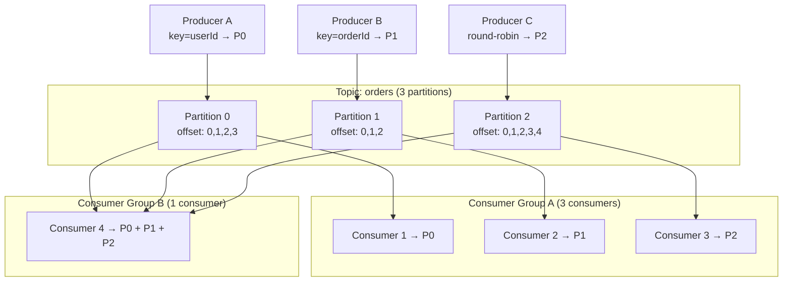

Kafka là nền tảng event streaming phân tán cung cấp message delivery throughput cao, fault-tolerant, có thứ tự với durable log storage và consumer group semantics.

## Điểm Chính

- Core: <strong>Topic</strong> (luồng logic), <strong>Partition</strong> (đơn vị parallelism), <strong>Offset</strong> (vị trí message).
- Producer ghi vào topic; Consumer đọc từ topic qua consumer group.
- Retention: message giữ trên disk trong khoảng thời gian cấu hình (mặc định 7 ngày) — replay được.
- Throughput cao: ghi disk tuần tự, zero-copy, batching, compression.
- Replication: mỗi partition có leader + replica cho fault tolerance.

## Ví Dụ Code

*Spring Kafka: async producer với error fallback + manual-ack consumer*

```java
// Spring Kafka: full producer + consumer for order-events
@Service
@RequiredArgsConstructor
public class OrderEventPublisher {
    private final KafkaTemplate<String, Object> kafkaTemplate;
    private final OutboxRepository outboxRepo;

    // orderId as key → all events for same order go to same partition (ordered)
    public void publishOrderCreated(OrderCreatedEvent event) {
        kafkaTemplate.send("order-events", event.getOrderId(), event)
            .whenComplete((result, ex) -> {
                if (ex != null) {
                    log.error("Failed to publish order-events: orderId={}", event.getOrderId(), ex);
                    // Fallback: persist to outbox table for retry
                    outboxRepo.save(new OutboxMessage("order-events", event));
                } else {
                    RecordMetadata meta = result.getRecordMetadata();
                    log.info("Published: orderId={} partition={} offset={}",
                        event.getOrderId(), meta.partition(), meta.offset());
                }
            });
    }
}

// Consumer: manual ack — offset committed only after successful processing
@Component
@RequiredArgsConstructor
public class InventoryConsumer {
    private final InventoryService inventoryService;

    @KafkaListener(topics = "order-events", groupId = "inventory-service",
                   containerFactory = "kafkaListenerContainerFactory")
    public void onOrderEvent(OrderCreatedEvent event,
            @Header(KafkaHeaders.RECEIVED_PARTITION) int partition,
            @Header(KafkaHeaders.OFFSET) long offset,
            Acknowledgment ack) {
        log.info("Consuming: orderId={} p={} o={}", event.getOrderId(), partition, offset);
        inventoryService.reserveStock(event); // process first
        ack.acknowledge();                    // then commit offset (at-least-once)
    }
}

// application.yml: strong guarantees config
// spring.kafka.producer.acks: all
// spring.kafka.producer.enable-idempotence: true
// spring.kafka.listener.ack-mode: manual
// spring.kafka.consumer.enable-auto-commit: false
```

## Ứng Dụng Thực Tế

Dùng Kafka cho: event sourcing, cross-service event streaming, activity feed, audit log, CDC (change data capture). Đặt <code>acks=all</code> và <code>enable.idempotence=true</code> trên producer cho exactly-once ở phía producer.

## Câu Hỏi Phỏng Vấn

<details>
<summary><strong>Kafka đảm bảo ordering ở mức nào?</strong></summary>

**A:** Kafka đảm bảo ordering **trong cùng partition** — messages với cùng partition key luôn đến consumer theo thứ tự. Không đảm bảo ordering **across partitions**. Ví dụ: tất cả events của userId=123 gửi với key="123" → luôn vào cùng partition → consumer thấy theo thứ tự. Nếu cần global ordering → dùng 1 partition (throughput thấp). Trade-off: nhiều partition = throughput cao = consumers nhiều = ordering không đảm bảo across partitions.

</details>

<details>
<summary><strong>Exactly-once semantics trong Kafka đạt được thế nào?</strong></summary>

**A:** Cần kết hợp: (1) **Idempotent Producer**: `enable.idempotence=true` — mỗi message có sequence number, broker deduplicate retry. (2) **Transactional Producer**: `transactional.id` — atomic write across partitions và consumer offset. (3) **Consumer**: đọc với `isolation.level=read_committed` — chỉ thấy committed message. Exactly-once có overhead: latency tăng, throughput giảm. Kafka Streams hỗ trợ EOS natively. Trong practice, at-least-once + idempotent consumer thường đủ tốt và đơn giản hơn.

</details>

<details>
<summary><strong>Consumer group rebalancing xảy ra khi nào và tác động gì?</strong></summary>

**A:** Rebalance trigger: consumer join/leave group, consumer heartbeat timeout, partition thay đổi (add/remove). Trong rebalance: tất cả consumer dừng consume (stop-the-world), group coordinator redistribute partitions. Tác động: latency spike, có thể duplicate processing (uncommitted offsets được reprocess). Minimize: tăng `session.timeout.ms`, dùng Static Membership (`group.instance.id`) — consumer reconnect với cùng assignment mà không trigger rebalance. Incremental Cooperative Rebalancing (Kafka 2.4+) chỉ reassign affected partitions.

</details>

## Sơ Đồ Kafka Architecture


