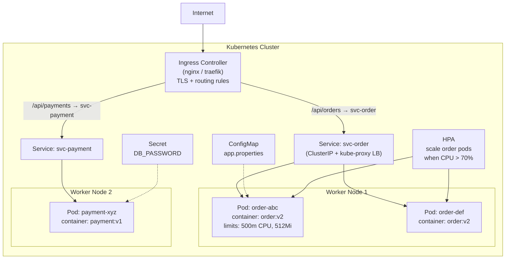

Kubernetes orchestrate containerized workload — schedule Pod lên Node, quản lý scaling và self-healing, cung cấp service discovery, config management và rolling deployment.

## Điểm Chính

- Core object: <strong>Pod</strong> (1+ container), <strong>Deployment</strong> (quản lý replica), <strong>Service</strong> (stable network endpoint), <strong>ConfigMap/Secret</strong>.
- Control plane: API Server, Scheduler, Controller Manager, etcd.
- Node: Kubelet (chạy pod), Kube-proxy (networking), container runtime.
- Self-healing: restart pod thất bại, reschedule trên node chết, kill pod không pass health check.
- kubectl: CLI tool chính. <code>kubectl get pods</code>, <code>describe</code>, <code>logs</code>, <code>exec</code>, <code>apply -f</code>.

## Ví Dụ Code

*K8s Deployment: topologySpreadConstraints, envFrom ConfigMap+Secret, liveness vs readiness probe, Prometheus annotations, resource requests/limits*

```bash
# ── order-service Kubernetes Deployment (production-grade) ──
apiVersion: apps/v1
kind: Deployment
metadata:
  name: order-service
  namespace: ecommerce
  labels: {app: order-service, version: v1.2.3}
spec:
  replicas: 3
  selector:
    matchLabels: {app: order-service}
  template:
    metadata:
      labels: {app: order-service, version: v1.2.3}
      annotations:
        prometheus.io/scrape: "true"         # Prometheus auto-discovers this pod
        prometheus.io/path: "/actuator/prometheus"
        prometheus.io/port:  "8080"
    spec:
      # Spread replicas across nodes — single node failure → still 2 replicas up
      topologySpreadConstraints:
      - maxSkew: 1
        topologyKey: kubernetes.io/hostname
        whenUnsatisfiable: DoNotSchedule
        labelSelector:
          matchLabels: {app: order-service}

      containers:
      - name: order-service
        image: myrepo/order-service:v1.2.3   # always use exact SHA or semver tag
        ports: [{containerPort: 8080}]
        envFrom:
        - configMapRef: {name: order-service-config}  # non-sensitive config
        - secretRef:    {name: order-service-secrets}  # DB password, JWT secret

        resources:
          requests: {cpu: "250m", memory: "512Mi"}   # Scheduler uses this for placement
          limits:   {cpu: "500m", memory: "1Gi"}     # OOM kill threshold

        # livenessProbe: restart container if JVM is hung/deadlocked
        livenessProbe:
          httpGet: {path: /actuator/health/liveness, port: 8080}
          initialDelaySeconds: 45    # allow JVM + Spring context warmup
          periodSeconds: 10
          failureThreshold: 3

        # readinessProbe: remove pod from Service endpoints if not ready
        # (e.g., DB connection pool exhausted, downstream dependency down)
        readinessProbe:
          httpGet: {path: /actuator/health/readiness, port: 8080}
          initialDelaySeconds: 30
          periodSeconds: 5
          failureThreshold: 3
```

## Ứng Dụng Thực Tế

Luôn đặt resource <code>requests</code> và <code>limits</code> — nếu không, HPA không thể tính utilization và pod có thể được schedule trên node quá tải. Map Spring Boot Actuator health endpoint với liveness/readiness probe.

## Câu Hỏi Phỏng Vấn

<details>
<summary><strong>Pod và Container khác nhau thế nào?</strong></summary>

**A:** Container: isolated process với own filesystem, network namespace. Pod: smallest deployable unit trong K8s — một hoặc nhiều containers share cùng network namespace (cùng IP, port space) và storage volumes. Containers trong cùng Pod communicate qua localhost. Pod là ephemeral — không persist sau crash, Deployment tạo Pod mới. Multi-container Pod dùng cho: sidecar (logging agent, service mesh proxy), init containers (database migration trước khi main container start).

</details>

<details>
<summary><strong>Liveness probe và Readiness probe khác nhau như thế nào?</strong></summary>

**A:** **Liveness**: kiểm tra app có đang running không. Fail → K8s restart container. Dùng cho: deadlock detection, hung process. Endpoint: `/actuator/health/liveness`. **Readiness**: kiểm tra app có sẵn sàng nhận traffic không. Fail → K8s remove pod khỏi Service endpoints (không route traffic). Dùng khi: app đang warmup, cache loading, DB connection không sẵn sàng. Endpoint: `/actuator/health/readiness`. Startup probe (K8s 1.16+): cho slow-starting app — disable liveness check trong startup period để tránh restart loop.

</details>

<details>
<summary><strong>ConfigMap và Secret khác nhau thế nào?</strong></summary>

**A:** ConfigMap: non-sensitive configuration (app.properties, feature flags) — stored plaintext trong etcd. Secret: sensitive data (passwords, API keys, certificates) — base64 encoded (không encrypted by default). Để thực sự secure Secrets: bật etcd encryption at rest, dùng Sealed Secrets hoặc External Secrets Operator (pull từ AWS Secrets Manager / HashiCorp Vault). Secret inject vào Pod: environment variable (`secretKeyRef`) hoặc volume mount (file — prefer vì không expose trong `kubectl describe pod`).

</details>

## Sơ Đồ Kubernetes Topology


