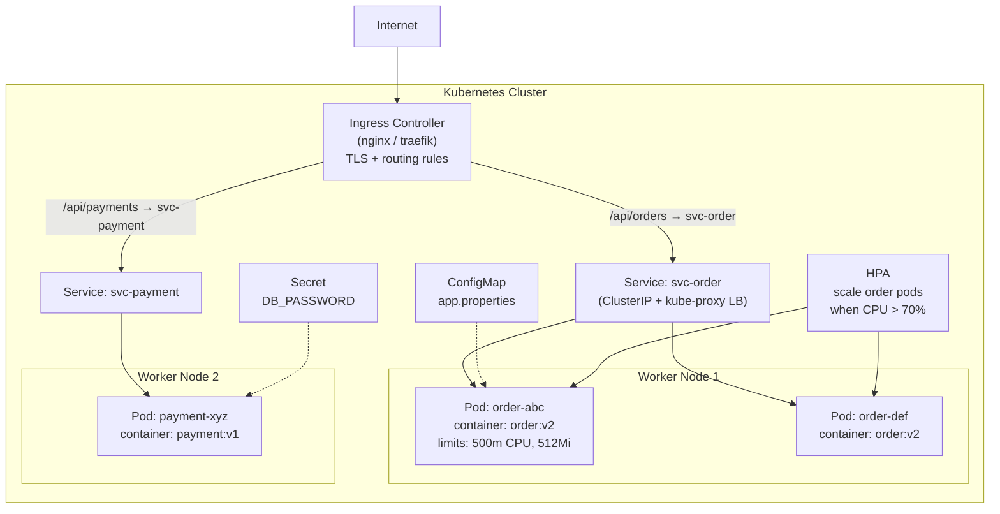

Kubernetes orchestrate containerized workload — schedule Pod lên Node, quản lý scaling và self-healing, cung cấp service discovery, config management và rolling deployment.

## Điểm Chính

- Core object: <strong>Pod</strong> (1+ container), <strong>Deployment</strong> (quản lý replica), <strong>Service</strong> (stable network endpoint), <strong>ConfigMap/Secret</strong>.
- Control plane: API Server, Scheduler, Controller Manager, etcd.
- Node: Kubelet (chạy pod), Kube-proxy (networking), container runtime.
- Self-healing: restart pod thất bại, reschedule trên node chết, kill pod không pass health check.
- kubectl: CLI tool chính. <code>kubectl get pods</code>, <code>describe</code>, <code>logs</code>, <code>exec</code>, <code>apply -f</code>.

## Toàn Bộ K8s Objects Cần Biết

### Workload

| Object | Dùng khi nào |
|--------|-------------|
| **Pod** | Unit nhỏ nhất — hiếm khi tạo thủ công |
| **ReplicaSet** | Đảm bảo đúng số pod running — Deployment tự quản lý, không cần tạo tay |
| **Deployment** | Stateless app, rolling update, rollback |
| **StatefulSet** | Stateful app (database, Kafka) — pod có stable name (`pod-0`, `pod-1`), stable storage per pod |
| **DaemonSet** | Chạy đúng 1 pod trên **mỗi node** — log collector, monitoring agent, network plugin |
| **Job** | Chạy đến khi hoàn thành — batch processing, data migration |
| **CronJob** | Job theo lịch (`0 2 * * *`) |

> **StatefulSet vs Deployment**: StatefulSet pod có tên cố định (`mysql-0`, `mysql-1`), xóa theo thứ tự ngược, có PVC riêng per pod. Deployment pod tên random (`mysql-abc123`), interchangeable.

### Networking

| Object | Vai trò |
|--------|---------|
| **Service** | Stable endpoint cho pod. 4 loại: `ClusterIP` (internal), `NodePort` (expose port trên node), `LoadBalancer` (cloud LB), `ExternalName` (DNS alias) |
| **Ingress** | HTTP/HTTPS routing rules (host/path → service) |
| **IngressClass** | Chỉ định controller handle Ingress (nginx, alb, traefik) |
| **NetworkPolicy** | Firewall rules giữa các pod — pod A chỉ được nói chuyện với pod B |

### Config & Storage

| Object | Vai trò |
|--------|---------|
| **ConfigMap** | Non-sensitive config (env vars, config files) |
| **Secret** | Sensitive data — base64 encoded, không phải encrypted by default |
| **PersistentVolume (PV)** | Storage thật (EBS, NFS) — cluster-level resource |
| **PersistentVolumeClaim (PVC)** | Pod *request* storage — binding với PV |
| **StorageClass** | Template auto-provision PV (dynamic provisioning) — ví dụ `gp3` EBS |

```
# Flow dynamic provisioning:
Pod dùng PVC → PVC request StorageClass "gp3"
→ K8s tự tạo EBS volume (PV) → bind PVC → mount vào Pod
```

### Scaling & Scheduling

| Object | Vai trò |
|--------|---------|
| **HPA** | Scale số replica theo CPU/memory/custom metric |
| **PodDisruptionBudget (PDB)** | Giới hạn số pod bị gián đoạn *tự nguyện* qua Eviction API (`kubectl drain`, nâng cấp node). **Không** giới hạn rolling update của Deployment — cái đó do `maxSurge`/`maxUnavailable` quyết định |
| **ResourceQuota** | Giới hạn tổng resource (CPU, memory, pod count) cho 1 namespace |
| **LimitRange** | Default và max/min `requests/limits` per pod trong namespace |
| **PriorityClass** | Pod priority — high priority pod có thể evict pod thấp hơn khi node thiếu resource |

### RBAC & Identity

| Object | Vai trò |
|--------|---------|
| **ServiceAccount** | Identity của pod khi gọi K8s API hoặc assume IAM role (IRSA trên EKS) |
| **Role** | Quyền trong 1 namespace |
| **ClusterRole** | Quyền cluster-wide (nodes, PV, namespaces) |
| **RoleBinding** | Gán Role cho User/ServiceAccount trong namespace |
| **ClusterRoleBinding** | Gán ClusterRole cluster-wide |

### Organization & Scheduling Rules

| Object | Vai trò |
|--------|---------|
| **Namespace** | Virtual cluster — isolate resources giữa teams/environments |
| **Label / Selector** | Service dùng selector để tìm đúng pods |
| **Taint / Toleration** | Taint trên node ngăn pod schedule lên → pod cần Toleration để chạy trên node đó |
| **NodeAffinity** | Pod muốn/phải chạy trên node có label nhất định |
| **TopologySpreadConstraints** | Phân tán pods đều giữa các node/AZ |

### Thứ Tự Ưu Tiên Học

```
🔴 Phải biết:
   Pod, Deployment, ReplicaSet, StatefulSet, DaemonSet
   Service (4 loại), Ingress
   ConfigMap, Secret
   PVC / PV / StorageClass
   HPA, PDB
   ServiceAccount, Role/RoleBinding
   Namespace

🟡 Nên biết:
   Job, CronJob
   NetworkPolicy
   ResourceQuota, LimitRange
   Taint/Toleration, NodeAffinity

🟢 Advanced:
   VPA, PriorityClass
   IngressClass
   ClusterRole/ClusterRoleBinding chi tiết
   TopologySpreadConstraints
```

> **Mẹo nhớ ReplicaSet**: Deployment tạo ReplicaSet phía sau — bạn không tương tác trực tiếp. Khi `kubectl rollout undo`, Deployment scale down ReplicaSet mới và scale up ReplicaSet cũ.

## Ví Dụ Code

*K8s Deployment: topologySpreadConstraints, envFrom ConfigMap+Secret, liveness vs readiness probe, Prometheus annotations, resource requests/limits*

```bash
# ── order-service Kubernetes Deployment (production-grade) ──
apiVersion: apps/v1
kind: Deployment
metadata:
  name: order-service
  namespace: ecommerce
  labels: {app: order-service, version: v1.2.3}
spec:
  replicas: 3
  selector:
    matchLabels: {app: order-service}
  template:
    metadata:
      labels: {app: order-service, version: v1.2.3}
      annotations:
        prometheus.io/scrape: "true"         # Prometheus auto-discovers this pod
        prometheus.io/path: "/actuator/prometheus"
        prometheus.io/port:  "8080"
    spec:
      # Spread replicas across nodes — single node failure → still 2 replicas up
      topologySpreadConstraints:
      - maxSkew: 1
        topologyKey: kubernetes.io/hostname
        whenUnsatisfiable: DoNotSchedule
        labelSelector:
          matchLabels: {app: order-service}

      containers:
      - name: order-service
        image: myrepo/order-service:v1.2.3   # always use exact SHA or semver tag
        ports: [{containerPort: 8080}]
        envFrom:
        - configMapRef: {name: order-service-config}  # non-sensitive config
        - secretRef:    {name: order-service-secrets}  # DB password, JWT secret

        resources:
          requests: {cpu: "250m", memory: "512Mi"}   # Scheduler uses this for placement
          limits:   {cpu: "500m", memory: "1Gi"}     # OOM kill threshold

        # livenessProbe: restart container if JVM is hung/deadlocked
        livenessProbe:
          httpGet: {path: /actuator/health/liveness, port: 8080}
          initialDelaySeconds: 45    # allow JVM + Spring context warmup
          periodSeconds: 10
          failureThreshold: 3

        # readinessProbe: remove pod from Service endpoints if not ready
        # (e.g., still warming up, shutting down). Cân nhắc kỹ trước khi đưa DB / dịch vụ DÙNG CHUNG
        # vào readiness: dịch vụ đó chết → MỌI pod cùng bị gỡ khỏi Service → toàn bộ app ngừng phục vụ.
        # Spring Boot mặc định không thêm check hệ thống bên ngoài vào probe (Actuator docs).
        readinessProbe:
          httpGet: {path: /actuator/health/readiness, port: 8080}
          initialDelaySeconds: 30
          periodSeconds: 5
          failureThreshold: 3
```

## YAML Files Cho 1 Service

Không có con số cố định — phụ thuộc vào complexity. Chia theo 3 tier:

**Minimum (2 file)** — dev/test:
```
deployment.yaml    ← pods + replicas + container spec
service.yaml       ← expose port (ClusterIP)
```

**Typical Production (5-6 file)**:
```
deployment.yaml    ← pods, replicas, resource limits, probes
service.yaml       ← ClusterIP / LoadBalancer
ingress.yaml       ← HTTP routing, domain, TLS termination
configmap.yaml     ← non-sensitive config (env vars, feature flags)
secret.yaml        ← sensitive data (DB password, JWT key)
hpa.yaml           ← HorizontalPodAutoscaler (auto-scaling)
```

**Full Production (8-10 file)**:
```
+ pdb.yaml           ← PodDisruptionBudget (giới hạn pod bị evict khi drain node)
+ serviceaccount.yaml ← RBAC identity
+ networkpolicy.yaml  ← restrict pod-to-pod traffic
+ pvc.yaml            ← PersistentVolumeClaim (nếu cần persistent storage)
```

**Các file bổ sung quan trọng:**

```yaml
# hpa.yaml — auto-scale khi CPU > 70%
apiVersion: autoscaling/v2
kind: HorizontalPodAutoscaler
metadata:
  name: order-hpa
spec:
  scaleTargetRef:
    apiVersion: apps/v1
    kind: Deployment
    name: order-service
  minReplicas: 2
  maxReplicas: 10
  metrics:
    - type: Resource
      resource:
        name: cpu
        target:
          type: Utilization
          averageUtilization: 70
```

```yaml
# pdb.yaml — khi drain node (Eviction API), mỗi lần chỉ cho evict tối đa 1 pod.
# Không dùng minAvailable: 2 ở đây: HPA có thể scale xuống còn 2 replica → mọi eviction
# bị từ chối → kubectl drain treo. PDB KHÔNG áp dụng cho rolling update của Deployment.
apiVersion: policy/v1
kind: PodDisruptionBudget
metadata:
  name: order-pdb
spec:
  maxUnavailable: 1
  selector:
    matchLabels:
      app: order-service
```

```yaml
# ingress.yaml — HTTP routing + TLS
apiVersion: networking.k8s.io/v1
kind: Ingress
metadata:
  name: order-ingress
  # Không dùng nginx.ingress.kubernetes.io/rewrite-target: / ở đây — annotation đó viết lại MỌI
  # đường dẫn khớp /orders thành "/" (/orders/42 → /). Chỉ cần rewrite khi app không phục vụ dưới /orders,
  # và khi đó phải dùng regex với capture group (path: /orders(/|$)(.*), pathType: ImplementationSpecific,
  # rewrite-target: /$2) — xem docs ingress-nginx "Rewrite".
spec:
  ingressClassName: nginx
  rules:
    - host: api.example.com
      http:
        paths:
          - path: /orders
            pathType: Prefix
            backend:
              service:
                name: order-service
                port:
                  number: 80
  tls:
    - hosts: [api.example.com]
      secretName: tls-secret
```

```yaml
# httproute.yaml — cùng routing bằng Gateway API (thay thế được khuyến nghị cho Ingress).
# Gateway (điểm vào, listener, TLS) do team platform tạo; team service chỉ khai báo HTTPRoute.
apiVersion: gateway.networking.k8s.io/v1
kind: HTTPRoute
metadata:
  name: order-route
spec:
  parentRefs:
    - name: public-gateway          # Gateway dùng chung của cluster
  hostnames:
    - "api.example.com"
  rules:
    - matches:
        - path:
            type: PathPrefix
            value: /orders
      backendRefs:
        - name: order-service
          port: 80
```

```yaml
# service.yaml — expose pod ra trong cluster
apiVersion: v1
kind: Service
metadata:
  name: order-service
spec:
  selector:
    app: order-service       # match label trong deployment
  ports:
    - port: 80
      targetPort: 8080       # port container đang listen
  type: ClusterIP            # chỉ accessible trong cluster (dùng Ingress để expose ra ngoài)
```

```yaml
# configmap.yaml — non-sensitive config (env vars, feature flags)
apiVersion: v1
kind: ConfigMap
metadata:
  name: order-config
data:
  APP_ENV: "production"
  LOG_LEVEL: "INFO"
  KAFKA_BROKERS: "kafka:9092"
  CACHE_TTL_SECONDS: "300"
```

```yaml
# secret.yaml — sensitive data, base64 encoded
# Tạo base64: echo -n "mypassword" | base64
apiVersion: v1
kind: Secret
metadata:
  name: order-secret
type: Opaque
data:
  DB_PASSWORD: cGFzc3dvcmQxMjM=   # "password123"
  JWT_SECRET: c2VjcmV0a2V5MTIz    # "secretkey123"
  REDIS_PASSWORD: cmVkaXMxMjM=
```

**Thực tế với nhiều service → dùng Helm Chart:**

Microservices với 10 services × 6 file = ~60 YAML files. Helm template hóa toàn bộ — chỉ cần sửa `values.yaml`:

```
my-service/
├── Chart.yaml
├── values.yaml            ← chỉ sửa file này (image tag, replicas, env...)
└── templates/
    ├── deployment.yaml    ← {{ .Values.image.tag }}, {{ .Values.replicas }}
    ├── service.yaml
    ├── ingress.yaml
    ├── configmap.yaml
    ├── hpa.yaml
    └── secret.yaml
```

**values.yaml — file duy nhất cần thay đổi giữa các môi trường:**

```yaml
# values.yaml — default values (production)
replicaCount: 3

image:
  repository: myregistry/order-service
  tag: "1.0.0"
  pullPolicy: IfNotPresent

service:
  type: ClusterIP
  port: 80
  targetPort: 8080

ingress:
  enabled: true
  host: api.example.com
  path: /orders
  tls: true
  secretName: tls-secret

resources:
  requests:
    cpu: "250m"
    memory: "512Mi"
  limits:
    cpu: "500m"
    memory: "1Gi"

autoscaling:
  enabled: true
  minReplicas: 2
  maxReplicas: 10
  targetCPUUtilizationPercentage: 70

config:
  APP_ENV: "production"
  LOG_LEVEL: "INFO"
  KAFKA_BROKERS: "kafka:9092"

probes:
  liveness:
    path: /actuator/health/liveness
    initialDelaySeconds: 45
  readiness:
    path: /actuator/health/readiness
    initialDelaySeconds: 30
```

**Helm template dùng values — deployment.yaml trong templates/:**

```yaml
# templates/deployment.yaml
apiVersion: apps/v1
kind: Deployment
metadata:
  name: {{ .Release.Name }}-{{ .Chart.Name }}
spec:
  {{- if not .Values.autoscaling.enabled }}
  replicas: {{ .Values.replicaCount }}   # bật HPA thì để HPA quản lý số replica
  {{- end }}
  selector:
    matchLabels:
      app: {{ .Chart.Name }}
  template:
    metadata:
      labels:
        app: {{ .Chart.Name }}           # phải khớp selector
    spec:
      containers:
        - name: {{ .Chart.Name }}
          image: "{{ .Values.image.repository }}:{{ .Values.image.tag }}"
          ports:
            - containerPort: {{ .Values.service.targetPort }}
          resources:
            requests:
              cpu: {{ .Values.resources.requests.cpu }}
              memory: {{ .Values.resources.requests.memory }}
            limits:
              cpu: {{ .Values.resources.limits.cpu }}
              memory: {{ .Values.resources.limits.memory }}
          livenessProbe:
            httpGet:
              path: {{ .Values.probes.liveness.path }}
              port: {{ .Values.service.targetPort }}
            initialDelaySeconds: {{ .Values.probes.liveness.initialDelaySeconds }}
```

**Override values.yaml theo môi trường:**

```bash
# Deploy lên staging với image tag mới và chỉ 1 replica
helm upgrade --install order-service ./my-service \
  --values values.yaml \
  --set image.tag=1.2.0 \
  --set replicaCount=1 \
  --set config.APP_ENV=staging \
  --namespace staging

# Deploy lên production — values.production.yaml là file override riêng cho prod
# (không đặt comment sau dấu \ nối dòng: shell sẽ hiểu sai lệnh)
helm upgrade --install order-service ./my-service \
  --values values.yaml \
  --values values.production.yaml \
  --namespace production
```

```yaml
# values.production.yaml — chỉ chứa thứ khác với default
replicaCount: 5
image:
  tag: "1.2.0"
autoscaling:
  maxReplicas: 20
```

## Ứng Dụng Thực Tế

Luôn đặt resource <code>requests</code> và <code>limits</code> — nếu không, HPA không thể tính utilization và pod có thể được schedule trên node quá tải. Map Spring Boot Actuator health endpoint với liveness/readiness probe. Dùng PDB để drain node không evict quá nhiều pod cùng lúc; còn rolling update không bị PDB giới hạn — cấu hình bằng <code>maxSurge</code>/<code>maxUnavailable</code> và readiness probe.

## Câu Hỏi Phỏng Vấn

<details>
<summary><strong>Pod và Container khác nhau thế nào?</strong></summary>

**A:** Container: isolated process với own filesystem, network namespace. Pod: smallest deployable unit trong K8s — một hoặc nhiều containers share cùng network namespace (cùng IP, port space) và storage volumes. Containers trong cùng Pod communicate qua localhost. Pod là ephemeral — không persist sau crash, Deployment tạo Pod mới. Multi-container Pod dùng cho: sidecar (logging agent, service mesh proxy), init containers (database migration trước khi main container start).

</details>

<details>
<summary><strong>Liveness probe và Readiness probe khác nhau như thế nào?</strong></summary>

**A:** **Liveness**: kiểm tra app có đang running không. Fail → K8s restart container. Dùng cho: deadlock detection, hung process. Endpoint: `/actuator/health/liveness`. **Readiness**: kiểm tra app có sẵn sàng nhận traffic không. Fail → K8s remove pod khỏi Service endpoints (không route traffic). Dùng khi: app đang warmup, cache loading, đang shutdown. Cẩn thận khi đưa hệ thống bên ngoài dùng chung (DB, API khác) vào readiness — nó chết thì mọi pod cùng bị gỡ; và **không bao giờ** đưa chúng vào liveness, vì Kubernetes sẽ restart tất cả instance và gây lỗi dây chuyền (Spring Boot Actuator docs). Endpoint: `/actuator/health/readiness`. Startup probe (K8s 1.16+): cho slow-starting app — disable liveness check trong startup period để tránh restart loop.

</details>

<details>
<summary><strong>ConfigMap và Secret khác nhau thế nào?</strong></summary>

**A:** ConfigMap: non-sensitive configuration (app.properties, feature flags) — stored plaintext trong etcd. Secret: sensitive data (passwords, API keys, certificates) — base64 encoded (không encrypted by default). Để thực sự secure Secrets: bật etcd encryption at rest, dùng Sealed Secrets hoặc External Secrets Operator (pull từ AWS Secrets Manager / HashiCorp Vault). Secret inject vào Pod: environment variable (`secretKeyRef`) hoặc volume mount (file — thường được ưu tiên: file được cập nhật khi Secret đổi (trừ khi mount bằng `subPath`), còn biến môi trường chỉ đọc lúc container khởi động và bị process con kế thừa). Secret mặc định lưu **không mã hóa** trong etcd.

</details>

<details>
<summary><strong>1 microservice cần bao nhiêu YAML file trong K8s? Helm giải quyết vấn đề gì?</strong></summary>

**A:** Không cố định — chia theo tier: **Minimum** (2 file: Deployment + Service) để chạy được; **Typical production** (5-6 file: + Ingress + ConfigMap + Secret + HPA); **Full production** (8-10 file: + PodDisruptionBudget + ServiceAccount + NetworkPolicy + PVC). Với 10 microservices × 6 file = ~60 YAML files — quản lý thủ công rất khó (duplicate, khó update đồng loạt, dễ sai). Helm giải quyết bằng cách template hóa: một bộ `templates/` dùng chung, chỉ cần sửa `values.yaml` per service (image tag, replica count, env vars). Ngoài ra Helm quản lý release versioning và rollback: `helm upgrade --install`, `helm rollback`.

</details>

<details>
<summary><strong>HPA và PDB khác nhau thế nào?</strong></summary>

**A:** **HPA** (HorizontalPodAutoscaler): tự động tăng/giảm số replica dựa trên metrics (CPU, memory, custom metrics). Scale-out khi CPU > threshold, scale-in khi load giảm. Cần `resources.requests` đặt đúng để HPA tính được utilization. **PDB** (PodDisruptionBudget): giới hạn *voluntary disruption* đi qua Eviction API (drain node, nâng cấp node). Ví dụ `minAvailable: 2` → Eviction API từ chối evict nếu việc đó làm số pod sẵn sàng xuống dưới 2. Theo docs Kubernetes, PDB **không** giới hạn rolling update của Deployment/StatefulSet, không chặn việc xóa pod trực tiếp, và không ngăn được gián đoạn không tự nguyện (node chết). HPA liên quan đến scaling, PDB liên quan đến availability — hai thứ bổ sung cho nhau.

</details>

<details>
<summary><strong>Ingress khác Service (LoadBalancer type) thế nào?</strong></summary>

**A:** **Service LoadBalancer**: tạo một cloud load balancer riêng per service → tốn tiền (mỗi LB tính phí riêng), không có HTTP routing logic. **Ingress**: một Ingress Controller duy nhất (nginx, traefik) nhận tất cả HTTP/HTTPS traffic rồi route đến đúng Service theo host/path rules. Tiết kiệm hơn (1 LB cho toàn cluster), hỗ trợ TLS termination, path-based routing (`/orders → order-service`, `/payments → payment-service`), rate limiting, auth. Mô hình phổ biến: một điểm vào L7 dùng chung + Service ClusterIP, thay vì một LoadBalancer cho mỗi microservice. Lưu ý 2026: dự án **ingress-nginx đã ngừng bảo trì từ 03/2026** (không còn bản vá bảo mật — thông báo của Kubernetes SIG Network); Kubernetes khuyến nghị chuyển sang **Gateway API** (`Gateway` + `HTTPRoute`) hoặc một Ingress controller khác còn được bảo trì.

</details>

## Sơ Đồ Kubernetes Topology


```mermaid
flowchart TB
    Internet["Internet"] --> Ingress["Ingress Controller\n(nginx / traefik)\nTLS + routing rules"]

    subgraph Cluster["Kubernetes Cluster"]
        Ingress -->|"/api/orders → svc-order"| SvcA["Service: svc-order\n(ClusterIP + kube-proxy LB)"]
        Ingress -->|"/api/payments → svc-payment"| SvcB["Service: svc-payment"]

        subgraph Node1["Worker Node 1"]
            P1["Pod: order-abc\ncontainer: order:v2\nlimits: 500m CPU, 512Mi"]
            P2["Pod: order-def\ncontainer: order:v2"]
        end

        subgraph Node2["Worker Node 2"]
            P3["Pod: payment-xyz\ncontainer: payment:v1"]
        end

        SvcA --> P1 & P2
        SvcB --> P3

        CM["ConfigMap\napp.properties"] -.-> P1
        Secret["Secret\nDB_PASSWORD"] -.-> P3
        HPA["HPA\nscale order pods\nwhen CPU > 70%"] --> P1 & P2
    end
```
