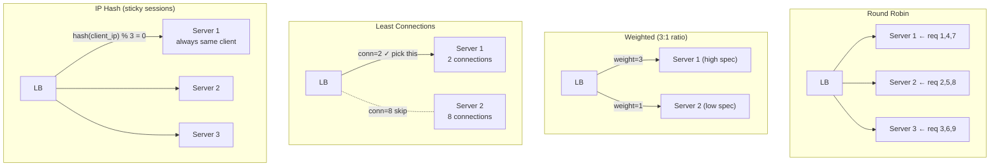

Load balancer phân phối request đến đến nhiều instance service để tối đa hóa throughput, giảm thiểu latency và đảm bảo high availability.

## Điểm Chính

- <strong>L4 (Transport)</strong>: route theo IP/port. Nhanh, không biết về HTTP. (TCP load balancing).
- <strong>L7 (Application)</strong>: route theo HTTP path/header/cookie. Cho phép URL-based routing, SSL termination, content inspection.
- Thuật toán: Round Robin, Least Connections, IP Hash (sticky), Weighted Round Robin, Random.
- Health check: tự động loại bỏ instance không healthy khỏi rotation.
- Cloud: AWS ALB (L7), NLB (L4), GCP Load Balancer. K8s: Service (kube-proxy) + Ingress (L7).

## Ví Dụ Code

*Nginx L7 upstream: least_conn + weighted + backup server + L7 path routing; K8s Ingress*

```bash
# Nginx L7 load balancer for order-service (upstream config)
upstream order_service {
    least_conn;                                  # least-connections algorithm
    server order-service-1:8080 weight=3;        # 3x more traffic than weight=1
    server order-service-2:8080 weight=3;
    server order-service-3:8080 weight=1;        # lower-spec instance
    server order-service-dr:8080 backup;         # only used if all above fail
    keepalive 32;                                # persist connections to upstream
}

server {
    listen 443 ssl;
    server_name api.example.com;

    location /api/orders/ {
        proxy_pass         http://order_service;
        proxy_set_header   X-Real-IP        $remote_addr;
        proxy_set_header   X-Forwarded-For  $proxy_add_x_forwarded_for;
        proxy_set_header   Host             $host;
        proxy_connect_timeout 5s;
        proxy_read_timeout    60s;

        # Health check: remove from pool after 3 failures, add back after 2 passes
        # (nginx plus feature; OSS uses passive health check)
    }

    # L7 routing: different services by path prefix
    location /api/payments/ {
        proxy_pass http://payment_service;
    }
    location /api/users/ {
        proxy_pass http://user_service;
    }
}

# Kubernetes Ingress (L7) — preferred in K8s environments
# apiVersion: networking.k8s.io/v1
# kind: Ingress
# metadata:
#   name: api-ingress
#   annotations:
#     nginx.ingress.kubernetes.io/upstream-hash-by: "$http_x_user_id"  # sticky by user
# spec:
#   rules:
#   - http:
#       paths:
#       - path: /api/orders
#         backend: { service: { name: order-service, port: { number: 8080 } } }
#       - path: /api/payments
#         backend: { service: { name: payment-service, port: { number: 8080 } } }
```

## Ứng Dụng Thực Tế

Với microservice trong K8s: dùng Ingress (Nginx, Traefik) cho external traffic, K8s Service cho internal. Với multi-region: dùng global load balancer (AWS Route53 + ALB) với geolocation routing và health-based failover.

## Câu Hỏi Phỏng Vấn

<details>
<summary><strong>Least Connections algorithm phù hợp khi nào?</strong></summary>

**A:** Phù hợp khi requests có response time khác nhau đáng kể — một số requests xử lý nhanh, một số chậm (database queries, file upload). Round Robin không tính đến việc server A đang có 100 slow connections trong khi server B chỉ có 2 — Round Robin vẫn phân phối đều. Least Connections route đến server ít active connections nhất → load thực tế cân bằng hơn. Weighted Least Connections: kết hợp số connections + server capacity. Nginx: `least_conn;` directive.

</details>

<details>
<summary><strong>Layer 4 và Layer 7 load balancing khác nhau thế nào?</strong></summary>

**A:** L4 (Transport): route dựa trên IP + TCP/UDP port. Không inspect packet content, rất nhanh. Không thể route theo URL path hay HTTP header. Dùng cho: TCP traffic không phải HTTP, extremely high throughput. L7 (Application): inspect HTTP header, URL, cookie → route thông minh hơn. Ví dụ: `/api/static` → cache server, `/api/search` → search cluster. Hỗ trợ TLS termination, compression, WebSocket upgrade. AWS ALB là L7; NLB là L4. Nginx/HAProxy hỗ trợ cả hai.

</details>

## Sơ Đồ Load Balancing Algorithms


