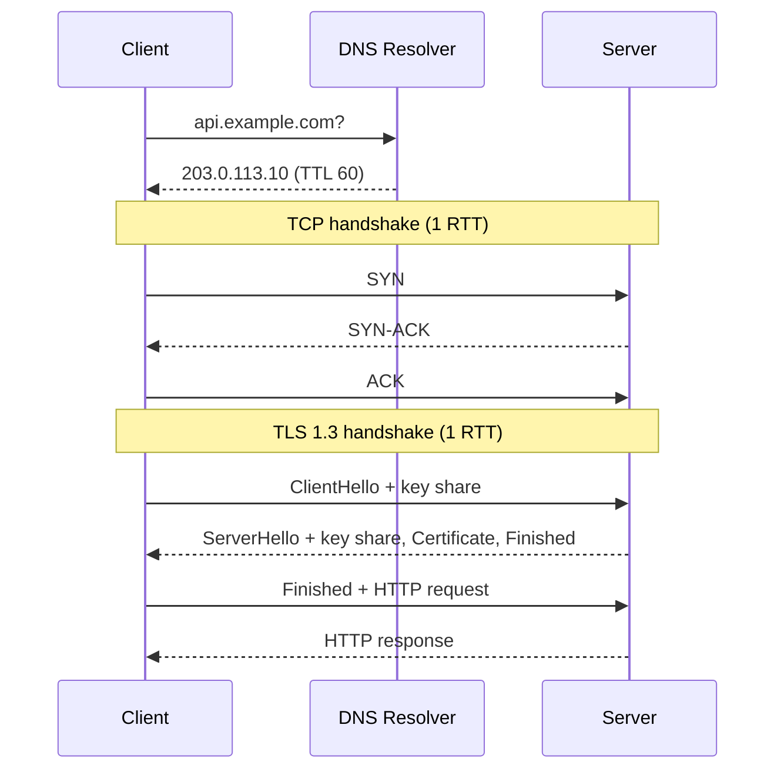

Mỗi lần service của bạn gọi `https://api.example.com/orders`, trước khi byte HTTP đầu tiên được gửi đi đã có ba việc xảy ra: phân giải DNS, bắt tay TCP, bắt tay TLS. Hầu hết lỗi "timeout", "connection refused", "certificate" trong production nằm ở ba tầng này — không phải ở code business.

## Điểm Chính

- **Chuyện gì xảy ra khi gọi một URL**: DNS phân giải tên → IP; mở kết nối TCP (3-way handshake); bắt tay TLS (nếu HTTPS); gửi HTTP request; nhận response; giữ kết nối để dùng lại (keep-alive) hoặc đóng.
- **DNS**:
  - Client hỏi *recursive resolver* (của ISP, `8.8.8.8`, hoặc DNS nội bộ Kubernetes); resolver lần lượt hỏi root → TLD (`.com`) → *authoritative server* của domain.
  - Mọi bản ghi có **TTL** — resolver, OS và cả JVM đều cache.
  - Bản ghi hay gặp: `A` (IPv4), `AAAA` (IPv6), `CNAME` (bí danh sang tên khác), `MX` (mail), `TXT` (xác minh domain, SPF), `SRV`.
- **TCP**: hướng kết nối, đảm bảo thứ tự và độ tin cậy (retransmit, ACK), có kiểm soát luồng và tắc nghẽn.
  - Mở: `SYN` → `SYN-ACK` → `ACK` (tốn 1 RTT trước khi gửi dữ liệu).
  - Đóng: mỗi phía gửi `FIN` và nhận `ACK`; phía **chủ động đóng** vào trạng thái `TIME_WAIT` (2×MSL) để các gói trễ không lẫn vào kết nối mới dùng cùng cặp địa chỉ/cổng.
- **UDP**: không kết nối, không đảm bảo thứ tự hay tới nơi, header nhỏ — dùng cho DNS, streaming, game, và là nền của QUIC/HTTP/3.
- **TLS 1.3** (RFC 8446):
  - Bắt tay đầy đủ chỉ **1-RTT** (TLS 1.2 cần 2-RTT).
  - Chỉ dùng trao đổi khóa Diffie-Hellman tạm thời (ECDHE/DHE) → mọi kết nối có **forward secrecy**; đã bỏ trao đổi khóa RSA tĩnh.
  - **0-RTT** (resumption với PSK) cho phép gửi dữ liệu ngay gói đầu nhưng **không chống replay** và không có forward secrecy → chỉ dùng cho request idempotent.
- **Certificate**: server gửi chuỗi chứng chỉ; client kiểm tra chữ ký tới một CA gốc mình tin, hạn dùng, và **tên host khớp** (SAN). mTLS = client cũng gửi chứng chỉ (hay dùng giữa các service nội bộ, service mesh).

## Ví Dụ Code

*Đo từng giai đoạn của một request*

```bash
curl -s -o /dev/null https://example.com -w '
dns:        %{time_namelookup}s
tcp:        %{time_connect}s
tls:        %{time_appconnect}s
first byte: %{time_starttransfer}s
total:      %{time_total}s
'
# Các mốc là thời gian tích lũy từ lúc bắt đầu:
# tls - tcp = thời gian bắt tay TLS; first byte - tls ≈ thời gian server xử lý
```

*Điều tra DNS*

```bash
dig api.example.com +short          # IP hiện tại
dig api.example.com                 # xem TTL, CNAME chain
dig @8.8.8.8 api.example.com        # hỏi resolver cụ thể — so với DNS nội bộ
nslookup order-service.default.svc.cluster.local   # trong pod Kubernetes
```

*Điều tra TCP/TLS*

```bash
nc -vz db.internal 5432                        # cổng có mở không (connection refused vs timeout)
ss -tan state time-wait | wc -l                # số kết nối đang TIME_WAIT
openssl s_client -connect example.com:443 -servername example.com </dev/null \
  | openssl x509 -noout -subject -issuer -dates -ext subjectAltName   # xem cert, hạn, SAN
```

*Timeout trong Java — luôn đặt, đừng dùng mặc định vô hạn*

```java
HttpClient client = HttpClient.newBuilder()
        .connectTimeout(Duration.ofSeconds(2))          // giới hạn DNS + TCP (+ TLS) handshake
        .build();

HttpRequest request = HttpRequest.newBuilder(URI.create("https://api.example.com/orders/42"))
        .timeout(Duration.ofSeconds(5))                 // giới hạn chờ response
        .build();

HttpResponse<String> response = client.send(request, HttpResponse.BodyHandlers.ofString());
```

*Cache DNS của JVM*

```properties
# $JAVA_HOME/conf/security/java.security  (hoặc Security.setProperty lúc khởi động)
networkaddress.cache.ttl=30            # giây giữ kết quả phân giải thành công
networkaddress.cache.negative.ttl=10   # giây giữ kết quả phân giải thất bại
```

## Ứng Dụng Thực Tế

**Phân biệt lỗi kết nối**:
- `UnknownHostException` — DNS: sai tên, DNS nội bộ lỗi, thiếu search domain.
- `Connection refused` — tới được máy nhưng không có tiến trình nghe cổng đó (service chết, sai port) → trả lỗi ngay.
- `Connect timed out` — gói bị chặn/mất: firewall, security group, route sai, máy không tồn tại.
- `Read timed out` — kết nối đã mở nhưng server xử lý chậm.
- `PKIX path building failed` / `SSLHandshakeException` — chứng chỉ do CA không nằm trong truststore của JVM (hay gặp với CA nội bộ), hết hạn, hoặc tên host không khớp.

**Connection pool**: mỗi kết nối mới tốn 1 RTT cho TCP + 1 RTT cho TLS 1.3 (+ tra DNS). Giữ kết nối (HTTP keep-alive, HikariCP cho DB) để trả chi phí này một lần. Tạo client HTTP mới cho mỗi request là lỗi hiệu năng phổ biến và làm phình số kết nối `TIME_WAIT`.

**DNS và failover**: khi IP của service đổi (blue/green, failover database), client chỉ thấy IP mới sau khi mọi tầng cache hết TTL. JVM có cache DNS riêng; nếu app cache quá lâu, sau failover vẫn đi tới IP cũ. Kiểm tra `networkaddress.cache.ttl` khi dùng dịch vụ đổi IP theo DNS (AWS RDS, ELB).

**TLS termination**: thường TLS kết thúc ở load balancer/ingress, bên trong đi HTTP thường hoặc mTLS qua service mesh. Khi đó app đọc scheme/IP gốc của client từ header `X-Forwarded-Proto`/`X-Forwarded-For` (Spring Boot: `server.forward-headers-strategy`).

## Câu Hỏi Phỏng Vấn

<details>
<summary><strong>Mô tả chuyện gì xảy ra khi gõ một URL vào trình duyệt.</strong></summary>

**A:** (1) Phân tích URL (scheme, host, port, path). (2) DNS: kiểm tra cache trình duyệt/OS, nếu không có thì hỏi recursive resolver → root → TLD → authoritative, nhận IP và TTL. (3) TCP 3-way handshake tới IP:443. (4) TLS handshake: thỏa thuận thuật toán, trao đổi khóa ECDHE, server gửi certificate để client xác thực, sinh khóa phiên — TLS 1.3 tốn 1 RTT. (5) Gửi HTTP request (HTTP/2 thì qua các stream trên cùng kết nối). (6) Server (thường qua load balancer → app) xử lý và trả response. (7) Trình duyệt parse HTML, tải thêm CSS/JS/ảnh (tái sử dụng kết nối), render. (8) Kết nối được giữ lại để dùng tiếp.

</details>

<details>
<summary><strong>TCP và UDP khác nhau thế nào? Khi nào dùng UDP?</strong></summary>

**A:** TCP: có kết nối (handshake), đảm bảo dữ liệu tới đủ, đúng thứ tự, không trùng (sequence number, ACK, retransmit), có kiểm soát luồng và tắc nghẽn — đổi lại có độ trễ và overhead. UDP: gửi từng datagram độc lập, không đảm bảo tới nơi hay thứ tự, không handshake, header 8 byte. Dùng UDP khi độ trễ quan trọng hơn độ tin cậy hoặc ứng dụng tự xử lý mất gói: DNS (một hỏi một đáp), video call, game, streaming, và QUIC — giao thức nền của HTTP/3, tự cài đặt độ tin cậy và mã hóa trên UDP.

</details>

<details>
<summary><strong>TIME_WAIT là gì? Tại sao server có hàng nghìn kết nối TIME_WAIT?</strong></summary>

**A:** Phía chủ động đóng kết nối TCP giữ trạng thái `TIME_WAIT` trong 2×MSL để (1) gửi lại ACK cuối nếu bị mất, (2) không để gói trễ của kết nối cũ lọt vào kết nối mới dùng cùng bộ (IP, port) nguồn-đích. Nhiều `TIME_WAIT` thường vì ứng dụng mở–đóng kết nối liên tục thay vì dùng lại (không có connection pool, tắt keep-alive, tạo HTTP client mới mỗi request). Phía client có thể cạn cổng tạm (ephemeral port). Cách sửa gốc là tái sử dụng kết nối, không phải chỉnh tham số kernel.

</details>

<details>
<summary><strong>TLS đảm bảo những gì? TLS 1.3 cải tiến gì so với 1.2?</strong></summary>

**A:** TLS đảm bảo **bí mật** (mã hóa), **toàn vẹn** (phát hiện sửa đổi) và **xác thực** server (qua certificate, tùy chọn cả client với mTLS). TLS 1.3: bắt tay 1-RTT thay vì 2-RTT; chỉ còn trao đổi khóa Diffie-Hellman tạm thời nên mọi kết nối có forward secrecy (lộ private key của server sau này không giải mã được traffic cũ đã ghi lại); bỏ RSA key exchange tĩnh và các thuật toán yếu; mã hóa phần lớn handshake (kể cả certificate); có 0-RTT resumption nhưng dữ liệu 0-RTT có thể bị replay nên chỉ dành cho request idempotent.

</details>

<details>
<summary><strong>Gặp lỗi "PKIX path building failed" khi gọi API nội bộ, xử lý thế nào?</strong></summary>

**A:** JVM không dựng được chuỗi tin cậy từ certificate server tới một CA có trong truststore — thường do API dùng CA nội bộ/tự ký, hoặc server không gửi đủ intermediate certificate. Kiểm tra bằng `openssl s_client -showcerts`. Sửa đúng: server cấu hình gửi đủ chuỗi; phía client thêm CA gốc nội bộ vào truststore (`keytool -importcert` hoặc truststore riêng qua `javax.net.ssl.trustStore`, Spring Boot SSL bundles). Không tắt kiểm tra certificate (trust-all) — như vậy mất hoàn toàn khả năng chống man-in-the-middle.

</details>

## Sơ Đồ: Một Request HTTPS Mới


