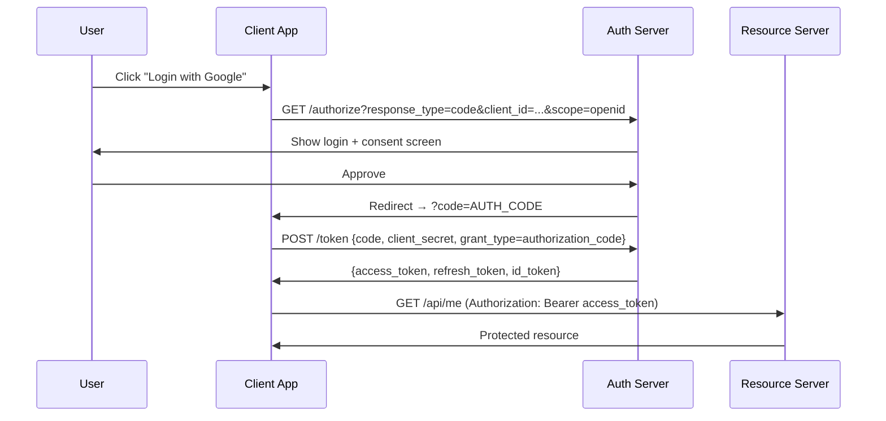

OAuth2 là framework ủy quyền cho phép app bên thứ ba truy cập tài nguyên user mà không chia sẻ credential, sử dụng access token được cấp bởi Authorization Server.

## Điểm Chính

- Role: <strong>Resource Owner</strong> (user), <strong>Client</strong> (app của bạn), <strong>Authorization Server</strong> (Keycloak, Okta, Google), <strong>Resource Server</strong> (API).
- Grant type: <strong>Authorization Code</strong> (web app, bảo mật nhất), <strong>Client Credentials</strong> (M2M), <strong>Implicit</strong> (deprecated), <strong>Resource Owner Password</strong> (legacy).
- PKCE: mở rộng cho public client (SPA, mobile) để ngăn chặn authorization code interception.
- OpenID Connect (OIDC): mở rộng OAuth2 thêm identity layer — trả về <code>id_token</code> với thông tin user.
- Spring Security: <code>spring-boot-starter-oauth2-resource-server</code> xác minh JWT token tự động.

## Ví Dụ Code

*OAuth2: Resource Server (JWKS + Keycloak role mapping) + M2M Client Credentials (WebClient auto token attach)*

```java
import org.springframework.security.config.annotation.web.builders.HttpSecurity;
import org.springframework.security.oauth2.server.resource.authentication.*;
import org.springframework.security.oauth2.jwt.*;

// ---- OAuth2 Roles:
// Resource Owner  = the user (owns their order data)
// Client          = your frontend / mobile app requesting access
// Authorization Server = Keycloak / Okta / AWS Cognito (issues tokens)
// Resource Server = this Order Service API (validates tokens, serves resources)

// ---- Option A: Resource Server — validates JWT from external Authorization Server ----
// Use when: integrating with Keycloak, Okta, Google, Auth0, AWS Cognito
@Configuration
@EnableWebSecurity
public class OAuth2ResourceServerConfig {

    @Bean
    public SecurityFilterChain filterChain(HttpSecurity http) throws Exception {
        return http
            .sessionManagement(sm -> sm.sessionCreationPolicy(SessionCreationPolicy.STATELESS))
            .csrf(csrf -> csrf.disable())
            .authorizeHttpRequests(auth -> auth
                .requestMatchers("/api/v1/public/**").permitAll()
                .requestMatchers("/api/v1/orders/**").hasAuthority("SCOPE_orders:read")
                .requestMatchers(HttpMethod.POST, "/api/v1/orders").hasAuthority("SCOPE_orders:write")
                .requestMatchers("/api/v1/admin/**").hasRole("ADMIN")
                .anyRequest().authenticated()
            )
            // Configure JWT validation — Spring fetches JWKS automatically and caches it
            .oauth2ResourceServer(oauth2 -> oauth2
                .jwt(jwt -> jwt
                    .decoder(jwtDecoder())
                    .jwtAuthenticationConverter(jwtAuthConverter())
                )
            )
            .build();
    }

    @Bean
    public JwtDecoder jwtDecoder() {
        // NimbusJwtDecoder fetches public keys from the Authorization Server's JWKS endpoint
        // and caches them for signature verification — no private key needed here
        return NimbusJwtDecoder
            .withJwkSetUri("https://keycloak.example.com/realms/order-realm/protocol/openid-connect/certs")
            .build();
    }

    @Bean
    public JwtAuthenticationConverter jwtAuthConverter() {
        // Map Keycloak-specific "realm_access.roles" claim → Spring Security GrantedAuthority
        JwtGrantedAuthoritiesConverter rolesConverter = new JwtGrantedAuthoritiesConverter();
        rolesConverter.setAuthoritiesClaimName("realm_access.roles");  // Keycloak structure
        rolesConverter.setAuthorityPrefix("ROLE_");                    // maps "ADMIN" → "ROLE_ADMIN"

        JwtAuthenticationConverter converter = new JwtAuthenticationConverter();
        converter.setJwtGrantedAuthoritiesConverter(rolesConverter);
        return converter;
    }
}

// application.yml config for Resource Server (alternative to @Bean JwtDecoder):
/*
spring:
  security:
    oauth2:
      resourceserver:
        jwt:
          issuer-uri: https://keycloak.example.com/realms/order-realm
          # Spring auto-discovers JWKS URI from issuer-uri/.well-known/openid-configuration
*/

// ---- Option B: Service-to-Service (M2M) with Client Credentials Grant ----
// Inventory Service calling Order Service internally — no user involved
@Configuration
public class OrderServiceClientConfig {

    @Bean
    public OAuth2AuthorizedClientManager authorizedClientManager(
            ClientRegistrationRepository clients,
            OAuth2AuthorizedClientRepository authorizedClients) {

        OAuth2AuthorizedClientProvider provider =
            OAuth2AuthorizedClientProviderBuilder.builder()
                .clientCredentials()  // M2M: no user interaction — service authenticates itself
                .build();

        DefaultOAuth2AuthorizedClientManager manager =
            new DefaultOAuth2AuthorizedClientManager(clients, authorizedClients);
        manager.setAuthorizedClientProvider(provider);
        return manager;
    }

    @Bean
    public WebClient inventoryServiceClient(OAuth2AuthorizedClientManager authorizedClientManager) {
        // Intercept each request and attach a Bearer token fetched via Client Credentials
        ServletOAuth2AuthorizedClientExchangeFilterFunction oauth2 =
            new ServletOAuth2AuthorizedClientExchangeFilterFunction(authorizedClientManager);
        oauth2.setDefaultClientRegistrationId("inventory-service"); // matches spring.security.oauth2.client

        return WebClient.builder()
            .baseUrl("https://inventory-service.internal")
            .apply(oauth2.oauth2Configuration())
            .build();
    }
}

// application.yml — register M2M client:
/*
spring:
  security:
    oauth2:
      client:
        registration:
          inventory-service:
            authorization-grant-type: client_credentials
            client-id: ${INVENTORY_CLIENT_ID}
            client-secret: ${INVENTORY_CLIENT_SECRET}
            scope: inventory:read,inventory:write
        provider:
          inventory-service:
            token-uri: https://keycloak.example.com/realms/order-realm/protocol/openid-connect/token
*/
```

## Ứng Dụng Thực Tế

Với microservice, dùng Client Credentials grant cho service-to-service call. Cấu hình mỗi service như Resource Server xác minh JWT từ Authorization Server trung tâm. Dùng Keycloak hoặc AWS Cognito để tránh tự chạy Auth Server.

## Câu Hỏi Phỏng Vấn

<details>
<summary><strong>Các OAuth2 grant type khác nhau khi nào dùng?</strong></summary>

**A:** Authorization Code: web app với backend, dùng kèm PKCE cho SPA/mobile. Implicit: deprecated — không dùng (token lộ trong URL fragment). Client Credentials: machine-to-machine (không có user), ví dụ: microservice gọi nhau. Device Code: TV/IoT không có browser. Resource Owner Password: legacy, tránh dùng (user nhập credential vào client app). Authorization Code + PKCE là recommendation hiện tại cho mọi client type (RFC 9700).

</details>

<details>
<summary><strong>PKCE là gì và tại sao SPA cần nó?</strong></summary>

**A:** PKCE (Proof Key for Code Exchange): extension ngăn authorization code interception attack. SPA không thể giữ client_secret an toàn (JS bị inspect được). Với PKCE: client generate random `code_verifier`, hash thành `code_challenge` (SHA256), gửi challenge với authorization request. Khi đổi code lấy token, gửi kèm code_verifier. Auth server verify hash match — attacker có code nhưng không có verifier → không thể đổi token. Spring Authorization Server và Keycloak đều enforce PKCE cho public clients.

</details>

## Sơ Đồ OAuth2 Authorization Code Flow


