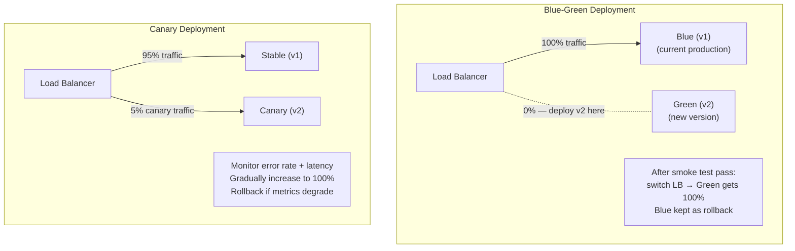

CI/CD pipeline chuyển code từ commit đến production qua các giai đoạn: source, build, test (unit/integration/security), package, deploy staging, deploy production.

## Điểm Chính

- <strong>Source</strong>: trigger trên commit/PR vào branch main/release.
- <strong>Build</strong>: compile, kiểm tra code style (Checkstyle, SpotBugs), static analysis (SonarQube).
- <strong>Test</strong>: unit test (nhanh, <1phút), integration test (TestContainers), contract test (Pact).
- <strong>Security scan</strong>: SAST (SonarQube, SpotBugs), DAST, scan vulnerability dependency (Trivy, OWASP).
- <strong>Package</strong>: build Docker image, push lên registry tag với git SHA.
- <strong>Deploy staging</strong>: deploy lên staging, chạy smoke test, performance test.
- <strong>Deploy prod</strong>: blue-green hoặc canary, monitor X phút, auto-rollback khi error rate tăng.

## Ví Dụ Code

*Full GitHub Actions CI/CD: test → security scan → push → blue-green deploy*

```bash
# .github/workflows/ci-cd.yml — full pipeline: test → build → scan → push → deploy
name: CI/CD Pipeline
on:
  push:
    branches: [main, release/**]
  pull_request:
    branches: [main]

jobs:
  test:
    runs-on: ubuntu-latest
    steps:
      - uses: actions/checkout@v4
      - uses: actions/setup-java@v4
        with: { java-version: '21', distribution: 'temurin' }
      - name: Unit & Integration Tests + Coverage
        run: mvn verify -Pcoverage
      - name: SonarQube Analysis
        run: mvn sonar:sonar -Dsonar.projectKey=order-service
        env:
          SONAR_TOKEN: ${{ secrets.SONAR_TOKEN }}
      - name: Quality Gate check
        run: |
          STATUS=$(curl -s "$SONAR_URL/api/qualitygates/project_status?projectKey=order-service" | jq -r '.projectStatus.status')
          [ "$STATUS" = "OK" ] || (echo "Quality Gate FAILED: $STATUS" && exit 1)

  security-scan:
    needs: test
    runs-on: ubuntu-latest
    steps:
      - name: Build Docker image
        run: docker build -t order-service:${{ github.sha }} .
      - name: Trivy vulnerability scan
        run: trivy image --exit-code 1 --severity HIGH,CRITICAL order-service:${{ github.sha }}
      - name: Push to registry
        run: |
          docker tag order-service:${{ github.sha }} ${{ secrets.REGISTRY }}/order-service:${{ github.sha }}
          docker push ${{ secrets.REGISTRY }}/order-service:${{ github.sha }}

  deploy-staging:
    needs: security-scan
    runs-on: ubuntu-latest
    environment: staging
    steps:
      - name: Deploy to staging
        run: |
          kubectl set image deployment/order-service app=${{ secrets.REGISTRY }}/order-service:${{ github.sha }}
          kubectl rollout status deployment/order-service --timeout=120s
      - name: Smoke test
        run: curl -f https://staging-api.example.com/actuator/health

  deploy-prod:
    needs: deploy-staging
    runs-on: ubuntu-latest
    environment: production    # requires manual approval
    steps:
      - name: Deploy to production (blue-green)
        run: |
          kubectl set image deployment/order-service-green app=${{ secrets.REGISTRY }}/order-service:${{ github.sha }}
          kubectl rollout status deployment/order-service-green --timeout=180s
      - name: Switch traffic
        run: kubectl patch service order-service -p '{"spec":{"selector":{"slot":"green"}}}'
      - name: Monitor error rate (5 min)
        run: |
          sleep 300
          ERROR_RATE=$(curl -s "$PROMETHEUS_URL/api/v1/query?query=rate(http_errors[5m])" | jq '.data.result[0].value[1]')
          echo "Error rate: $ERROR_RATE"
          # Auto-rollback if error rate > 1%
          awk "BEGIN { if ($ERROR_RATE > 0.01) exit 1 }" || kubectl rollout undo deployment/order-service-green
```

## Ứng Dụng Thực Tế

Thêm quality gate làm fail pipeline: coverage test tối thiểu (ví dụ 80%), ngưỡng severity vulnerability (fail khi CRITICAL), performance regression (latency p99 tăng >20%). Các gate này ngăn regression len lén vào production.

## Câu Hỏi Phỏng Vấn

1. Giai đoạn nào mọi CI/CD pipeline production cần có?
1. Làm thế nào để ngăn secret bị lộ trong CI log?
1. Quality gate là gì và làm thế nào để implement?

## Sơ Đồ Blue-Green & Canary Deployment


