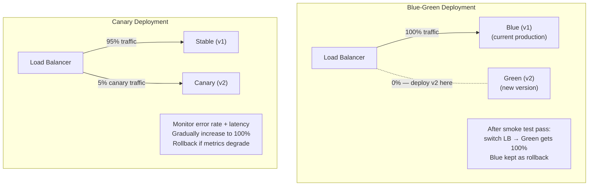

CI/CD pipeline chuyển code từ commit đến production qua các giai đoạn: source, build, test (unit/integration/security), package, deploy staging, deploy production.

## Điểm Chính

- <strong>Source</strong>: trigger trên commit/PR vào branch main/release.
- <strong>Build</strong>: compile, kiểm tra code style (Checkstyle, SpotBugs), static analysis (SonarQube).
- <strong>Test</strong>: unit test (nhanh, <1phút), integration test (TestContainers), contract test (Pact).
- <strong>Security scan</strong>: SAST (SonarQube, SpotBugs), DAST, scan vulnerability dependency (Trivy, OWASP).
- <strong>Package</strong>: build Docker image, push lên registry tag với git SHA.
- <strong>Deploy staging</strong>: deploy lên staging, chạy smoke test, performance test.
- <strong>Deploy prod</strong>: blue-green hoặc canary, monitor X phút, auto-rollback khi error rate tăng.

## Ví Dụ Code

*Full GitHub Actions CI/CD: test → security scan → push → blue-green deploy*

```yaml
# .github/workflows/ci-cd.yml — test → build → scan → push → staging → prod (blue-green)
name: CI/CD Pipeline
on:
  push:
    branches: [main]
  pull_request:
    branches: [main]      # PR chỉ chạy job test — các job deploy có điều kiện push lên main

permissions:
  contents: read

env:
  IMAGE: ${{ vars.REGISTRY }}/order-service:${{ github.sha }}

jobs:
  test:
    runs-on: ubuntu-latest
    steps:
      - uses: actions/checkout@v4
        with: { fetch-depth: 0 }                  # Sonar cần lịch sử git cho blame/new code
      - uses: actions/setup-java@v4
        with: { java-version: '21', distribution: 'temurin', cache: maven }
      - name: Unit & Integration Tests + Coverage
        run: mvn -B verify -Pcoverage
      - name: SonarQube analysis + Quality Gate
        # sonar.qualitygate.wait=true: scanner chờ kết quả Quality Gate, gate đỏ → step fail
        run: mvn -B sonar:sonar -Dsonar.projectKey=order-service -Dsonar.qualitygate.wait=true
        env:
          SONAR_TOKEN: ${{ secrets.SONAR_TOKEN }}
          SONAR_HOST_URL: ${{ vars.SONAR_HOST_URL }}

  build-scan-push:
    needs: test
    if: github.event_name == 'push' && github.ref == 'refs/heads/main'
    runs-on: ubuntu-latest
    steps:
      - uses: actions/checkout@v4                 # cần source + Dockerfile để build image
      - name: Build image (multi-stage Dockerfile tự chạy mvn package)
        run: docker build -t "$IMAGE" .
      - name: Trivy vulnerability scan (fail on HIGH/CRITICAL)
        run: |
          docker run --rm -v /var/run/docker.sock:/var/run/docker.sock \
            aquasec/trivy:0.74.0 image --exit-code 1 --severity HIGH,CRITICAL "$IMAGE"
      - uses: docker/login-action@v3
        with:
          registry: ${{ vars.REGISTRY }}
          username: ${{ secrets.REGISTRY_USER }}
          password: ${{ secrets.REGISTRY_PASSWORD }}
      - name: Push to registry
        run: docker push "$IMAGE"

  deploy-staging:
    needs: build-scan-push
    runs-on: ubuntu-latest
    environment: staging
    steps:
      - name: Configure kubeconfig
        run: mkdir -p ~/.kube && echo "${{ secrets.KUBECONFIG_STAGING }}" > ~/.kube/config
      - name: Deploy to staging
        run: |
          kubectl set image deployment/order-service app="$IMAGE"
          kubectl rollout status deployment/order-service --timeout=120s
      - name: Smoke test
        run: curl -fsS https://staging-api.example.com/actuator/health

  deploy-prod:
    needs: deploy-staging
    runs-on: ubuntu-latest
    environment: production                       # bật "required reviewers" → cổng duyệt thủ công
    steps:
      - name: Configure kubeconfig
        run: mkdir -p ~/.kube && echo "${{ secrets.KUBECONFIG_PROD }}" > ~/.kube/config
      - name: Deploy to idle color (blue-green)
        run: |
          LIVE=$(kubectl get svc order-service -o jsonpath='{.spec.selector.slot}')
          IDLE=$([ "$LIVE" = "blue" ] && echo green || echo blue)
          echo "LIVE=$LIVE" >> "$GITHUB_ENV"; echo "IDLE=$IDLE" >> "$GITHUB_ENV"
          kubectl set image deployment/order-service-$IDLE app="$IMAGE"
          kubectl rollout status deployment/order-service-$IDLE --timeout=180s
      - name: Switch traffic to idle color
        run: |
          kubectl patch svc order-service -p "{\"spec\":{\"selector\":{\"app\":\"order-service\",\"slot\":\"$IDLE\"}}}"
      - name: Watch 5xx ratio for 5 minutes, switch back on regression
        run: |
          sleep 300
          # Tỉ lệ response 5xx trên tổng request (metric HTTP server của Spring Boot/Micrometer).
          # Label lọc service (ở đây job="order-service") tùy cấu hình scrape của bạn.
          Q='sum(rate(http_server_requests_seconds_count{job="order-service",status=~"5.."}[5m])) / sum(rate(http_server_requests_seconds_count{job="order-service"}[5m]))'
          RATIO=$(curl -sG "${{ vars.PROMETHEUS_URL }}/api/v1/query" --data-urlencode "query=$Q" \
                  | jq -r '.data.result[0].value[1] // "0"')
          echo "5xx ratio: $RATIO"
          if awk -v r="$RATIO" 'BEGIN { exit !(r > 0.01) }'; then
            # Rollback blue-green = trả Service về màu cũ (màu cũ vẫn đang chạy version trước)
            kubectl patch svc order-service -p "{\"spec\":{\"selector\":{\"app\":\"order-service\",\"slot\":\"$LIVE\"}}}"
            echo "Error ratio > 1% — traffic switched back to $LIVE"; exit 1
          fi
```

## Ứng Dụng Thực Tế

Thêm quality gate làm fail pipeline: coverage test tối thiểu (ví dụ 80%), ngưỡng severity vulnerability (fail khi CRITICAL), performance regression (latency p99 tăng >20%). Các gate này ngăn regression len lén vào production.

## Câu Hỏi Phỏng Vấn

<details>
<summary><strong>Giai đoạn nào mọi CI/CD pipeline production cần có?</strong></summary>

**A:** Minimum stages: (1) **Build**: compile, package artifact. (2) **Unit test**: fast, isolated, fail fast. (3) **Static analysis**: lint, type check, security scan (Snyk, SonarQube). (4) **Integration test**: test với real dependency (DB, message queue). (5) **Docker build + push**: build và tag image. (6) **Deploy to staging**: auto deploy. (7) **Smoke test**: verify critical path hoạt động. (8) **Deploy to production**: manual gate hoặc auto. Optional: performance test, E2E test, contract test.

</details>

<details>
<summary><strong>Làm thế nào để ngăn secret bị lộ trong CI log?</strong></summary>

**A:** (1) Dùng CI **secret management** (GitHub Secrets, GitLab CI Variables, Jenkins Credentials) — không hardcode trong yaml. (2) Secret được inject vào env var, CI mask giá trị trong log. (3) Không print env var trong script (`printenv`). (4) Dùng `--quiet` flag cho tools có thể log secrets. (5) Scan trước commit với **pre-commit hooks** (gitleaks, detect-secrets). (6) Không log request/response payload chứa credential. (7) Rotate secret thường xuyên — rủi ro leak giảm theo time window.

</details>

<details>
<summary><strong>Quality gate là gì và làm thế nào để implement?</strong></summary>

**A:** **Quality gate**: tập hợp threshold phải pass trước khi artifact được promote (merge, deploy). Ví dụ: code coverage > 80%, 0 critical vulnerability (SonarQube), p95 latency < 500ms (performance test), contract test pass. Implement: (1) SonarQube Quality Gate: config threshold, tích hợp vào CI — fail build nếu gate không pass. (2) k6 threshold: `thresholds: { http_req_duration: ["p(95)<500"] }` → CI fail nếu vi phạm. (3) GitHub branch protection: require status check pass trước merge.

</details>

## Sơ Đồ Blue-Green & Canary Deployment


```mermaid
flowchart TB
    subgraph BlueGreen["Blue-Green Deployment"]
        LB1["Load Balancer"] -->|"100% traffic"| Blue["Blue (v1)\n(current production)"]
        LB1 -.-|"0% — deploy v2 here"| Green["Green (v2)\n(new version)"]
        Switch["After smoke test pass:\nswitch LB → Green gets 100%\nBlue kept as rollback"]
    end

    subgraph Canary["Canary Deployment"]
        LB2["Load Balancer"] -->|"95% traffic"| Stable["Stable (v1)"]
        LB2 -->|"5% canary traffic"| Canary2["Canary (v2)"]
        Monitor2["Monitor error rate + latency\nGradually increase to 100%\nRollback if metrics degrade"]
    end
```
