Producer publish message lên Kafka topic; Consumer đọc message và commit offset để theo dõi tiến trình — với delivery guarantee có thể cấu hình ở cả hai phía.

## Điểm Chính

- Producer acks: <code>acks=0</code> (fire-and-forget), <code>acks=1</code> (leader xác nhận), <code>acks=all</code> (tất cả ISR xác nhận — mạnh nhất).
- <code>enable.idempotence=true</code>: ngăn message trùng lặp từ retry (exactly-once ở phía producer).
- Consumer: <code>auto.offset.reset=earliest</code> (đọc từ đầu) hoặc <code>latest</code> (chỉ đọc message mới).
- Chiến lược commit: auto-commit (đơn giản, rủi ro at-least-once) vs manual commit (sau xử lý, đảm bảo mạnh hơn).
- Deserialization: <code>ErrorHandlingDeserializer</code> bọc deserializer để xử lý poison pill.

## Ví Dụ Code

*Producer acks=all + idempotence config; manual-ack consumer; poison pill handling*

```java
// Producer config: acks=all + idempotence → no message loss, no duplicates on retry
// application.yml
spring:
  kafka:
    bootstrap-servers: ${spring.kafka.bootstrap-servers:localhost:9092}
    producer:
      acks: all                   # wait for all ISR replicas to confirm
      retries: 3                  # retry on transient error
      enable-idempotence: true    # exactly-once at producer level (dedup by seq no.)
      key-serializer: org.apache.kafka.common.serialization.StringSerializer
      value-serializer: org.springframework.kafka.support.serializer.JsonSerializer
    consumer:
      auto-offset-reset: earliest
      enable-auto-commit: false   # manual commit — we control when offset moves
      key-deserializer: org.apache.kafka.common.serialization.StringDeserializer
      value-deserializer: org.springframework.kafka.support.serializer.JsonDeserializer
      properties:
        spring.json.trusted.packages: "com.example.events"
    listener:
      ack-mode: manual            # ack only after successful processing

// Producer: publish payment-events with error handling
@Service
@RequiredArgsConstructor
public class PaymentEventPublisher {
    private final KafkaTemplate<String, Object> kafkaTemplate;

    public void publishPaymentProcessed(PaymentProcessedEvent event) {
        kafkaTemplate.send("payment-events", event.getOrderId(), event)
            .whenComplete((result, ex) -> {
                if (ex != null) {
                    log.error("publish failed: orderId={}", event.getOrderId(), ex);
                } else {
                    log.info("payment-events sent: orderId={} offset={}",
                        event.getOrderId(), result.getRecordMetadata().offset());
                }
            });
    }
}

// Consumer: manual ack pattern — commit only after business logic succeeds
@KafkaListener(topics = "payment-events", groupId = "order-service")
public void onPaymentProcessed(PaymentProcessedEvent event, Acknowledgment ack) {
    orderService.markPaid(event.getOrderId(), event.getAmount()); // business logic
    ack.acknowledge(); // commit offset: if we crash here, we reprocess (at-least-once)
}

// Poison pill handling: wrap deserializer to route bad messages to DLQ
// spring.kafka.consumer.value-deserializer: ErrorHandlingDeserializer
// spring.kafka.consumer.properties.spring.deserializer.value.delegate.class: JsonDeserializer
```

## Ứng Dụng Thực Tế

Bật <code>enable.idempotence=true</code> và <code>acks=all</code> trên producer trong production. Dùng manual commit trên consumer và commit SAU khi xử lý để đảm bảo at-least-once delivery. Thêm error handling với retry + DLQ cho poison pill.

## Câu Hỏi Phỏng Vấn

1. Sự khác biệt giữa acks=1 và acks=all là gì?
1. enable.idempotence=true làm gì cho Kafka producer?
1. Rủi ro của auto-commit trong Kafka consumer là gì?

## Sơ Đồ Kafka Producer & Consumer Internals

```mermaid
flowchart TB
    subgraph Producer["Kafka Producer"]
        Rec["ProducerRecord\ntopic, key, value"] --> Ser["Serializer\n(key + value → bytes)"]
        Ser --> Part["Partitioner\nhash(key) % numPartitions"]
        Part --> Buf["RecordAccumulator\n(batch buffer per partition)"]
        Buf -->|"linger.ms OR batch.size full"| Net["NetworkClient → Broker"]
    end

    subgraph Consumer["Kafka Consumer"]
        Poll["consumer.poll(Duration)"] --> Fetch["Fetch from broker\n(assigned partitions)"]
        Fetch --> Deser["Deserializer\nbytes → object"]
        Deser --> Process["Process records"]
        Process --> Commit["commitSync() / commitAsync()\nadvance offset in __consumer_offsets"]
    end
```


