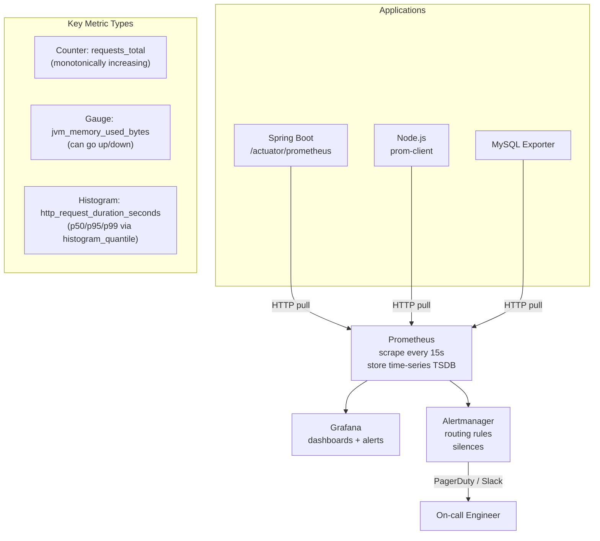

Prometheus scrape metric từ service theo pull model, lưu trong time-series DB và đánh giá alert rule; Grafana visualize metric trong dashboard.

## Điểm Chính

- Pull model Prometheus: scrape <code>/actuator/prometheus</code> từ mỗi service instance.
- PromQL: ngôn ngữ query mạnh. <code>rate(http_requests_total[5m])</code> = request rate mỗi giây.
- Alertmanager: nhận alert từ Prometheus, route đến PagerDuty/Slack/email.
- Grafana: kết nối đến Prometheus data source, render dashboard. Shared community dashboard (JVM, Spring Boot).
- Recording rule: pre-compute PromQL query tốn kém cho dashboard performance.

## Ví Dụ Code

*Prometheus K8s scraping và alert rule*

```bash
# Prometheus scrape config (prometheus.yml)
scrape_configs:
  - job_name: 'spring-boot-services'
    kubernetes_sd_configs:
    - role: pod
    relabel_configs:
    - source_labels: [__meta_kubernetes_pod_annotation_prometheus_io_scrape]
      action: keep
      regex: true
    - source_labels: [__meta_kubernetes_pod_annotation_prometheus_io_path]
      target_label: __metrics_path__

# Alerting rules
groups:
- name: api-alerts
  rules:
  - alert: HighErrorRate
    expr: rate(http_server_requests_seconds_count{status=~"5.."}[5m]) > 0.05
    for: 2m
    labels: {severity: critical}
    annotations:
      summary: "High error rate: {{ $value | humanizePercentage }}"
```

## Ứng Dụng Thực Tế

Import Grafana dashboard có sẵn (JVM Micrometer dashboard ID 4701, Spring Boot 12900). Thêm custom panel cho business metric (order/phút, payment success rate). Thiết lập PagerDuty integration trong Alertmanager cho critical alert.

## Câu Hỏi Phỏng Vấn

<details>
<summary><strong>Counter, Gauge, Histogram trong Prometheus khác nhau thế nào?</strong></summary>

**A:** **Counter**: chỉ tăng (reset về 0 khi restart). Dùng cho: request count, error count. Query: `rate(http_requests_total[5m])` — requests/giây trong 5 phút. **Gauge**: có thể tăng/giảm. Dùng cho: memory usage, active connections, queue size. Query: `jvm_memory_used_bytes`. **Histogram**: sample observations vào buckets, tính quantile. Dùng cho: request duration, response size. Query: `histogram_quantile(0.99, rate(http_request_duration_seconds_bucket[5m]))` — p99 latency. Summary: tương tự histogram nhưng quantile tính phía client — không thể aggregate across instances.

</details>

<details>
<summary><strong>Alert effective bằng cách nào? Viết alert rule thế nào?</strong></summary>

**A:** Alert rule tốt: symptom-based (user-facing metric) thay vì cause-based. Ví dụ: alert khi `p99 latency > 1s` (symptom) thay vì `CPU > 80%` (cause — CPU cao không nhất thiết user bị ảnh hưởng). Grafana rule: `WHEN avg() OF query(A, 5m, now) IS ABOVE 1`. Prometheus alertrule: `expr: histogram_quantile(0.99,...) > 1`, `for: 5m` (phải persist 5 phút, không phải spike). `for` clause tránh flapping. Labels `severity: critical/warning` để route đến Alertmanager → PagerDuty (critical) vs Slack (warning).

</details>

## Sơ Đồ Prometheus & Grafana Stack


