Spring AOP tạo dynamic proxy (JDK dynamic proxy cho interface, CGLIB subclass proxy cho class) bọc bean và chặn method call để áp dụng advice.

## Điểm Chính

- <strong>JDK Dynamic Proxy</strong>: yêu cầu bean implement một interface. Proxy implement cùng interface.
- <strong>CGLIB</strong>: subclass bean class. Không cần interface. Dùng khi không có interface hoặc <code>@EnableAspectJAutoProxy(proxyTargetClass=true)</code>.
- Spring Boot mặc định CGLIB cho bean <code>@Configuration</code> và service.
- Proxy bọc real bean: caller → proxy → real bean. Proxy áp dụng advice trước/sau delegation.
- Class/method được đánh dấu <code>final</code> không thể được proxy bởi CGLIB!

## Ví Dụ Code

*Proxy mechanism: JDK proxy (interface) vs CGLIB (class), conceptual proxy internals, self-invocation fix with AopContext, proxy type detection*

```java
import org.springframework.aop.framework.AopContext;
import org.springframework.context.annotation.*;
import org.springframework.transaction.annotation.Transactional;

// ---- How Spring creates proxies ----

// Case 1: Bean implements interface → JDK Dynamic Proxy
public interface PaymentService {
    PaymentResult charge(String paymentMethodId, BigDecimal amount);
}

@Service
public class StripePaymentService implements PaymentService {
    @Override
    @Transactional  // triggers AOP proxy
    public PaymentResult charge(String paymentMethodId, BigDecimal amount) {
        // Spring wraps this in a JDK dynamic proxy because PaymentService interface exists
        // Caller gets: PaymentService proxy (interface proxy)
        // NOT: StripePaymentService directly
        return stripeClient.charge(paymentMethodId, amount.longValue());
    }
}

// Case 2: Bean has NO interface → CGLIB subclass proxy
@Service  // no interface
public class OrderFulfillmentService {
    @Transactional
    public void fulfill(Long orderId) {
        // Spring generates: class OrderFulfillmentService$$SpringCGLIB extends OrderFulfillmentService
        // CGLIB subclasses the bean and overrides all public methods to add advice
    }
    // CGLIB cannot proxy final methods — @Transactional on a final method is SILENTLY IGNORED!
    @Transactional
    public final void shipOrder(Long orderId) { /* AOP does NOT apply here */ }
}

// ---- What the CGLIB-generated proxy looks like (conceptually) ----
class OrderFulfillmentService$$SpringCGLIB extends OrderFulfillmentService {
    private final OrderFulfillmentService target;    // the real bean
    private final TransactionInterceptor txInterceptor;

    @Override
    public void fulfill(Long orderId) {
        // 1. Before advice: begin transaction
        TransactionStatus tx = txInterceptor.beginTransaction();
        try {
            target.fulfill(orderId);     // delegate to the REAL bean's method
            txInterceptor.commit(tx);    // 3. After returning: commit
        } catch (RuntimeException ex) {
            txInterceptor.rollback(tx);  // 4. After throwing: rollback
            throw ex;
        }
    }
    // Caller interacts with this proxy; the real OrderFulfillmentService is hidden inside
}

// ---- Self-invocation problem and the fix ----
@Service
public class OrderService {
    // PROBLEM: calling this.placeOrder() from within this class skips the proxy
    @Transactional
    public Order placeOrder(CreateOrderRequest request) { /* ... */ }

    public void placeOrdersBatch(List<CreateOrderRequest> requests) {
        for (CreateOrderRequest req : requests) {
            this.placeOrder(req);   // 'this' = raw bean, NOT the proxy → @Transactional ignored!
        }
    }

    // FIX 1: Get the proxy via AopContext (requires exposeProxy=true in config)
    @Configuration
    @EnableAspectJAutoProxy(exposeProxy = true)
    public class AopConfig {}

    public void placeOrdersBatchFixed(List<CreateOrderRequest> requests) {
        OrderService proxy = (OrderService) AopContext.currentProxy();  // get the AOP proxy
        for (CreateOrderRequest req : requests) {
            proxy.placeOrder(req);   // calls through proxy → @Transactional fires correctly
        }
    }
    // FIX 2 (preferred): refactor placeOrder into a separate @Service bean and inject it
}

// ---- Verify which type of proxy Spring created ----
@SpringBootApplication
public class ProxyDebugApp {
    public static void main(String[] args) {
        ApplicationContext ctx = SpringApplication.run(ProxyDebugApp.class, args);

        PaymentService paymentService = ctx.getBean(PaymentService.class);
        System.out.println(paymentService.getClass().getName());
        // JDK proxy (interface):  "com.sun.proxy.$Proxy42"
        // CGLIB (no interface):   "OrderFulfillmentService$$SpringCGLIB$$0"

        // Check programmatically
        System.out.println(AopUtils.isJdkDynamicProxy(paymentService));   // true for interface
        System.out.println(AopUtils.isCglibProxy(paymentService));         // true for CGLIB
    }
}
```

## Ứng Dụng Thực Tế

Hiểu proxy giải thích tại sao: final method phá vỡ @Transactional, tại sao @Autowired cho bạn proxy không phải raw bean, và tại sao cần AspectJ compile-time weaving để chặn private method. Inject <code>AopContext.currentProxy()</code> như workaround cho self-invocation.

## Câu Hỏi Phỏng Vấn

<details>
<summary><strong>@Transactional self-invocation không work vì sao?</strong></summary>

**A:** Spring AOP proxy wrap bean bên ngoài. Khi external caller gọi `service.methodA()` → proxy intercept → start transaction → call actual `methodA()`. Nếu `methodA()` gọi `this.methodB()` — `this` là actual object, không phải proxy → `@Transactional` trên `methodB()` bị bypass. Fix: (1) Inject `self`: `@Autowired MyService self;` rồi `self.methodB()`. (2) Tách ra service khác. (3) Dùng AspectJ weaving (load-time weaving, không dùng proxy). Đây là gotcha phổ biến nhất với Spring AOP.

</details>

<details>
<summary><strong>Khi nào Spring dùng JDK proxy vs CGLIB?</strong></summary>

**A:** JDK Dynamic Proxy: khi bean implement ít nhất một interface VÀ `proxyTargetClass=false` (default trước Spring Boot). CGLIB: khi class không implement interface, hoặc `@EnableAspectJAutoProxy(proxyTargetClass=true)`. Spring Boot 2.0+: default CGLIB cho tất cả (proxyTargetClass=true). Reason: CGLIB tránh edge cases khi inject vào biến có type là concrete class thay vì interface. JDK proxy cần interface. CGLIB không thể proxy final class/method — đây là limitation cần biết.

</details>

## Sơ Đồ JDK Proxy vs CGLIB

```mermaid
flowchart TB
    subgraph JDK["JDK Dynamic Proxy (interface required)"]
        Caller1["Caller"] --> P1["\$Proxy42\nimplements OrderService (interface)"]
        P1 --> IH["InvocationHandler\n→ run @Transactional logic\n→ delegate to target"]
        IH --> T1["OrderServiceImpl\nimplements OrderService"]
    end

    subgraph CGLIB["CGLIB Proxy (no interface needed)"]
        Caller2["Caller"] --> P2["OrderService\$\$EnhancerByCGLIB\nextends OrderService"]
        P2 --> MI["MethodInterceptor\n→ run @Async / @Cacheable logic\n→ call super.method()"]
        MI --> T2["OrderService\n(concrete class)"]
    end

    Rule["Spring Boot default: CGLIB\n(@EnableAspectJAutoProxy(proxyTargetClass=true))\nJDK proxy: only if proxyTargetClass=false AND interface present"]
    style Rule fill:#1e2a3f,stroke:#475569,color:#94a3b8
```


