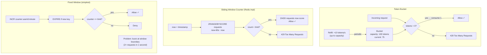

Rate limiting kiểm soát tần suất request từ client, bảo vệ service khỏi quá tải, lạm dụng và đảm bảo phân phối tài nguyên công bằng.

## Điểm Chính

- Áp dụng tại: API Gateway (mỗi client/route), service layer, hoặc Nginx (<code>limit_req</code>).
- <strong>Token Bucket</strong>: token được thêm với tốc độ cố định; mỗi request tiêu thụ một token. Cho phép bursting.
- <strong>Sliding Window</strong>: đếm request trong rolling time window. Mượt, không có lợi thế burst.
- <strong>Fixed Window</strong>: đếm mỗi phút/giờ cố định. Đơn giản nhưng edge-case: tốc độ 2× tại ranh giới window.
- Key: theo IP, user ID, API key hoặc kết hợp.
- Response: HTTP 429 với <code>Retry-After</code> và header <code>X-RateLimit-*</code>.

## Ví Dụ Code

*Bucket4j token bucket per user; 429 response + headers; Spring Cloud Gateway Redis rate limiter*

```java
// Token Bucket rate limiting with Bucket4j (in-process)
@Service @RequiredArgsConstructor
public class RateLimiterService {
    // ConcurrentHashMap: one bucket per user (in-memory — use Redis for distributed)
    private final Map<String, Bucket> buckets = new ConcurrentHashMap<>();

    // Create bucket: 100 req/min with burst up to 200
    private Bucket createBucket() {
        return Bucket.builder()
            .addLimit(Bandwidth.builder()
                .capacity(200)                           // max burst size
                .refillGreedy(100, Duration.ofMinutes(1)) // refill 100 tokens/min
                .build())
            .build();
    }

    public boolean tryConsume(String userId) {
        Bucket bucket = buckets.computeIfAbsent(userId, k -> createBucket());
        return bucket.tryConsume(1); // consume 1 token; false if bucket empty
    }
}

// Rate limiting filter applied to all API endpoints
@Component @RequiredArgsConstructor
public class RateLimitFilter extends OncePerRequestFilter {
    private final RateLimiterService rateLimiter;

    @Override
    protected void doFilterInternal(HttpServletRequest req,
            HttpServletResponse resp, FilterChain chain)
            throws ServletException, IOException {
        String userId = req.getHeader("X-User-Id");
        if (userId != null && !rateLimiter.tryConsume(userId)) {
            resp.setStatus(HttpStatus.TOO_MANY_REQUESTS.value()); // 429
            resp.setHeader("Retry-After", "60");
            resp.setHeader("X-RateLimit-Limit", "100");
            resp.getWriter().write("{"error":"Rate limit exceeded"}");
            return;
        }
        chain.doFilter(req, resp);
    }
}

// Distributed rate limiting: Spring Cloud Gateway + Redis (preferred for microservices)
// application.yml:
// spring:
//   cloud:
//     gateway:
//       routes:
//         - id: order-service
//           uri: lb://order-service
//           predicates:
//             - Path=/api/orders/**
//           filters:
//             - name: RequestRateLimiter
//               args:
//                 redis-rate-limiter.replenishRate: 10     # tokens/second
//                 redis-rate-limiter.burstCapacity: 50     # max burst
//                 redis-rate-limiter.requestedTokens: 1
//                 key-resolver: "#{@userKeyResolver}"      # rate limit per user

// KeyResolver bean: extract user ID from JWT header
// @Bean KeyResolver userKeyResolver() {
//     return exchange -> Mono.just(
//         exchange.getRequest().getHeaders().getFirst("X-User-Id"));
// }
```

## Ứng Dụng Thực Tế

Cho distributed rate limiting qua các instance, back token bucket bằng Redis (Bucket4j-Redis). Cho API Gateway-level limiting, dùng <code>RedisRateLimiter</code> tích hợp của Spring Cloud Gateway. Luôn bao gồm rate limit header trong response để client tự điều chỉnh.

## Câu Hỏi Phỏng Vấn

<details>
<summary><strong>Token Bucket và Leaky Bucket khác nhau thế nào?</strong></summary>

**A:** Token Bucket: allow burst — nếu bucket có tokens tích lũy, nhiều requests có thể pass ngay. Refill tokens theo rate cố định. Burst friendly, average rate controlled. Leaky Bucket: smooth output rate — requests queue vào bucket, process ở rate cố định (leak out). Nếu bucket đầy → reject. Không allow burst, output rate uniform. Token Bucket: cho API rate limiting có burst provision (user có thể gửi 10 requests/giây burst, average 5/giây). Leaky Bucket: cho traffic shaping, network QoS.

</details>

<details>
<summary><strong>Implement rate limiting distributed (nhiều app instance) thế nào?</strong></summary>

**A:** Mỗi instance tự track → không accurate với nhiều instances. Cần centralized counter: Redis. Pattern: `INCR userId:window EX 60` — atomic increment với expiry. Nếu result > limit → reject. Hoặc dùng Lua script cho atomic check-and-increment. Sliding window: ZSET với `ZADD userId:requests now timestamp` + `ZREMRANGEBYSCORE` để remove old entries + `ZCARD` đếm current. Bucket4j + Redis là library Java cho distributed rate limiting. API Gateway (Kong, AWS API Gateway) cũng cung cấp built-in distributed rate limiting.

</details>

## Sơ Đồ Rate Limiting Algorithms


