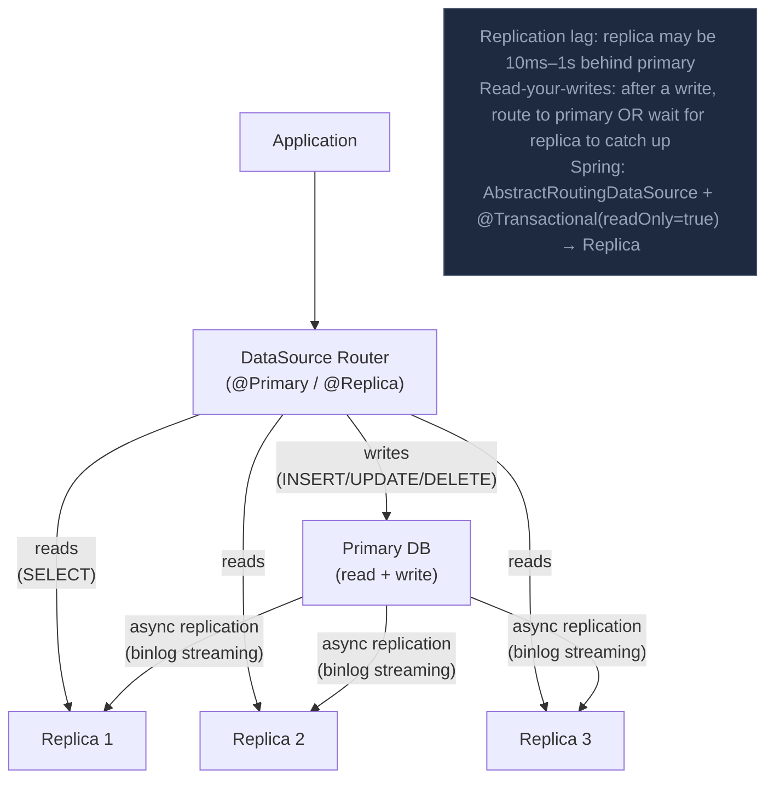

Read replica là bản copy bất đồng bộ của primary DB, chấp nhận query read-only — cho phép tải read được offload khỏi primary cho horizontal read scaling.

## Điểm Chính

- Replication lag: replica có thể lag sau primary một chút (mili giây đến giây). Có thể gây stale read.
- Dùng read replica cho: reporting query, analytics, search, non-critical read.
- Tránh cho: read ngay sau write phải thấy write đó (dùng primary cho những này).
- Setup trong AWS RDS: thêm read replica với một click; replication bất đồng bộ tự động.
- Nhiều replica: query đọc được phân phối qua tất cả replica (LB hoặc application routing).

## Ví Dụ Code

*Read Replica: report queries → replica; replication lag + read-your-writes fix; PgBouncer pooling*

```java
// Read Replica: offload read traffic from primary DB
// @Transactional(readOnly=true) → routes to replica via AbstractRoutingDataSource

@Service @RequiredArgsConstructor
public class OrderReportService {

    // These read-heavy operations → replica (can tolerate replication lag)
    @Transactional(readOnly = true)
    public Page<OrderSummary> getOrderHistory(String userId, Pageable pageable) {
        return orderRepo.findByUserIdOrderByCreatedAtDesc(userId, pageable);
    }

    @Transactional(readOnly = true)
    public SalesReport generateDailySalesReport(LocalDate date) {
        return orderRepo.aggregateSalesByDate(date); // expensive GROUP BY → replica
    }

    // Write: always goes to primary
    @Transactional
    public Order createOrder(CreateOrderRequest req) {
        Order order = orderRepo.save(new Order(req));
        // Read from PRIMARY right after write → read-your-writes consistency
        // (same transaction → same connection → primary)
        return order;
    }
}

// Replication lag handling: user just placed order, reads their order list
// Problem: replica may lag 200ms → user doesn't see their new order!
// Solution 1: read from primary for 5s after any write (sticky primary)
// Solution 2: include orderId in redirect URL → fetch that order from primary
// Solution 3: optimistic UI update (show order immediately, backend catches up)

// AWS RDS Read Replica setup:
// - Multi-AZ Primary: synchronous replication to standby (failover, NOT for reads)
// - Read Replica: async replication, for read offloading (different endpoint)
// - Replication lag metric: ReplicaLag in CloudWatch → alert if > 5 seconds
// - Add multiple replicas: distribute reads with application-level LB or RDS Proxy

// Connection pooling with PgBouncer (reduces DB connections):
// Primary: 20 app instances × 20 connections = 400 → PgBouncer pools to 50 actual connections
// Replica: 20 app instances × 50 connections = 1000 → PgBouncer pools to 100
```

## Ứng Dụng Thực Tế

Thêm <code>@Transactional(readOnly=true)</code> vào TẤT CẢ query method trong service layer ngay bây giờ — dù không có read replica, nó tối ưu Hibernate (không dirty checking, không first-level cache flush) và chuẩn bị cho replica routing khi cần.

## Câu Hỏi Phỏng Vấn

<details>
<summary><strong>Replication lag ảnh hưởng thế nào và handle thế nào?</strong></summary>

**A:** MySQL async replication: replica có thể lag 10ms đến giây sau primary. Read-your-writes problem: user vừa update profile → refresh trang → query replica → thấy data cũ. Fix options: (1) Route đến primary ngay sau write (in same session). (2) Application-level timestamp: client gửi `X-Written-At` header, nếu replica lag > timestamp → fallback primary. (3) Semi-synchronous replication: primary chờ ít nhất 1 replica confirm trước khi commit — tăng write latency, giảm lag. (4) Accept eventual consistency cho non-critical reads.

</details>

<details>
<summary><strong>Implement read/write routing trong Spring Boot thế nào?</strong></summary>

**A:** AbstractRoutingDataSource: xác định DataSource dựa trên current context. `@Transactional(readOnly=true)` set context → RoutingDataSource chọn replica. Implement: extend `AbstractRoutingDataSource`, override `determineCurrentLookupKey()` → check `TransactionSynchronizationManager.isCurrentTransactionReadOnly()`. Register primary và replicas với keys "write"/"read". AspectJ intercept `@Transactional(readOnly=true)` và set thread-local key. Library: Spring Data JPA DataSource Proxy hoặc Sharding-JDBC (ShardingSphere) đều support read/write splitting out-of-box.

</details>

## Sơ Đồ Read Replica Architecture


