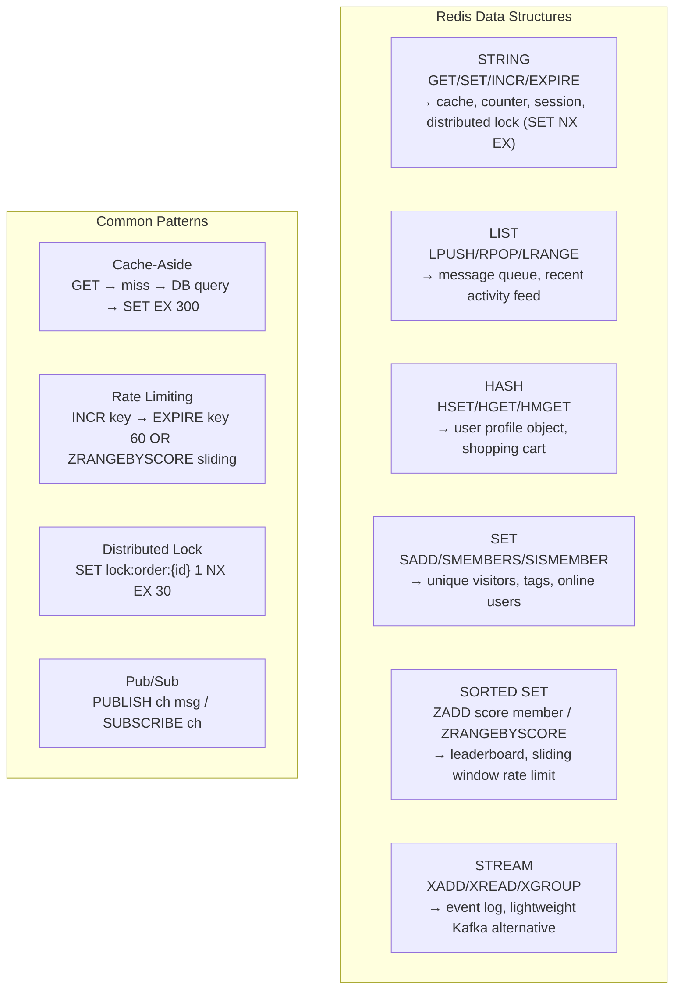

Redis là in-memory data structure store dùng cho caching, session, pub/sub messaging, rate limiting và distributed lock — với latency dưới mili-giây.

## Điểm Chính

- Cấu trúc dữ liệu: String, List, Set, Sorted Set (ZSet), Hash, Stream, Bitmap, HyperLogLog.
- Persistence: RDB snapshot + AOF (append-only file) cho durability. Chế độ cache thuần: không persistence.
- Pub/Sub: messaging nhẹ. Cho messaging bền vững, dùng Redis Streams.
- Thao tác atomic: <code>INCR</code>, <code>SETNX</code>, <code>GETSET</code>, <code>LPUSH/RPOP</code>.
- Cluster mode: sharding qua node. Sentinel: HA không sharding.
- TTL: đặt expiry với <code>EXPIRE key seconds</code> — tự động evict cache entry.

## Ví Dụ Code

*Redis: product cache, cart (Hash), rate limiting (INCR), distributed lock (SETNX), @Cacheable*

```java
// ✅ Redis use cases in Spring Boot e-commerce platform

@Service
public class RedisService {
    @Autowired
    private RedisTemplate<String, Object> redis;
    @Autowired
    private StringRedisTemplate stringRedis;

    // --- Use case 1: Cache product details (String / JSON) ---
    // Key pattern: "product:{id}" — TTL 10 minutes (product data changes infrequently)
    public Product getProduct(Long id) {
        String key = "product:" + id;
        Product cached = (Product) redis.opsForValue().get(key);
        if (cached != null) return cached;
        Product product = productRepository.findById(id).orElseThrow();
        redis.opsForValue().set(key, product, 10, TimeUnit.MINUTES);
        return product;
    }

    // --- Use case 2: Shopping cart (Hash — one key per user, fields per product) ---
    // HSET cart:user:42 product:99 2    → add 2 units of product 99
    // HGETALL cart:user:42              → get full cart
    public void addToCart(Long userId, Long productId, int qty) {
        String key = "cart:user:" + userId;
        redis.opsForHash().put(key, "product:" + productId, String.valueOf(qty));
        redis.expire(key, 7, TimeUnit.DAYS);  // cart expires after 7 days of inactivity
    }
    public Map<Object, Object> getCart(Long userId) {
        return redis.opsForHash().entries("cart:user:" + userId);
    }

    // --- Use case 3: Rate limiting (atomic INCR + EXPIRE) ---
    // Token bucket approximation: fixed window per second per client
    public boolean isRateLimitAllowed(String clientId, int maxPerSecond) {
        String key = "ratelimit:" + clientId + ":" + (System.currentTimeMillis() / 1000);
        Long count = stringRedis.opsForValue().increment(key);
        if (count == 1) stringRedis.expire(key, 2, TimeUnit.SECONDS);  // 2s safety margin
        return count <= maxPerSecond;  // false → return HTTP 429
    }

    // --- Use case 4: Distributed lock (SETNX + Expiry — simple version) ---
    // Production: use Redisson RLock for Redlock algorithm
    public boolean acquireLock(String resource, String requestId, long ttlMs) {
        // SET NX EX: set only if not exists + expiry in one atomic command
        Boolean acquired = stringRedis.opsForValue()
            .setIfAbsent("lock:" + resource, requestId, ttlMs, TimeUnit.MILLISECONDS);
        return Boolean.TRUE.equals(acquired);
    }
    public void releaseLock(String resource, String requestId) {
        // Only release if we own the lock (check requestId matches)
        String currentHolder = stringRedis.opsForValue().get("lock:" + resource);
        if (requestId.equals(currentHolder)) {
            stringRedis.delete("lock:" + resource);
        }
    }
}

// ✅ @Cacheable — Spring Cache abstraction backed by Redis
@Service
public class ProductService {
    @Cacheable(value = "products", key = "#id", unless = "#result == null")
    public Product findById(Long id) { return productRepository.findById(id).orElse(null); }

    @CacheEvict(value = "products", key = "#product.id")
    public Product update(Product product) { return productRepository.save(product); }
}
```

## Ứng Dụng Thực Tế

Dùng <code>@Cacheable</code>/<code>@CacheEvict</code> với Redis CacheManager cho method-level caching trong suốt trong Spring. Cho distributed lock, dùng <code>RLock</code> của Redisson implement Redlock algorithm đúng.

## Câu Hỏi Phỏng Vấn

<details>
<summary><strong>Redis persistence options và khi nào dùng loại nào?</strong></summary>

**A:** **RDB (Snapshot)**: fork process, dump snapshot vào file định kỳ. Fast restart (load snapshot), nhưng mất data từ lần snapshot cuối đến lúc crash. Dùng cho: cache (mất data chấp nhận được), backup point-in-time. **AOF (Append Only File)**: log mọi write command, replay khi restart. `appendfsync always` (safe nhưng slow), `everysec` (1s durability, balance), `no` (OS decides). Dùng cho: cần durability cao hơn. **AOF + RDB**: dùng cả hai — best of both worlds. Redis 7+: RDB-AOF hybrid format.

</details>

<details>
<summary><strong>Redis cluster và Redis Sentinel khác nhau thế nào?</strong></summary>

**A:** **Redis Sentinel**: high availability cho single master setup. Sentinel monitors master, tự động failover sang replica khi master down. Không hỗ trợ horizontal scaling — dữ liệu vẫn trên một master. Dùng khi: HA quan trọng nhưng dataset nhỏ. **Redis Cluster**: horizontal sharding — tự động chia data sang nhiều master nodes (16384 hash slots). Mỗi master có replica. Scale read và write. Dùng khi: dataset lớn hơn một server hoặc cần horizontal write scaling. Trade-off: Cluster không support multi-key operations qua shards.

</details>

## Sơ Đồ Redis Data Structures


