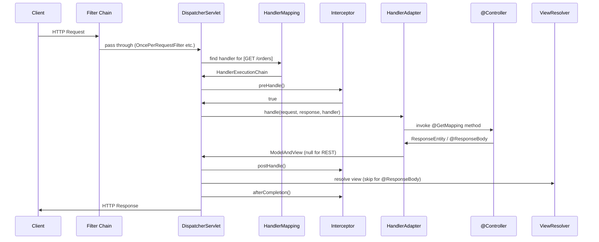

Mỗi HTTP request vào DispatcherServlet, đi qua filter → handler mapping → handler adapter → controller → view resolution, với interceptor bọc handler execution.

## Điểm Chính

- 1. <strong>Filter chain</strong>: Spring Security, CORS, encoding filter — trước Spring MVC.
- 2. <strong>DispatcherServlet</strong> nhận request.
- 3. <strong>HandlerMapping</strong>: <code>RequestMappingHandlerMapping</code> tìm controller method khớp.
- 4. <strong>HandlerInterceptor.preHandle()</strong>: kiểm tra authentication, logging.
- 5. <strong>HandlerAdapter</strong> gọi controller method, giải quyết argument.
- 6. <strong>Controller</strong> thực thi business logic, trả về <code>ModelAndView</code> hoặc response body.
- 7. <strong>HandlerInterceptor.postHandle()</strong>: thêm header, chỉnh sửa model.
- 8. <strong>View resolution</strong> (cho MVC) hoặc <code>HttpMessageConverter</code> (cho REST) ghi response.
- 9. <strong>HandlerInterceptor.afterCompletion()</strong>: cleanup, logging.

## Ví Dụ Code

*Request flow demo: RequestLoggingInterceptor (preHandle/postHandle/afterCompletion) + WebMvcConfigurer registration*

```java
import org.springframework.web.servlet.*;
import org.springframework.web.servlet.config.annotation.*;
import org.springframework.stereotype.*;
import org.slf4j.*;

// ---- Request Flow: Filter → DispatcherServlet → Interceptor → Controller → Response ----
//
// 1. FILTER (Servlet API, before Spring MVC)
//    → Security filter (Spring Security)
//    → CORS filter
//    → Correlation ID filter  ← runs here
//    → DispatcherServlet
// 2. HandlerMapping: maps URL to @RequestMapping method
// 3. preHandle() interceptor
// 4. Controller method executes
// 5. postHandle() interceptor (only on success)
// 6. afterCompletion() interceptor (always — even on exception)
// 7. HttpMessageConverter → JSON serialized → response sent

// ---- Interceptor: timing + request logging (runs INSIDE Spring context) ----
@Component
public class RequestLoggingInterceptor implements HandlerInterceptor {

    private static final Logger log = LoggerFactory.getLogger(RequestLoggingInterceptor.class);
    // ThreadLocal: each request thread has its own start time
    private final ThreadLocal<Long> startTime = new ThreadLocal<>();

    // Step 3: called before controller — return false to abort (e.g. failed auth check)
    @Override
    public boolean preHandle(HttpServletRequest request,
                             HttpServletResponse response,
                             Object handler) {
        startTime.set(System.currentTimeMillis());

        // Access handler metadata — only possible with interceptors (not filters)
        if (handler instanceof HandlerMethod handlerMethod) {
            log.debug("→ [{}.{}] {} {}",
                handlerMethod.getBeanType().getSimpleName(),
                handlerMethod.getMethod().getName(),
                request.getMethod(),
                request.getRequestURI());
        }
        return true; // continue processing; return false to send 401/403 and stop chain
    }

    // Step 5: called after controller returns — model is available, response not yet written
    @Override
    public void postHandle(HttpServletRequest request,
                           HttpServletResponse response,
                           Object handler,
                           ModelAndView modelAndView) {
        // Rarely used for REST APIs (no ModelAndView); useful for MVC apps to inject view data
        response.addHeader("X-Served-By", "order-service");
    }

    // Step 6: called after response committed — always runs (even on exception)
    @Override
    public void afterCompletion(HttpServletRequest request,
                                HttpServletResponse response,
                                Object handler,
                                Exception ex) {
        long elapsed = System.currentTimeMillis() - startTime.get();
        startTime.remove(); // CRITICAL: clean up ThreadLocal to prevent memory leak

        if (ex != null) {
            log.error("✗ {} {} → {} ({}ms) [exception: {}]",
                request.getMethod(), request.getRequestURI(),
                response.getStatus(), elapsed, ex.getMessage());
        } else {
            log.info("✓ {} {} → {} ({}ms)",
                request.getMethod(), request.getRequestURI(),
                response.getStatus(), elapsed);
        }
    }
}

// ---- Register interceptor via WebMvcConfigurer ----
@Configuration
public class WebMvcConfig implements WebMvcConfigurer {

    private final RequestLoggingInterceptor loggingInterceptor;

    public WebMvcConfig(RequestLoggingInterceptor loggingInterceptor) {
        this.loggingInterceptor = loggingInterceptor;
    }

    @Override
    public void addInterceptors(InterceptorRegistry registry) {
        registry.addInterceptor(loggingInterceptor)
                .addPathPatterns("/api/**")          // apply to all API endpoints
                .excludePathPatterns(               // skip these (already handled by security)
                    "/api/v1/auth/**",
                    "/actuator/**"
                );
    }
}
```

## Ứng Dụng Thực Tế

Dùng filter cho cross-cutting concern phải áp dụng bất kể Spring MVC (ví dụ: security). Dùng interceptor cho concern Spring-aware (ví dụ: truy cập metadata controller method). Cả hai đăng ký khác nhau — filter qua FilterRegistrationBean, interceptor qua WebMvcConfigurer.

## Câu Hỏi Phỏng Vấn

<details>
<summary><strong>Filter và Interceptor khác nhau thế nào?</strong></summary>

**A:** Filter (javax.servlet): Servlet API, nằm ngoài Spring context, intercept trước khi request đến DispatcherServlet — dùng cho CORS, authentication (Spring Security), compression, request logging. Interceptor (HandlerInterceptor): Spring-aware, chạy trong DispatcherServlet sau HandlerMapping resolve handler, có access đến handler method thông tin. preHandle/postHandle/afterCompletion. Dùng Interceptor cho: authorization check có biết endpoint, audit logging với method info. Dùng Filter cho: low-level concerns (encoding, security headers).

</details>

<details>
<summary><strong>@ControllerAdvice hoạt động thế nào?</strong></summary>

**A:** `@ControllerAdvice` là global exception handler — apply cho tất cả controllers (hoặc subset nếu specify `basePackages`). `@ExceptionHandler` trong ControllerAdvice intercept exception từ bất kỳ controller nào. Spring scan ControllerAdvice beans và register exception handler; khi exception không handled trong controller → DispatcherServlet tìm matching @ExceptionHandler. Cần define hierarchy: specific exception trước generic — Spring pick most specific match. Combine với `@ResponseStatus` để set HTTP status code.

</details>

## Sơ Đồ Spring MVC Request Flow


