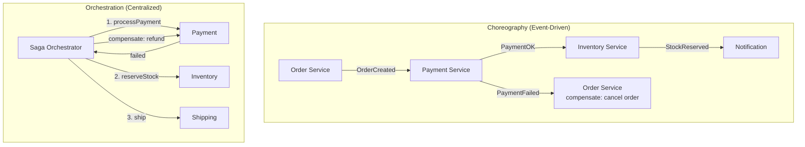

Saga quản lý distributed transaction qua microservice bằng cách chia thành chuỗi local transaction, mỗi cái publish event hoặc command để trigger bước tiếp theo.

## Điểm Chính

- Vấn đề: không có ACID transaction đơn nào spanning nhiều service.
- Saga: mỗi service commit cục bộ và publish event; khi thất bại, compensating transaction hoàn tác các bước trước.
- <strong>Choreography</strong>: service phản ứng với event — decoupled nhưng khó theo dõi.
- <strong>Orchestration</strong>: saga orchestrator trung tâm điều phối — dễ monitor hơn, điểm kiểm soát duy nhất.
- Compensating transaction: ngược lại của hành động gốc (ví dụ: hoàn tiền sau khi giao hàng thất bại).

## Ví Dụ Code

*Saga Pattern: happy path + compensation flow + OrderService initiator + InventoryService participant with both forward and compensating transactions*

```java
// ✅ Saga Pattern: managing distributed transactions without 2PC
// Problem: placing an order spans 3 services (Inventory, Payment, Shipping)
// No single DB transaction across services → use Saga: chain of local transactions + compensation

// ─── Happy path flow (Choreography via Kafka events) ───
// 1. OrderService:    CREATE order → publish "order.created"
// 2. InventoryService: reserve stock → publish "stock.reserved"  (or "stock.failed")
// 3. PaymentService:  charge card   → publish "payment.completed" (or "payment.failed")
// 4. ShippingService: schedule ship → publish "shipping.scheduled"
// 5. OrderService:    update status → COMPLETED

// ─── Compensation flow (if payment fails) ───
// 3. PaymentService:  publish "payment.failed"
// 2. InventoryService: listens to "payment.failed" → release reservation (compensating tx)
// 1. OrderService:    listens to "payment.failed" or "stock.failed" → cancel order

// ✅ OrderService: initiate saga
@Service
public class OrderSagaInitiator {
    @Autowired KafkaTemplate<String, Object> kafka;

    @Transactional
    public Order placeOrder(PlaceOrderRequest request) {
        // Local transaction: persist order in PENDING state
        Order order = new Order(request.getCustomerId(), request.getItems(), OrderStatus.PENDING);
        Order saved = orderRepository.save(order);

        // Publish saga start event — Outbox pattern recommended for reliability
        kafka.send("order.created", String.valueOf(saved.getId()),
            new OrderCreatedEvent(saved.getId(), saved.getCustomerId(),
                                  saved.getItems(), saved.getTotal()));
        return saved;
    }

    // Compensation: listen for failure events and cancel the order
    @KafkaListener(topics = {"stock.reservation.failed", "payment.failed"}, groupId = "order-service")
    @Transactional
    public void onSagaFailure(SagaFailureEvent event) {
        log.warn("Saga failed for orderId={}, reason={}", event.getOrderId(), event.getReason());
        orderRepository.updateStatus(event.getOrderId(), OrderStatus.CANCELLED);
        kafka.send("order.cancelled",
            new OrderCancelledEvent(event.getOrderId(), event.getReason()));
    }
}

// ✅ InventoryService: react to saga event, publish next or compensation
@Service
public class InventorySagaParticipant {
    @Autowired KafkaTemplate<String, Object> kafka;

    @KafkaListener(topics = "order.created", groupId = "inventory-service")
    @Transactional
    public void onOrderCreated(OrderCreatedEvent event) {
        try {
            // Local transaction: atomically check + reserve stock
            reservationService.reserveForOrder(event.getOrderId(), event.getItems());
            // Publish success → triggers next saga step (PaymentService)
            kafka.send("stock.reserved",
                new StockReservedEvent(event.getOrderId(), event.getCustomerId(), event.getTotal()));
        } catch (InsufficientStockException e) {
            // Publish failure → triggers compensation in OrderService
            kafka.send("stock.reservation.failed",
                new StockReservationFailedEvent(event.getOrderId(), e.getMessage()));
        }
    }

    // Compensation: release reservation when payment fails
    @KafkaListener(topics = "payment.failed", groupId = "inventory-service")
    @Transactional
    public void onPaymentFailed(PaymentFailedEvent event) {
        reservationService.releaseReservation(event.getOrderId());
        log.info("Released stock reservation for orderId={}", event.getOrderId());
    }
}
```

## Ứng Dụng Thực Tế

Bắt đầu với choreography (đơn giản hơn), chuyển sang orchestration (Temporal, Axon, AWS Step Functions) khi saga phức tạp (5+ bước, nhiều compensation). Luôn làm mỗi bước idempotent — Kafka giao at-least-once.

## Câu Hỏi Phỏng Vấn

<details>
<summary><strong>Compensating transaction là gì? Ví dụ cụ thể.</strong></summary>

**A:** Khi một step trong saga fail, không thể rollback các step đã committed (distributed system không có 2PC atomic). Thay vào đó, chạy compensating transaction để undo effect: Order saga — `createOrder` → `chargePayment` → `reserveInventory`. Nếu `reserveInventory` fail → chạy `refundPayment` (compensate `chargePayment`) và `cancelOrder` (compensate `createOrder`). Compensating transaction là business operation, không phải DB rollback. Cần design idempotent — có thể gọi nhiều lần.

</details>

<details>
<summary><strong>Choreography và Orchestration Saga có trade-off gì?</strong></summary>

**A:** Choreography (event-driven): services react to events, không có central coordinator. Ưu: loose coupling, resilient (không single point of failure). Nhược: flow khó trace, business logic phân tán khắp services, testing complex. Orchestration (centralized): Saga Orchestrator gọi services theo thứ tự, handle compensation. Ưu: flow rõ ràng, dễ debug, single place implement logic. Nhược: orchestrator là central dependency, có thể trở thành bottleneck. Chọn choreography cho simple flow ít steps; orchestration cho complex saga nhiều steps và compensation logic phức tạp.

</details>

## Sơ Đồ Choreography vs Orchestration


