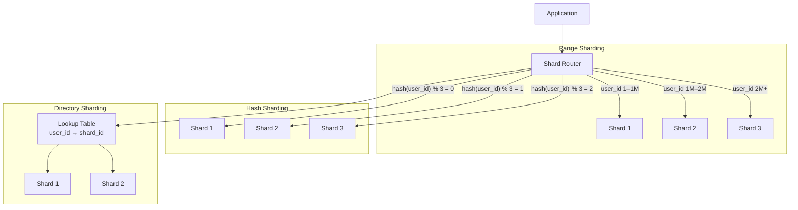

Sharding phân vùng dữ liệu qua nhiều database instance (shard) để mỗi shard giữ một phần dữ liệu — cho phép horizontal write scaling vượt quá khả năng một node.

## Điểm Chính

- <strong>Range sharding</strong>: shard theo key range (A-M → shard1, N-Z → shard2). Đơn giản, nhưng hotspot trên sequential key.
- <strong>Hash sharding</strong>: shard = <code>hash(key) % N</code>. Phân phối đều, nhưng range query hit tất cả shard.
- <strong>Directory sharding</strong>: bảng lookup map key → shard. Linh hoạt, nhưng bảng lookup là bottleneck.
- Cross-shard operation: JOIN và transaction qua shard rất phức tạp hoặc không thể.
- Resharding: thêm shard cần migrate dữ liệu. Dùng consistent hashing để giảm thiểu migration.
- Application-level sharding (thủ công) vs middleware sharding (Vitess, Citus, ProxySQL).

## Ví Dụ Code

*Hash sharding router; cross-shard query anti-pattern; resharding + Vitess/Citus recommendation*

```java
// Application-level hash sharding by userId (horizontal write scale)
@Component
public class ShardRouter {
    private final List<DataSource> shards; // shard-0, shard-1, shard-2, shard-3
    private final int shardCount;

    public ShardRouter(List<DataSource> shards) {
        this.shards = shards;
        this.shardCount = shards.size();
    }

    // Hash sharding: same userId always routes to same shard
    public DataSource getShardForUser(String userId) {
        int shardIndex = Math.abs(userId.hashCode()) % shardCount;
        return shards.get(shardIndex);
    }

    // Range sharding (alternative): A-F → shard-0, G-M → shard-1, etc.
    // Risk: hotspot if names starting with 'A' are most popular
}

// Repository using shard router
@Repository @RequiredArgsConstructor
public class ShardedOrderRepository {

    public Order findOrder(String orderId, String userId) {
        DataSource shard = shardRouter.getShardForUser(userId);
        // Use JdbcTemplate or JPA with dynamic DataSource
        return jdbcTemplate(shard).queryForObject(
            "SELECT * FROM orders WHERE id = ? AND user_id = ?",
            ORDER_ROW_MAPPER, orderId, userId);
    }

    // Cross-shard query — EXPENSIVE: must query ALL shards
    public List<Order> findOrdersByStatus(OrderStatus status) {
        return shards.parallelStream()  // query all shards in parallel
            .flatMap(shard -> jdbcTemplate(shard)
                .query("SELECT * FROM orders WHERE status = ?",
                    ORDER_ROW_MAPPER, status.name()).stream())
            .collect(Collectors.toList());
        // Avoid this pattern — design your sharding key to eliminate cross-shard queries
    }
}

// Resharding: adding shard-4 requires migrating ~25% of data
// Use consistent hashing to minimize: only 1/5 of data needs to move (not 1/4)

// Recommendation: use managed sharding solutions instead of manual:
// - Vitess (MySQL): transparent sharding, connection pooling, resharding online
// - Citus (PostgreSQL): distributed tables, parallel queries across shards
// - PlanetScale (MySQL): schema migrations without downtime, branch-based workflow
```

## Ứng Dụng Thực Tế

Sharding là phương án cuối cùng cho write scaling. Trước khi sharding: connection pooling (PgBouncer), read replica, caching, archive dữ liệu cũ, DB vertical scaling. Mỗi cái này đơn giản hơn. Nếu phải shard, dùng sharding framework (Vitess, Citus) thay vì làm thủ công.

## Câu Hỏi Phỏng Vấn

<details>
<summary><strong>Hot spot problem trong sharding là gì và giải quyết thế nào?</strong></summary>

**A:** Hot spot: một shard nhận significantly nhiều traffic hơn các shard khác. Ví dụ: shard theo user_id range — user 1-1M (mostly inactive) vs user 1M-2M (active users). Hoặc: một celebrity account nhận 10M requests/day — nếu shard theo userId, shard đó bị overload. Fix: (1) **Virtual shards**: nhiều logical shards per physical shard, tái distribute khi cần. (2) **Consistent hashing** với virtual nodes. (3) **Compound key**: (userId, timestamp) thay vì chỉ userId. (4) **Cache hot data** tại layer trên.

</details>

<details>
<summary><strong>Resharding là gì và tại sao phức tạp?</strong></summary>

**A:** Resharding = redistribute data khi thêm hoặc bớt shard node. Modulo sharding (hash % N): thêm node từ 3→4 → hầu hết keys map sang shard mới → phải move ~75% data — data migration expensive và có downtime risk. Consistent hashing: thêm node → chỉ move 1/N keys (keys của adjacent range) — minimal disruption. MongoDB, Cassandra, DynamoDB dùng consistent hashing với virtual nodes để online resharding. Luôn plan shard strategy trước — resharding production là một trong những riskiest operations.

</details>

## Sơ Đồ Sharding Strategies


