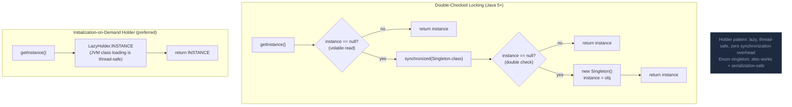

Singleton đảm bảo chỉ tồn tại một instance mỗi JVM — trong Spring, tất cả bean là singleton theo mặc định; hiếm khi cần implement Singleton thủ công.

## Điểm Chính

- Classic: private constructor + static getInstance(). Cần <code>volatile</code> cho DCL thread-safety.
- Tốt hơn: initialization-on-demand holder — lazy, thread-safe, không overhead synchronization.
- Spring bean là singleton mặc định — ưu tiên cách này hơn implement thủ công.
- Vấn đề: global state làm test khó; inject qua DI thay vì static lookup.

## Ví Dụ Code

*Spring @Component singleton + Enum singleton + Holder idiom + DCL (reference)*

```java
// ── 1. Spring @Component — the idiomatic singleton (preferred) ──────────────
@Component   // Spring creates ONE instance and injects it everywhere
public class OrderIdGenerator {
    private final AtomicLong sequence = new AtomicLong(1000L);
    public String generate() {
        return "ORD-" + LocalDate.now() + "-" + sequence.incrementAndGet();
    }
}
// Usage: @Autowired OrderIdGenerator generator; — easily mockable in tests

// ── 2. Enum Singleton — simplest thread-safe, serialization-safe ─────────────
public enum RegionConfig {
    INSTANCE;
    private final String defaultRegion = System.getenv().getOrDefault("AWS_REGION", "ap-southeast-1");
    private final int    maxOrderItems = 100;
    public String defaultRegion() { return defaultRegion; }
    public int    maxOrderItems()  { return maxOrderItems; }
}
// Usage: RegionConfig.INSTANCE.defaultRegion()

// ── 3. Initialization-on-demand Holder — lazy, thread-safe without sync ──────
public class LegacyConnectionPool {
    private LegacyConnectionPool() {
        // expensive initialization: open DB connections, load config
        loadConfig();
        initPoolConnections();
    }
    // JVM guarantees: Holder is initialized only when getInstance() is first called
    private static class Holder {
        static final LegacyConnectionPool INSTANCE = new LegacyConnectionPool();
    }
    public static LegacyConnectionPool getInstance() { return Holder.INSTANCE; }
}

// ── 4. Classic DCL (Double-Checked Locking) — for educational reference ──────
// Note: volatile is REQUIRED to prevent instruction reorder on multi-core CPUs
public class RateLimiter {
    private static volatile RateLimiter instance;
    private final int maxRps;
    private RateLimiter(int maxRps) { this.maxRps = maxRps; }
    public static RateLimiter getInstance() {
        if (instance == null) {                        // first check (no lock)
            synchronized (RateLimiter.class) {
                if (instance == null) {                // second check (with lock)
                    instance = new RateLimiter(1000);
                }
            }
        }
        return instance;
    }
}
// ⚠️ In Spring apps, NEVER use manual singleton — use @Component/@Bean instead
```

## Ứng Dụng Thực Tế

Trong Spring app không có lý do để implement Singleton thủ công. Tất cả bean @Component/@Service/@Repository đều là singleton. Dùng prototype scope khi cần instance mới mỗi lần gọi.

## Câu Hỏi Phỏng Vấn

<details>
<summary><strong>Enum singleton tốt hơn double-checked locking thế nào?</strong></summary>

**A:** Enum singleton: JVM guarantee lazy initialization, thread-safe, serialization-safe (không tạo extra instance khi deserialize). `public enum Config { INSTANCE; public void doSomething(){} }`. Double-checked locking: cần volatile (Java 5+ fix), complex code, serialization có thể break (cần implement `readResolve()`). Holder pattern: cũng tốt — `private static class Holder { static final T INSTANCE = new T(); }`. JVM class loading đảm bảo Holder chỉ initialized một lần, thread-safe.

</details>

<details>
<summary><strong>Spring singleton bean và GoF Singleton pattern khác nhau thế nào?</strong></summary>

**A:** Spring singleton: một instance per ApplicationContext — nếu có 2 contexts (test + prod trong cùng JVM), có 2 instances của bean. GoF Singleton: một instance per ClassLoader (per JVM trong hầu hết cases). Spring singleton không enforce private constructor hay getInstance() — bất kỳ ai cũng có thể `new MyService()`. Spring singleton là container-managed scoping, không phải creational pattern. Trong Spring app: không cần implement GoF Singleton — để Spring quản lý bean lifecycle là đủ.

</details>

## Sơ Đồ Singleton Pattern (Thread-Safe)


