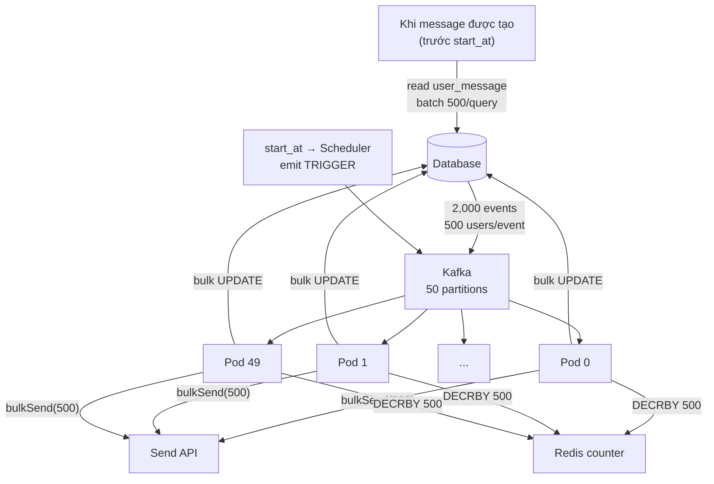
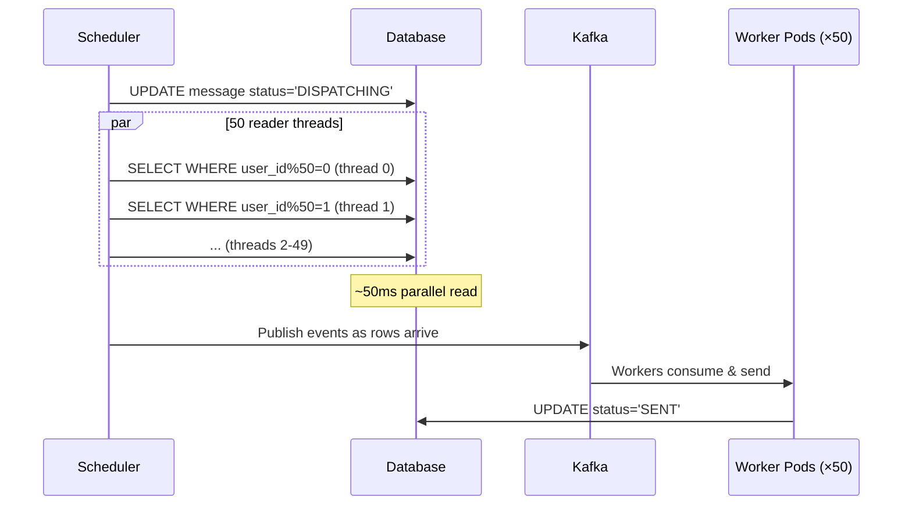
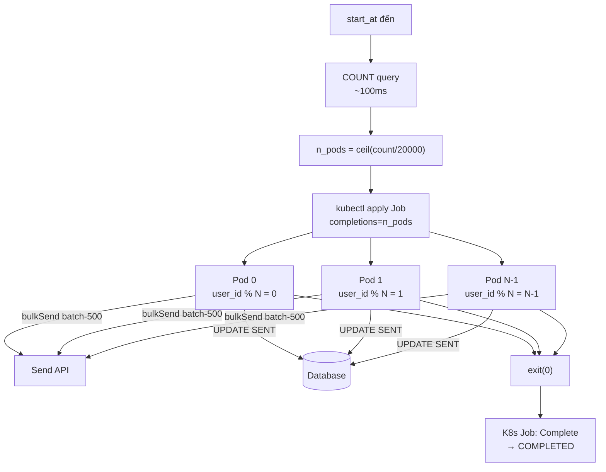
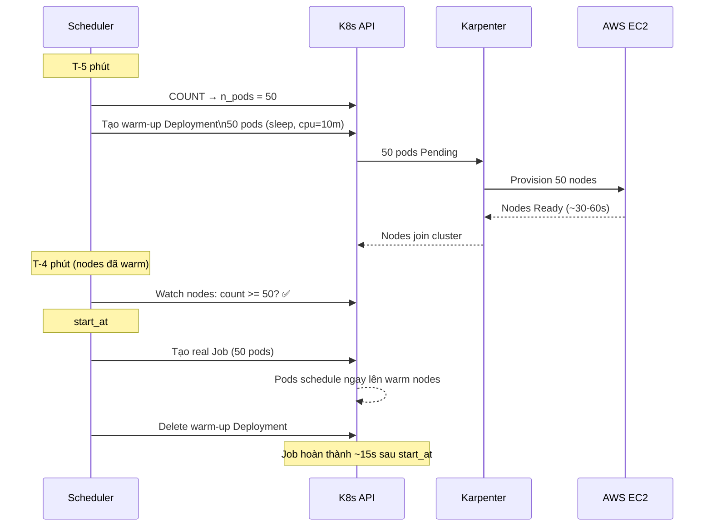
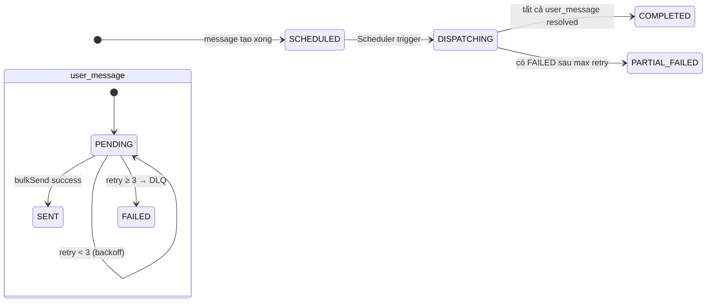

Thiết kế phần delivery: tại thời điểm `start_at`, gửi message đến toàn bộ users trong `user_message` — có thể lên đến 1M+ users — và hoàn thành trong vòng 5 phút.

## Problem Statement

```
Schema đã có sẵn:
  user(user_id, ...)
  message(message_id, content, start_at)
  user_message(id, user_id, message_id)

Yêu cầu:
  - Đúng start_at: trigger gửi tới TẤT CẢ users của message đó
  - 1 message có thể có 1M+ users
  - Có 1 Send API, không có rate limit
  - Fault tolerant: fail không mất, không double-send
  - SLA: toàn bộ phải hoàn thành trong 5 phút kể từ start_at

Constraint thực tế:
  - Admin có thể thêm/xóa users (user_message) bất kỳ lúc nào trước start_at
  - Admin có thể sửa content (message.content) trước start_at
  - Số lượng users không cố định — 1K hoặc 3M tùy message
```

## Schema Extension

Schema gốc không có status tracking — cần bổ sung:

```sql
ALTER TABLE message
  ADD COLUMN status VARCHAR(20) DEFAULT 'SCHEDULED';
  -- SCHEDULED → DISPATCHING → COMPLETED | PARTIAL_FAILED

ALTER TABLE user_message
  ADD COLUMN status      VARCHAR(20) DEFAULT 'PENDING',
  ADD COLUMN sent_at     TIMESTAMP   NULL,
  ADD COLUMN retry_count INT         DEFAULT 0,
  ADD COLUMN error       TEXT        NULL;
  -- PENDING → SENT | FAILED

CREATE INDEX idx_message_status_start ON message(status, start_at);
CREATE INDEX idx_um_message_status    ON user_message(message_id, status);
```

## Throughput Analysis (design-agnostic)

```
SLA: hoàn thành trong 300 giây

Nếu Send API per-user:
  ~100ms/call → 1 thread = 10 sends/s
  1M users → cần 333 threads đồng thời → không thực tế

Nếu Send API batch-500:
  ~300ms/call → 1 thread = 1,667 sends/s
  Cần 1M / (1,667 × 300s) ≈ 2 threads → rất dễ đạt

→ Batch Send API là lever quan trọng nhất.
   Mọi design dưới đây đều assume batch-500.
```

---

## Các Phương Án Thiết Kế

### Phương Án 1 — Pre-fan-out + Kafka + Fixed Pods

**Ý tưởng:** Publish Kafka events ngay khi message được tạo. Tại `start_at`, pods consume ngay lập tức — không mất thời gian scan DB.



**Flow:**
```
Khi tạo message:
  Fan-out Service đọc user_message → publish 2,000 events vào Kafka

start_at:
  Scheduler emit TRIGGER → 50 pods consume ngay
  Mỗi pod: ~40 events × 300ms API = 12 giây
  Tổng: ~12 giây cho 1M users

Completion: Redis DECRBY → về 0 → mark COMPLETED
```

**Vấn đề nghiêm trọng:**
```
Nếu sau khi publish Kafka:
  Admin thêm 500 users mới  → KHÔNG được gửi ❌
  Admin xóa 10,000 users    → VẪN bị gửi ❌
  Admin sửa content         → GỬI content cũ ❌

Kafka events đã stale — design này chỉ work khi data bất biến
sau khi publish. Không phù hợp với requirement mutable.
```

---

### Phương Án 2 — Fan-out tại Trigger + Parallel DB Read

**Ý tưởng:** Không pre-fan-out. Tại `start_at`, đọc DB song song với N threads thay vì tuần tự — loại bỏ bottleneck 50 giây.

**Vấn đề của fan-out tuần tự:**
```
1M rows / 1,000 per query = 1,000 queries
Sequential: 1,000 × 50ms = 50 giây chỉ để đọc DB
Còn 250 giây cho 1M sends → deadline rủi ro cao
```

**Giải pháp — 50 reader threads song song:**
```
Mỗi thread đọc 1 partition:
  SELECT user_id FROM user_message
  WHERE message_id = ?
    AND status = 'PENDING'
    AND user_id % 50 = {thread_id}

50 threads × 1 query mỗi thread = 50ms (parallel) thay vì 50 giây
→ Publish lên Kafka khi đọc xong
→ Workers consume ngay
```



**Data luôn fresh** — đọc tại thời điểm trigger, không bao giờ stale.

---

### Phương Án 3 — K8s Job Dynamic (Recommended)

**Ý tưởng:** Tại `start_at`, COUNT để biết số users, tính số pods cần thiết, tạo K8s Job với đúng số đó. Pod chạy xong job là tắt — không có idle resource.

**Bước 1 — COUNT tại trigger:**
```sql
SELECT COUNT(*) FROM user_message
WHERE message_id = ? AND status = 'PENDING'
-- Index scan: ~50-100ms cho 1M rows. Chạy 1 lần → negligible.
```

**Bước 2 — Tính số pods:**
```
users_per_pod = 20,000   # mỗi pod xử lý thoải mái trong SLA
n_pods = ceil(count / users_per_pod)

count = 5,000   → n_pods = 1
count = 1M      → n_pods = 50
count = 3M      → n_pods = 150
```

**Bước 3 — Tạo K8s Job:**
```yaml
apiVersion: batch/v1
kind: Job
metadata:
  name: msg-delivery-{{ message_id }}
spec:
  completionMode: Indexed        # pod nhận index 0, 1, ..., N-1
  completions: {{ n_pods }}
  parallelism: {{ n_pods }}
  ttlSecondsAfterFinished: 300   # tự dọn sau 5 phút
  template:
    spec:
      restartPolicy: OnFailure
      containers:
      - name: worker
        image: msg-worker:latest
        env:
        - name: MESSAGE_ID
          value: "{{ message_id }}"
        - name: TOTAL_PARTITIONS
          value: "{{ n_pods }}"
        # JOB_COMPLETION_INDEX: tự inject bởi K8s (0, 1, 2, ...)
```

**Bước 4 — Mỗi pod đọc partition của mình:**
```sql
SELECT u.user_id, m.content
FROM user_message u
JOIN message m ON m.message_id = u.message_id
WHERE u.message_id = ?
  AND u.status = 'PENDING'
  AND u.user_id % {TOTAL_PARTITIONS} = {JOB_COMPLETION_INDEX}
```

Content được đọc tại lúc execute → **không bao giờ stale**, kể cả khi admin sửa content 1 giây trước `start_at`.



**Completion detection — K8s tự track, không cần Redis:**
```
kubectl get job msg-delivery-99 -w

NAME                COMPLETIONS   DURATION
msg-delivery-99     0/50          5s
msg-delivery-99     23/50         15s
msg-delivery-99     50/50         22s   ← Job Complete
```

Scheduler watch Job status → `UPDATE message SET status='COMPLETED'`.

**SLA check:**
```
COUNT query:       ~100ms
Job creation:      ~500ms
Pod cold start:    ~1-2s    (Quarkus JVM) | ~50ms (Quarkus Native) | ~5-15s (Spring Boot)
Processing:        ~13s     (20K users, 40 API calls × 300ms)
──────────────────────────────────────────────────────────────
Tổng (Quarkus):    ~15s     → margin 20x
Tổng (Spring Boot): ~28s   → margin 10x
```

**Lưu ý:**
- Cold start phụ thuộc **framework**: Quarkus build-time DI = 1-2s; Spring Boot runtime scan = 5-15s.
- Nếu cluster cần provision **node mới**: Karpenter ~30-60s, Cluster Autoscaler ~3-5 phút — node provisioning time mới là bottleneck thực sự, không phải cold start.
- Worker Job pods được K8s schedule **độc lập**, không chạy trong node của Scheduler service.

### Phương Án 3 — Extended: Node Pre-warming

**Vấn đề:** Karpenter provision node mất 30-60s. Nếu ta chỉ trigger Job đúng `start_at`, node chưa có → pods pending → lãng phí 30-60s đầu tiên của SLA budget.

**Giải pháp:** Scheduler không chỉ đơn thuần trigger tại `start_at` — nó có thể hoạt động như một **look-ahead scheduler**, nhìn trước vài phút và chuẩn bị sẵn nodes.

#### Look-ahead Scheduler

Thay vì chỉ query messages đã quá `start_at`:
```sql
-- Thông thường: chỉ xử lý khi đến giờ
SELECT * FROM message
WHERE status = 'SCHEDULED' AND start_at <= NOW()

-- Look-ahead: nhìn trước 5 phút
SELECT * FROM message
WHERE status = 'SCHEDULED'
  AND start_at BETWEEN NOW() AND NOW() + INTERVAL 5 MINUTE
ORDER BY start_at ASC
```

Khi phát hiện message sắp đến trong 5 phút → bắt đầu **pre-warm phase**.

#### Pre-warm Flow



#### Warm-up Pods — Resource Strategy

Warm-up pods cần **tồn tại đủ lâu để giữ nodes**, nhưng không được chiếm resource của real Job pods.

```yaml
# Warm-up pod: nhỏ nhất có thể, chỉ để trigger provisioning
spec:
  containers:
  - name: warmup
    image: busybox
    command: ["sleep", "600"]   # sống 10 phút, đủ để real Job chạy xong
    resources:
      requests:
        cpu: "10m"              # gần như 0 — không chiếm slot
        memory: "32Mi"
  priorityClassName: low-priority  # bị evict nếu cần nhường chỗ

# Real Job pod: resource thật
spec:
  containers:
  - name: worker
    resources:
      requests:
        cpu: "500m"
        memory: "512Mi"
  priorityClassName: high-priority  # không bị evict
```

Karpenter sẽ **không terminate node** chỉ vì warm-up pod nhỏ — node vẫn tồn tại. Khi real Job pods land và warm-up pods bị evict, nodes tiếp tục chạy Job.

#### Tại sao không terminate node ngay khi delete warm-up?

Karpenter có **consolidation delay** (~30s mặc định): sau khi pod rời node, Karpenter chờ 30s rồi mới đánh giá có nên terminate node không. Trong 30s đó, real Job pods đã được schedule lên → Karpenter thấy node vẫn bận → không terminate.

```
T+0s    delete warm-up pods
T+0s    real Job pods schedule lên cùng nodes  ← cùng lúc
T+30s   Karpenter check: nodes có empty? → Không, Job pods đang chạy
T+13s   Job pods complete, nodes empty
T+43s   Karpenter consolidation → terminate nodes
```

#### Timeline với Pre-warming

```
T-5:00  Scheduler detect message sắp đến → COUNT → tạo warm-up Deployment
T-4:00  Nodes Ready (Karpenter provision xong ~60s)
T-0:00  start_at → tạo real Job → pods schedule ngay
T+0:02  cold start xong (Quarkus) → bắt đầu process
T+0:15  processing xong, 1M users đã nhận message
T+0:45  Karpenter terminate empty nodes
────────────────────────────────────────────────────
SLA: 300s  |  Thực tế: 15s  |  Margin: 20x
```

#### Khi nào không cần pre-warming

```
count nhỏ (< 5,000 users):
  n_pods = 1 → 1 warm node trong batch pool đã đủ
  Không cần pre-warm, pod schedule ngay

count vừa (5,000 - 100,000):
  n_pods = 1-5 → Karpenter provision 30-60s, vẫn trong SLA
  Pre-warm là optimization, không bắt buộc

count lớn (> 100,000):
  n_pods = 5+ → pre-warming đáng làm để đảm bảo margin
```

Scheduler có thể dùng threshold để quyết định:

```java
int nPods = (int) Math.ceil(count / USERS_PER_POD);
if (nPods > PRE_WARM_THRESHOLD) {   // ví dụ: 5
    schedulePreWarm(messageId, nPods, startAt);
} else {
    scheduleDirectJob(messageId, nPods, startAt);
}
```

---

## Bảng So Sánh

| Tiêu chí | Phương Án 1 (Pre-fan-out) | Phương Án 2 (Parallel Read) | Phương Án 3 (K8s Job) |
|---|---|---|---|
| **Data mutable đến start_at** | ❌ Events stale | ✅ Đọc tại trigger | ✅ Đọc tại execute |
| **Content mutable** | ❌ Content stale | ✅ | ✅ |
| **Thời gian sau trigger** | ~0ms (đã sẵn) | ~50ms read + 13s | ~1-15s startup + 13s (tùy framework) |
| **Resource khi idle** | 50 pods chạy liên tục | 50 pods chạy liên tục | 0 pods |
| **Scale theo message size** | Fixed 50 pods | Fixed 50 pods | Tự động theo COUNT |
| **Completion detection** | Redis counter + fallback | Redis counter + fallback | K8s Job built-in |
| **Xử lý cancel/xóa user** | ❌ Đã publish | ✅ Idempotency check | ✅ Đọc PENDING lúc chạy |
| **Complexity** | Cao (Kafka + Redis + Fan-out Svc) | Trung bình (Kafka + parallel reader) | Trung bình (K8s Job API) |
| **Phù hợp khi** | Data bất biến, latency siêu thấp | Data mutable, có sẵn Kafka | Data mutable, cần right-size |

---

## Trade-off Chi Tiết

### Khi nào chọn Phương Án 1?
- Data hoàn toàn bất biến sau khi tạo message (không cho sửa/xóa)
- Cần workers bắt đầu ngay lập tức tại trigger (latency < 1s)
- Đã có Kafka infrastructure

### Khi nào chọn Phương Án 2?
- Data mutable, nhưng đã có Kafka và muốn giữ fixed pod pool
- Cần balance giữa flexibility và infrastructure đơn giản
- Số lượng users tương đối ổn định (không quá biến động)

### Khi nào chọn Phương Án 3?
- Data mutable đến sát start_at
- Số users biến động lớn giữa các messages (vài nghìn đến vài triệu)
- Muốn zero idle resource — chỉ tốn compute khi thực sự cần
- Đã có K8s cluster; cold start thấp với Quarkus (~1-2s JVM, ~50ms Native), cao hơn với Spring Boot (~5-15s)

---

## Status State Machine



---

## Câu Hỏi Phỏng Vấn

<details>
<summary><strong>Pre-fan-out có vấn đề gì nếu data được phép sửa trước start_at?</strong></summary>

**A:** Pre-fan-out publish Kafka events tại thời điểm tạo message — từ đó trở đi, mọi thay đổi trong DB đều không phản ánh vào Kafka. Nếu admin thêm/xóa users hoặc sửa content sau khi đã fan-out, workers sẽ: gửi cho users đã bị xóa, bỏ qua users mới thêm, gửi content cũ. Pre-fan-out chỉ an toàn khi data bất biến sau khi publish. Với requirement mutable, cần dùng Phương Án 2 hoặc 3 — đọc DB tại thời điểm execute.

</details>

<details>
<summary><strong>COUNT query tại trigger có đắt không?</strong></summary>

**A:** Với index trên `(message_id, status)`, `SELECT COUNT(*)` là index range scan — không đọc actual row data. Với 1M rows, mất khoảng 50–100ms. Quan trọng hơn, nó chỉ chạy **một lần** tại trigger, không phải liên tục. Đổi lại, nó cho biết chính xác số pods cần tạo — right-sized theo từng message thay vì luôn spin 50 pods cố định dù chỉ có 1,000 users.

</details>

<details>
<summary><strong>K8s Job Indexed Mode hoạt động như thế nào?</strong></summary>

**A:** Khi Job có `completionMode: Indexed`, K8s inject biến môi trường `JOB_COMPLETION_INDEX` vào mỗi pod với giá trị 0, 1, 2, ..., N-1. Mỗi pod dùng index đó để xác định partition của mình: `WHERE user_id % TOTAL_PARTITIONS = JOB_COMPLETION_INDEX`. K8s tự track: pod exit(0) → completion tăng lên. Khi tất cả pods complete → Job.status = Complete. Không cần Redis counter, không cần external coordinator — K8s làm việc đó.

</details>

<details>
<summary><strong>Nếu 1 pod trong K8s Job fail, chuyện gì xảy ra?</strong></summary>

**A:** `restartPolicy: OnFailure` → K8s tự restart pod đó (trên node khác nếu cần). Pod mới spin up với cùng `JOB_COMPLETION_INDEX`, đọc lại DB partition của mình, chỉ gửi rows còn `PENDING` (rows đã `SENT` thì skip — idempotency). Nếu pod fail liên tục quá `backoffLimit` (default 6), Job đánh dấu failed. Scheduler nhận signal → mark message `PARTIAL_FAILED`, trigger alert. Quan trọng: cần đặt `activeDeadlineSeconds` trên Job bằng SLA timeout để tránh Job chạy mãi không kết thúc.

</details>

<details>
<summary><strong>Fan-out tuần tự mất 50 giây đọc DB — tại sao parallel read giải quyết được?</strong></summary>

**A:** Fan-out tuần tự: 1 thread chạy 1,000 queries × 50ms = 50 giây. Parallel read: 50 threads mỗi thread chạy `WHERE user_id % 50 = N` — chỉ 1 query/thread, 50 queries chạy song song trong ~50ms. Cùng lượng data, nhưng từ 50 giây xuống 50 mili-giây nhờ parallelism. Đây là lý do tại sao phân partition bằng modulo trên user_id — mỗi thread đọc disjoint subset, không overlap, không cần coordinate.

</details>

<details>
<summary><strong>Làm sao đảm bảo không double-send nếu pod restart?</strong></summary>

**A:** Idempotency check trước khi gọi Send API: mỗi pod query `WHERE status = 'PENDING'` trước khi send. Nếu pod A đã send và UPDATE thành `SENT`, rồi crash trước khi exit, K8s restart pod A — pod A mới đọc lại, thấy rows đã `SENT`, skip chúng. Chỉ send các rows còn `PENDING`. Cơ chế này đảm bảo at-least-once delivery ở tầng Kafka (nếu dùng Phương Án 1/2), và exactly-once effective delivery nhờ idempotency check ở DB.

</details>

<details>
<summary><strong>start_at còn 2 phút mà có 1M users — K8s Job cold start có đảm bảo SLA không?</strong></summary>

**A:** Cold start phụ thuộc framework: Quarkus JVM ~1-2s, Quarkus Native ~50ms, Spring Boot ~5-15s. Với Quarkus, 2 giây trong budget 300 giây gần như không đáng kể. Với Spring Boot, 15s vẫn ổn nếu nodes đã warm. Bottleneck thực sự không phải cold start mà là **node provisioning** — nếu cluster cần scale thêm node: Karpenter ~30-60s, Cluster Autoscaler ~3-5 phút. Để đảm bảo: (1) **Node warm pool**: giữ sẵn đủ nodes có capacity cho batch workload; (2) **Karpenter thay CA**: provisioning 30-60s vs 3-5 phút; (3) **Fallback**: nếu `start_at - now < threshold`, dùng Phương Án 2 (parallel read + existing workers). Lưu ý thêm: worker Job pods chạy trên nodes riêng do K8s schedule — không phụ thuộc node của Scheduler service.

</details>

<details>
<summary><strong>Send API (Twilio, SendGrid) bị timeout hoặc trả về 5xx — retry strategy thế nào?</strong></summary>

**A:** Exponential backoff với jitter: lần 1 retry sau 1s, lần 2 sau 2s, lần 3 sau 4s — tổng max ~7s cho 3 retries. Jitter để tránh thundering herd (50 pods cùng retry cùng lúc gây spike lên Send API). Sau `max_retry` (3-5 lần): UPDATE `user_message.status = 'FAILED'`, publish sang Dead Letter Queue để xử lý thủ công hoặc retry sau giờ thấp điểm. Quan trọng: phân biệt **retryable errors** (5xx, timeout) và **non-retryable** (4xx invalid phone/email) — non-retryable mark FAILED ngay, không retry.

</details>

<details>
<summary><strong>Làm sao biết delivery đang bị stuck hoặc progress bất thường?</strong></summary>

**A:** Hai tầng monitoring: (1) **Progress alert** — sau khi Job start, nếu sau T giây (ví dụ 60s) mà `remaining > 80% * total` → alert "delivery quá chậm". T phụ thuộc SLA và expected throughput; (2) **Job timeout** — đặt `activeDeadlineSeconds` trên K8s Job = SLA timeout (300s). Nếu Job không complete trong 300s, K8s tự terminate và Scheduler nhận event Failed. Ngoài ra: emit metrics sau mỗi batch (sent_count, failed_count, retry_count) vào Prometheus/CloudWatch — dashboard hiển thị real-time progress và alert khi `failed_rate > threshold`.

</details>
