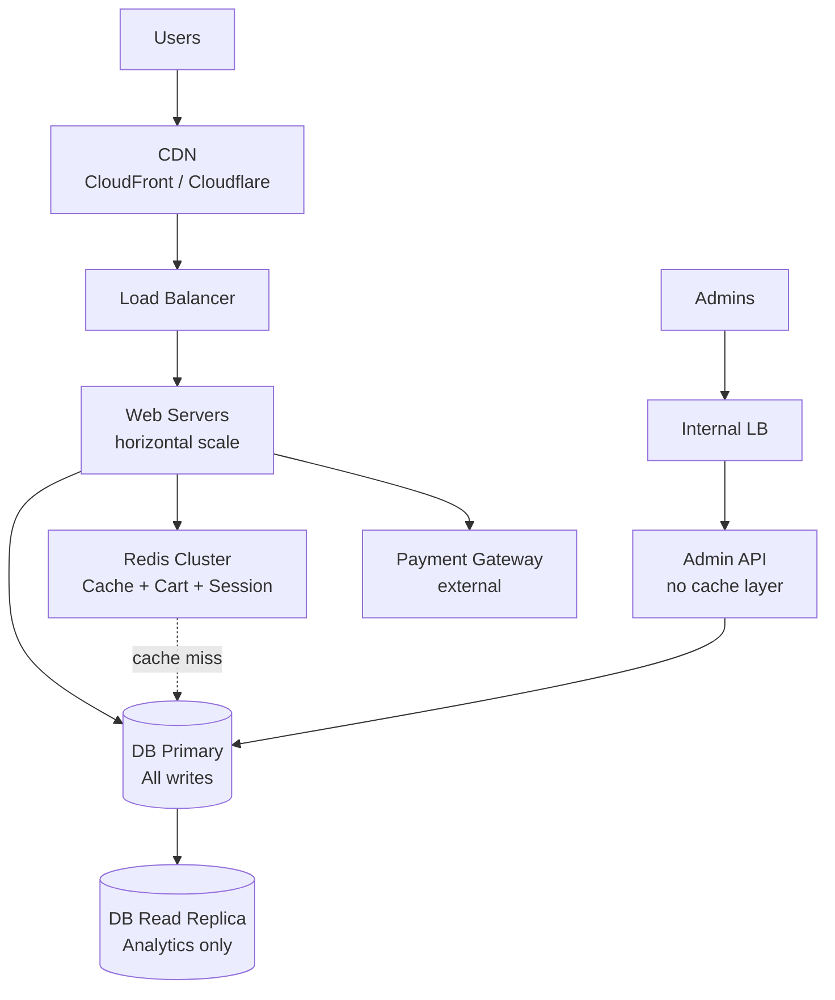
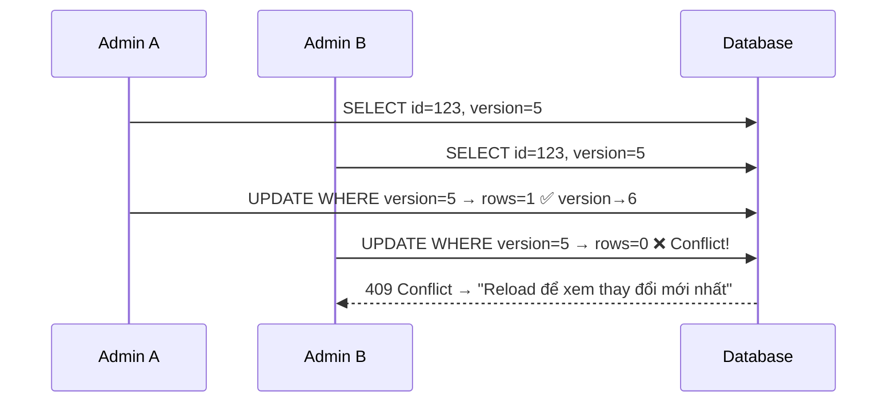

Thiết kế hệ thống web bán hàng với tính năng cơ bản: duyệt sản phẩm, giỏ hàng, checkout, mã giảm giá — chịu tải heavy read với 1M users/ngày thường, lên đến 10M vào ngày sale.

## Problem Statement

```
Tính năng:
  - Duyệt danh sách sản phẩm, xem chi tiết
  - Tìm kiếm, lọc theo danh mục
  - Giỏ hàng (add, remove, update qty)
  - Checkout, thanh toán
  - Mã giảm giá

Tải trọng:
  - Normal:   ~1M users/ngày   (~12 RPS avg, peak ~500 RPS)
  - Sale day: ~10M users/ngày  (~115 RPS avg, peak ~5,000 RPS)
  - Read/write ratio: ~95% / 5%

Admin:
  - Nhiều admin cùng CRUD sản phẩm
  - Có thể vô tình sửa cùng 1 sản phẩm

Trọng tâm thiết kế:
  - Có cần Read Replica không?
  - System boundary như thế nào?
  - Caching strategy?
```

## Traffic Estimation

```
Normal day:
  1,000,000 users / 86,400s = ~12 RPS average
  Peak (8-10x avg)          = ~100–500 RPS

Sale day:
  10,000,000 / 86,400s      = ~115 RPS average
  Peak burst                = ~2,000–5,000 RPS

Phân loại reads/writes:
  Reads:  browse, search, product detail, cart view  → ~95%
  Writes: add to cart, checkout, place order         → ~5%

Sale day peak breakdown:
  5,000 RPS × 95% = 4,750 RPS reads
  5,000 RPS × 5%  =   250 RPS writes

Một PostgreSQL/MySQL tune tốt: 1,000–10,000 simple queries/s
→ Vấn đề không phải DB capacity — vấn đề là tránh để DB
  phải xử lý phần lớn trong 4,750 RPS reads đó.
```

## System Architecture



### Phân tách system boundary

| Service | Responsibility | Storage |
|---|---|---|
| Web Servers | Serve requests, cache-aside logic | Stateless |
| Admin API | CRUD products, không dùng cache để tránh stale | Direct DB |
| Redis | Product cache, cart, session, inventory counter | In-memory |
| DB Primary | Tất cả writes: orders, inventory, users | PostgreSQL/MySQL |
| DB Replica | Analytics queries nặng, không route user traffic | Replica |
| CDN | Static assets, near-static HTML pages | Edge cache |

---

## Caching Strategy

### Layer 1 — CDN

```
Product images          TTL: 7 ngày  (URL kèm hash: /img/p123?v=abc)
Product list HTML       TTL: 5 phút  (stale-while-revalidate)
Category pages          TTL: 10 phút
```

### Layer 2 — Redis (quan trọng nhất)

```
product:{id}            Product detail data     TTL: 30 phút
product:list:{page}     Danh sách sản phẩm      TTL: 5 phút
product:search:{query}  Kết quả tìm kiếm        TTL: 5 phút
inventory:{id}          Số lượng tồn kho        TTL: 30 giây (nhạy cảm)
cart:{user_id}          Giỏ hàng                TTL: 7 ngày
session:{token}         Auth session            TTL: 24 giờ
discount:{code}         Thông tin mã giảm giá   TTL: theo expiry
```

### Cache-Aside Pattern

```
READ product/{id}:
  1. GET Redis key "product:{id}"
  2. HIT  → return immediately
  3. MISS → SELECT FROM DB
          → SET Redis "product:{id}" EX 1800
          → return

WRITE admin/product/{id}:
  1. UPDATE DB (source of truth)
  2. DEL "product:{id}"        ← invalidate detail
  3. DEL "product:list:*"      ← invalidate list pages
  → Lần request tiếp theo sẽ re-populate cache
```

### Cache hit rate và tác động đến DB

```
Target cache hit rate: 90%+

Sale day 10M users/day:
  10M × 95% read × 10% miss = 950,000 cache misses/day
  950,000 / 86,400 = ~11 RPS thực sự vào DB

→ DB gần như không bị load từ product reads
→ Không cần Read Replica cho user traffic
```

---

## Có Cần Read Replica Không?

### Kết luận: Không ngay từ đầu

Cache giải quyết phần lớn read load. Read Replica không phải silver bullet — nếu cache miss rate cao, replica cũng bị load như primary.

```
Thứ tự ưu tiên:
  1. Tối ưu cache (hit rate, TTL, invalidation)
  2. Index DB đúng chỗ (covering index cho list, filter, search)
  3. Đo metrics: DB CPU, connection pool, query latency
  4. Nếu DB CPU > 70% sustained → xem xét Read Replica
```

### Khi nào thêm Read Replica

| Scenario | Lý do thêm Replica |
|---|---|
| Analytics / reporting | Admin dashboard, revenue report — queries nặng, chậm |
| Cold cache (sản phẩm mới launch) | Cache miss đột biến, DB bị hit nhiều |
| DB Primary CPU > 70% sustained | Sau khi đã tối ưu cache và index |
| Regulatory: DR requirement | Replica ở region khác cho disaster recovery |

### Write → Primary only

```
Mọi write đều đi Primary:
  - Checkout, tạo order
  - Deduct inventory
  - Áp dụng discount code
  - Tạo/sửa/xóa sản phẩm (admin)

Không bao giờ đọc từ Replica cho user-facing operations:
  Replica lag (thường 10–100ms) → đọc inventory cũ → oversell risk
```

---

## Concurrent Admin Edits — Optimistic Locking

**Vấn đề:** Admin A và B cùng mở product #123. A save trước, B save sau — B ghi đè A, A mất công.

**Giải pháp: `version` column + Optimistic Locking**

```sql
ALTER TABLE product ADD COLUMN version INT DEFAULT 0 NOT NULL;

-- Admin load form:
SELECT id, name, price, stock, version FROM product WHERE id = ?
-- version được gửi kèm về form dưới dạng hidden field

-- Admin submit:
UPDATE product
SET name = ?, price = ?, stock = ?, version = version + 1
WHERE id = ? AND version = ?   ← must match version when loaded

-- rows_affected = 0 → version không match → conflict
-- Response 409: "Sản phẩm vừa được chỉnh bởi admin khác. Vui lòng reload."
```



**Tại sao không dùng Pessimistic Locking (`SELECT FOR UPDATE`)?**
```
Pessimistic: lock row khi A mở form
  → B không thể mở form trong khi A đang edit
  → Nếu A mở xong đi ăn trưa → lock giữ mãi
  → Timeout phức tạp, UX kém

Optimistic: không lock, chỉ check khi save
  → A và B đều mở được
  → Chỉ người save sau nhận conflict
  → Phù hợp vì admin hiếm khi edit cùng sản phẩm cùng lúc
```

---

## Cart — Redis làm Source of Truth

Cart không cần ACID, thay đổi liên tục, có TTL tự nhiên → Redis là lựa chọn tốt hơn DB.

```
Cart schema trong Redis (Hash):
  HSET cart:{user_id} product:{id} qty
  EXPIRE cart:{user_id} 604800       ← 7 ngày

Add to cart:
  HINCRBY cart:{user_id} product:{id} 1
  EXPIRE cart:{user_id} 604800       ← reset TTL

Remove item:
  HDEL cart:{user_id} product:{id}

Get cart:
  HGETALL cart:{user_id}
  → JOIN với product data từ Redis/DB để render

Checkout:
  HGETALL cart:{user_id}
  → validate inventory
  → tạo order trong DB
  → DEL cart:{user_id}
```

**Nhược điểm:** Nếu Redis down, cart mất. Mitigate bằng:
- Redis Cluster (high availability)
- Hoặc: persist cart vào DB async khi checkout, dùng Redis như cache

---

## Flash Sale — Inventory Race Condition

**Vấn đề:** 5,000 users đồng thời mua sản phẩm còn 100 cái. Naive approach:

```
SELECT stock FROM product WHERE id = ? → 100
// ... check > 0
UPDATE product SET stock = stock - 1 WHERE id = ?
→ 5,000 requests đọc stock=100, tất cả pass check, oversell!
```

**Giải pháp: Redis DECRBY làm gate**

```
Khi flash sale bắt đầu (hoặc khi product load):
  SET inventory:{product_id} {stock}   ← load từ DB

Khi user mua:
  remaining = DECRBY inventory:{product_id} 1

  if remaining < 0:
    INCR inventory:{product_id}         ← hoàn lại
    return 410 "Hết hàng"               ← không vào DB

  else:
    → Tạo order draft
    → UPDATE product SET stock=stock-1 WHERE id=? AND stock>0
    → if rows_affected=0: INCR inventory:{product_id}, rollback order
    → Confirm order

Kết quả:
  4,900 requests bị block tại Redis (nanoseconds)
  100 requests vào DB để tạo order (~5ms mỗi cái)
```

---

## Discount Code — Prevent Double Use

**Vấn đề:** Code "SALE10" chỉ dùng được 1 lần, 500 users dùng cùng lúc.

**Giải pháp: Atomic DB update**

```sql
-- Single-use code:
UPDATE discount_code
SET used_count = used_count + 1, used_by = ?, used_at = NOW()
WHERE code = ? AND used_count = 0 AND expired_at > NOW()

-- Limited-use code (max 100):
UPDATE discount_code
SET used_count = used_count + 1
WHERE code = ? AND used_count < max_uses AND expired_at > NOW()

-- rows_affected = 0 → code đã hết hoặc expired
```

Hoặc dùng Redis SET NX cho single-use codes siêu nhanh:

```
SET discount:used:{code} 1 NX EX 86400
→ NX: chỉ set nếu key chưa tồn tại (atomic)
→ Return OK → code hợp lệ, tiếp tục
→ Return nil → code đã dùng
```

---

## Bảng Quyết Định Thiết Kế

| Quyết định | Chọn | Lý do |
|---|---|---|
| Read Replica ngay từ đầu | Không | Cache giải quyết phần lớn, metric-driven sau |
| Read Replica khi nào | Analytics + DB CPU > 70% | Không speculative |
| Cart storage | Redis (source of truth) | Thay đổi thường xuyên, TTL tự nhiên, không cần ACID |
| Product cache | Redis cache-aside, TTL 30 phút | High hit rate, invalidate on admin write |
| Inventory cache | Redis DECRBY, TTL 30 giây | Atomic gate, chặn 99% requests tại Redis |
| Concurrent admin edit | Optimistic Locking (version) | Không block DB, UX tốt hơn pessimistic |
| Discount code race | Atomic DB UPDATE / Redis SET NX | Đảm bảo chỉ 1 request thành công |
| Admin API cache | Không cache | Admin cần thấy data thật, tránh serve stale |

---

## Câu Hỏi Phỏng Vấn

<details>
<summary><strong>Có cần Read Replica ngay từ đầu với 1M users/ngày không?</strong></summary>

**A:** Không cần ngay. Với cache hit rate 90%+, DB Primary thực sự chỉ nhận ~10% của read traffic, phần lớn là writes. Một DB được tune tốt xử lý thoải mái 250 RPS writes. Read Replica nên thêm khi: (1) cần chạy analytics queries nặng mà không ảnh hưởng user traffic, (2) DB Primary CPU > 70% sustained sau khi đã tối ưu cache và index. Thêm Replica mà không fix cache là sai — cache miss cao thì Replica cũng bị load như Primary.

</details>

<details>
<summary><strong>Cache invalidation khi admin sửa sản phẩm nên làm thế nào?</strong></summary>

**A:** Cache-aside với write-invalidate: sau khi UPDATE DB thành công, DEL Redis keys liên quan — `product:{id}` và `product:list:*`. Lần request tiếp theo sẽ miss → re-populate từ DB. Không nên dùng write-through (viết vào cache và DB đồng thời) vì nếu DB fail thì cache có stale data. Không nên dùng TTL-only mà không invalidate — admin sửa giá mà user vẫn thấy giá cũ 30 phút là không chấp nhận được trong thực tế.

</details>

<details>
<summary><strong>Tại sao chọn Optimistic Locking thay vì Pessimistic cho concurrent admin edits?</strong></summary>

**A:** Pessimistic Locking (SELECT FOR UPDATE) giữ DB row lock từ khi admin mở form đến khi save — nếu admin mở form rồi đi họp 1 tiếng, lock không được release, admin khác bị block. Cần mechanism timeout phức tạp. Optimistic Locking không lock gì cả, chỉ check `version` khi save: nếu version khớp → save thành công, nếu không → trả về conflict và yêu cầu reload. Phù hợp với admin workload vì xác suất hai admin edit cùng một sản phẩm trong cùng một khoảnh khắc rất thấp.

</details>

<details>
<summary><strong>Redis DECRBY cho inventory có đủ reliable không? Nếu Redis down thì sao?</strong></summary>

**A:** Redis DECRBY là atomic (single-threaded Redis), đủ reliable cho inventory gate. Vấn đề khi Redis down: toàn bộ inventory check fail → fallback về DB. Hai cách handle: (1) Circuit breaker — nếu Redis không available, route thẳng vào DB với `SELECT FOR UPDATE` (chậm hơn nhưng correct), chấp nhận throughput giảm; (2) Redis Cluster với sentinel/replication — HA nên downtime rất hiếm. Ngoài ra, luôn có DB `AND stock > 0` làm safety net — kể cả Redis out-of-sync thì DB không bao giờ cho stock âm.

</details>

<details>
<summary><strong>Tại sao cart để ở Redis thay vì DB? Rủi ro gì?</strong></summary>

**A:** Cart thay đổi liên tục (add, remove, update qty), không cần ACID, có TTL tự nhiên (bỏ hoang sau vài ngày). Redis HSET/HINCRBY là O(1), nhanh hơn DB write nhiều. Rủi ro chính: Redis down → mất cart. Mitigate bằng: Redis Cluster (ha), hoặc sync cart vào DB async khi user checkout (chỉ cần persist tại điểm quan trọng). Một số hệ thống dùng hybrid: Redis cho session cart, DB backup khi user login lại sau thời gian dài.

</details>

<details>
<summary><strong>Với 10M users ngày sale, hệ thống cần scale những gì?</strong></summary>

**A:** Theo thứ tự impact: (1) **CDN** — scale tự động, không cần làm gì thêm; (2) **Redis** — scale với Redis Cluster, thêm node read replica cho Redis; (3) **Web Servers** — horizontal scale với auto-scaling group, scale out trước sale; (4) **DB Primary** — nếu cache đủ tốt thì không cần scale nhiều; nếu không thì connection pooling (PgBouncer/ProxySQL) để giảm connection overhead. Quan trọng nhất: **load test trước sale** với realistic traffic pattern để biết bottleneck thực sự ở đâu — không nên scale speculative.

</details>

<details>
<summary><strong>Checkout pass Redis inventory check, nhưng DB UPDATE stock fail — xử lý thế nào?</strong></summary>

**A:** Đây là partial failure trong checkout flow — cần compensating transaction. Flow an toàn: (1) DECRBY Redis inventory (gate); (2) BEGIN transaction: INSERT order (status=PENDING) + UPDATE stock WHERE stock > 0; (3) nếu UPDATE rows_affected = 0 (stock thực tế = 0 dù Redis cho qua) → ROLLBACK, INCR Redis lại, trả về "Hết hàng"; (4) nếu thành công → COMMIT, UPDATE order status=CONFIRMED. Điểm mấu chốt: order chỉ CONFIRMED sau khi DB confirm đủ stock — không confirm ngay lúc Redis pass. Redis là fast-path gate, DB là source of truth cuối cùng. Payment chỉ được trigger sau khi order CONFIRMED.

</details>

<details>
<summary><strong>User search "áo xanh size M" — bạn query DB thế nào khi có hàng triệu sản phẩm?</strong></summary>

**A:** `LIKE '%áo xanh%'` không dùng index → full table scan → không scale. Giải pháp: **Elasticsearch/OpenSearch** làm search engine riêng. Flow: khi admin tạo/sửa sản phẩm → sync document vào ES index (async qua event/CDC). User search → query ES (inverted index, full-text, faceted filter) → nhận product_ids → fetch product detail từ Redis/DB. ES xử lý tốt: fuzzy search, filter nhiều chiều (category + size + price range + color), sorting theo relevance hoặc price. DB giữ authoritative data, ES chỉ để search và filter. Eventual consistency chấp nhận được — sản phẩm mới tạo có thể mất vài giây mới xuất hiện trong search.

</details>

<details>
<summary><strong>2 users apply cùng discount code "FLASH10" (limit 1 lần dùng) cùng lúc — đảm bảo chỉ 1 người thành công thế nào?</strong></summary>

**A:** DB atomic UPDATE đủ cho most cases: `UPDATE discount_code SET used_count = used_count + 1 WHERE code = ? AND used_count < max_uses` — MySQL/PostgreSQL đảm bảo row-level lock trong UPDATE, chỉ 1 trong 2 concurrent requests tăng được `used_count` từ 0 lên 1, request còn lại `rows_affected = 0` → từ chối. Nếu discount code cực hot (flash sale, hàng nghìn concurrent request): dùng Redis SET NX làm fast-path gate — `SET discount:used:{code} 1 NX EX 86400`. Chỉ 1 request SET NX thành công (atomic), còn lại return nil ngay mà không cần vào DB. DB vẫn là backup validation khi checkout để đảm bảo không race condition giữa Redis và DB state.

</details>
