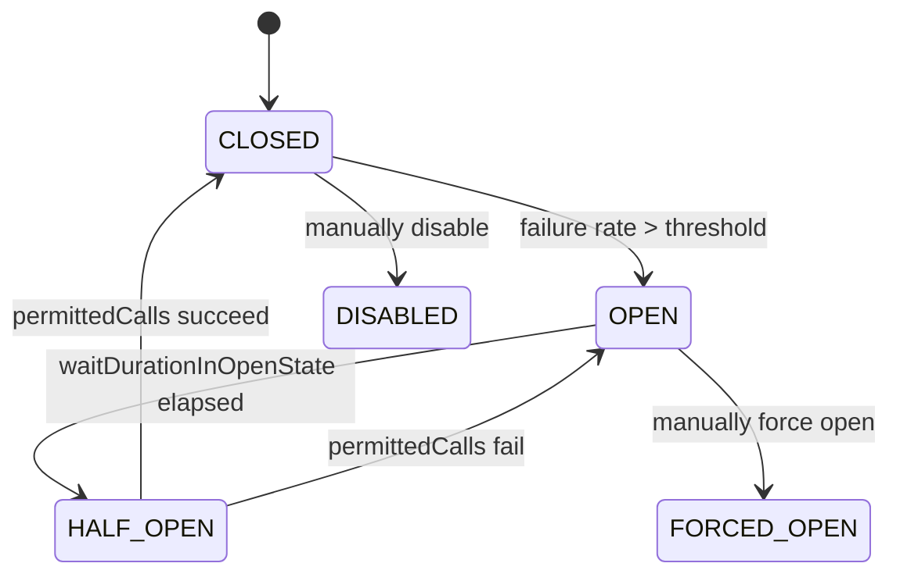

Circuit breaker có ba trạng thái — CLOSED (cho traffic qua), OPEN (chặn traffic), HALF_OPEN (kiểm tra phục hồi) — tự động hóa phát hiện lỗi và phục hồi.

## Điểm Chính

- <strong>CLOSED</strong>: tất cả call đi qua. Failure rate được theo dõi trong sliding window.
- <strong>OPEN</strong>: circuit "trip" khi failure rate > ngưỡng. Tất cả call fail nhanh (không gọi downstream). Sau <code>waitDurationInOpenState</code>, chuyển sang HALF_OPEN.
- <strong>HALF_OPEN</strong>: cho phép <code>permittedCallsInHalfOpen</code> call qua như probe. Nếu thành công → CLOSED. Nếu thất bại → về OPEN.
- Metric: <code>resilience4j_circuitbreaker_state</code> → monitor trong Grafana để cảnh báo khi chuyển sang OPEN.

## Ví Dụ Code

*3 trạng thái: state machine diagram + event listeners (onStateTransition, onCallNotPermitted) + manual control API*

```java
// ✅ Circuit Breaker state machine — visualized with comments
//
// ┌─────────────────────────────────────────────────────────────────────┐
// │  CLOSED (normal)     │  OPEN (tripped)      │  HALF_OPEN (probing) │
// │  All calls go through│  All calls fail fast │  Limited calls through│
// │  Monitors failure %  │  No downstream calls │  Tests if recovered  │
// └──────────┬───────────┴──────────┬───────────┴──────────┬───────────┘
//            │ failure rate         │ waitDuration          │ probe calls
//            │ > threshold          │ expires (30s)         │ succeed
//            └─────► OPEN ──────────┘          └────────────► CLOSED
//                                  └── probe calls fail ──► OPEN

@Configuration
public class CircuitBreakerConfig {
    @Bean
    public CircuitBreaker paymentCircuitBreaker(CircuitBreakerRegistry registry) {
        CircuitBreaker cb = registry.circuitBreaker("paymentService");

        // ── Observe and log all state transitions ──
        cb.getEventPublisher()
            .onStateTransition(event -> {
                CircuitBreakerTransition t = event.getStateTransition();
                log.warn("Circuit [{}]: {} → {}",
                    event.getCircuitBreakerName(),
                    t.getFromState(), t.getToState());
                // Alert on-call when circuit trips
                if (t.getToState() == CircuitBreaker.State.OPEN) {
                    alertService.sendAlert("CIRCUIT OPEN: paymentService is failing — fast-failing all requests");
                }
                if (t.getToState() == CircuitBreaker.State.CLOSED) {
                    alertService.sendInfo("CIRCUIT CLOSED: paymentService recovered");
                }
            })
            // Track how many calls were rejected while OPEN
            .onCallNotPermitted(event ->
                metricsRegistry.counter("circuit.rejected", "service", "paymentService").increment()
            )
            // Track slow calls (counted toward failure rate if > slow-call-duration-threshold)
            .onSlowCallRateExceeded(event ->
                log.warn("Payment service slow call rate exceeded: {}%", event.getSlowCallRate())
            );

        return cb;
    }
}

// ✅ Manual state inspection and control (useful for testing / maintenance mode)
@RestController
@RequestMapping("/admin/circuit-breakers")
public class CircuitBreakerAdminController {
    @Autowired
    private CircuitBreakerRegistry registry;

    // GET /admin/circuit-breakers/paymentService/state
    @GetMapping("/{name}/state")
    public Map<String, Object> getState(@PathVariable String name) {
        CircuitBreaker cb = registry.circuitBreaker(name);
        CircuitBreaker.Metrics m = cb.getMetrics();
        return Map.of(
            "state",           cb.getState().name(),
            "failureRate",     m.getFailureRate() + "%",
            "slowCallRate",    m.getSlowCallRate() + "%",
            "bufferedCalls",   m.getNumberOfBufferedCalls(),
            "failedCalls",     m.getNumberOfFailedCalls(),
            "notPermittedCalls", m.getNumberOfNotPermittedCalls()
        );
    }

    // POST /admin/circuit-breakers/paymentService/force-open
    // Use during planned maintenance: stop sending traffic to downstream service
    @PostMapping("/{name}/force-open")
    public void forceOpen(@PathVariable String name) {
        registry.circuitBreaker(name).transitionToForcedOpenState();
        log.warn("Circuit [{}] manually forced OPEN (maintenance mode)", name);
    }

    // POST /admin/circuit-breakers/paymentService/reset
    @PostMapping("/{name}/reset")
    public void reset(@PathVariable String name) {
        registry.circuitBreaker(name).reset();   // back to CLOSED, metrics cleared
    }
}
```

## Ứng Dụng Thực Tế

Thêm alert rule cho chuyển đổi trạng thái: CLOSED→OPEN nên gọi on-call. Theo dõi call-not-permitted event như chỉ số dẫn đầu về sức khỏe downstream. Trong test, dùng <code>cb.transitionToOpenState()</code> để xác minh fallback logic hoạt động.

## Câu Hỏi Phỏng Vấn

<details>
<summary><strong>Mô tả ba trạng thái của Circuit Breaker.</strong></summary>

**A:** **CLOSED** (bình thường): request được forward đến service. Đếm failures trong sliding window. Nếu failure rate vượt threshold → chuyển sang OPEN. **OPEN** (circuit trip): request fail ngay lập tức (fast fail) — không gọi service. Sau `waitDurationInOpenState` (ví dụ 30s) → chuyển sang HALF-OPEN. **HALF-OPEN** (probe): cho phép N request thử (`permittedNumberOfCallsInHalfOpenState`). Nếu success rate OK → CLOSED. Nếu failure vẫn cao → OPEN lại. Mục đích: tránh cascade failure, allow service time to recover.

</details>

<details>
<summary><strong>Fallback và circuit breaker kết hợp thế nào?</strong></summary>

**A:** Circuit breaker OPEN → throw exception (CallNotPermittedException). Fallback method xử lý exception này — return degraded response thay vì propagate error đến user. Ví dụ: Product service down → CB OPEN → ProductFallback: return cached product list hoặc `"Service temporarily unavailable"`. Resilience4j:
```java
@CircuitBreaker(name="product", fallbackMethod="getProductsFallback")
public List<Product> getProducts() { ... }

private List<Product> getProductsFallback(Exception e) {
    return cachedProducts; // or empty list
}
```
Fallback cho phép partial functionality thay vì complete failure.

</details>

<details>
<summary><strong>Khi nào circuit breaker không phù hợp?</strong></summary>

**A:** Circuit breaker không phù hợp khi: (1) **Synchronous critical path**: payment, authentication — không thể fallback với degraded response, cần real answer. (2) **Internal errors** (bugs, validation fail): CB không giúp vì không phải transient failure. (3) **Rare failures**: nếu service rất reliable (<0.1% fail), CB overhead không worth it. (4) **Retry là đủ**: nếu retry giải quyết được (network hiccup), không cần CB. (5) **Batch processing**: không có real-time user waiting → timeout / dead letter queue phù hợp hơn. CB hữu ích nhất cho: external service dependencies với uncertain reliability.

</details>

## Sơ Đồ Resilience4j State Transitions


