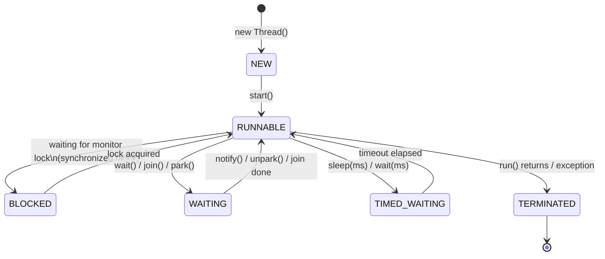

Một Java thread chuyển qua các trạng thái NEW → RUNNABLE → BLOCKED/WAITING/TIMED_WAITING → TERMINATED, được quản lý bởi JVM và OS scheduler.

## Điểm Chính

- <strong>NEW</strong>: đã tạo nhưng chưa start.
- <strong>RUNNABLE</strong>: đang chạy hoặc sẵn sàng chạy (OS quyết định CPU nào xử lý).
- <strong>BLOCKED</strong>: chờ lấy monitor lock (<code>synchronized</code>).
- <strong>WAITING</strong>: chờ vô thời hạn — <code>Object.wait()</code>, <code>Thread.join()</code>.
- <strong>TIMED_WAITING</strong>: chờ có timeout — <code>Thread.sleep()</code>, <code>wait(timeout)</code>.
- <strong>TERMINATED</strong>: run() hoàn thành hoặc ném exception.
- Dùng <code>jstack &lt;pid&gt;</code> hoặc thread dump để kiểm tra trạng thái thread đang chạy.

## Ví Dụ Code

*Thread states: NEW→RUNNABLE→BLOCKED→WAITING→TIMED_WAITING→TERMINATED + JMX monitoring*

```java
import java.util.concurrent.*;
import java.util.concurrent.locks.*;

// ---- Observing all 6 thread states in Order processing context ----
public class ThreadLifecycleDemo {

    private final Object orderLock = new Object();

    public void demonstrateStates() throws InterruptedException {

        // ---- State 1: NEW ----
        Thread orderProcessor = new Thread(() -> {
            System.out.println("[1] RUNNABLE: processing order...");

            // ---- State 4: TIMED_WAITING (Thread.sleep) ----
            try {
                Thread.sleep(2000);   // simulate I/O wait
            } catch (InterruptedException e) {
                // CORRECT interrupt handling: restore flag so callers can check it
                Thread.currentThread().interrupt();
                System.out.println("Thread interrupted — stopping gracefully");
                return;
            }
            System.out.println("[2] RUNNABLE: order processed");
        }, "order-processor-1");

        System.out.println("State after new:  " + orderProcessor.getState()); // NEW

        // ---- State 2: RUNNABLE ----
        orderProcessor.start();
        Thread.sleep(50);  // let it start
        System.out.println("State after start: " + orderProcessor.getState()); // RUNNABLE

        // Give it a moment to reach sleep()
        Thread.sleep(100);
        System.out.println("State while sleeping: " + orderProcessor.getState()); // TIMED_WAITING

        // ---- State 3: BLOCKED (waiting for monitor lock) ----
        synchronized (orderLock) {
            Thread blocker = new Thread(() -> {
                synchronized (orderLock) {  // tries to acquire lock held by main thread
                    System.out.println("Got lock");
                }
            }, "order-blocker");

            blocker.start();
            Thread.sleep(50);
            System.out.println("Blocker state:  " + blocker.getState()); // BLOCKED
        } // main releases lock → blocker transitions BLOCKED → RUNNABLE

        // ---- State 5: WAITING (join) ----
        Thread waiter = new Thread(() -> {
            try {
                orderProcessor.join();  // WAITING indefinitely until orderProcessor dies
            } catch (InterruptedException e) {
                Thread.currentThread().interrupt();
            }
        }, "order-waiter");
        waiter.start();
        Thread.sleep(50);
        System.out.println("Waiter state:   " + waiter.getState()); // WAITING

        // ---- State 6: TERMINATED ----
        orderProcessor.join();
        System.out.println("Final state:    " + orderProcessor.getState()); // TERMINATED
    }
}

// ---- Production: monitor thread states via JMX ----
public static void printThreadStats() {
    ThreadMXBean bean = ManagementFactory.getThreadMXBean();
    System.out.printf("Threads — total: %d  peak: %d  daemon: %d%n",
        bean.getThreadCount(), bean.getPeakThreadCount(), bean.getDaemonThreadCount());

    // Find blocked/waiting threads (potential deadlock or starvation)
    for (ThreadInfo info : bean.getThreadInfo(bean.getAllThreadIds())) {
        if (info.getThreadState() == Thread.State.BLOCKED ||
            info.getThreadState() == Thread.State.WAITING) {
            System.out.printf("  [%s] %s → waiting on: %s%n",
                info.getThreadState(), info.getThreadName(), info.getLockName());
        }
    }
}
```

## Ứng Dụng Thực Tế

Trong thread dump, thread BLOCKED chỉ ra lock contention. Thread WAITING chỉ ra deadlock tiềm năng. Dùng Prometheus + micrometer để theo dõi số thread đang hoạt động và độ sâu queue của executor trong production.

## Câu Hỏi Phỏng Vấn

<details>
<summary><strong>BLOCKED và WAITING khác nhau thế nào trong thread dump?</strong></summary>

**A:** BLOCKED: thread đang chờ acquire Java monitor lock (synchronized block/method) đang bị thread khác giữ. Thoát BLOCKED ngay khi lock được release — không cần notify. WAITING: thread đã acquire lock, tự nguyện release và chờ notification qua `Object.wait()`, `LockSupport.park()`, hoặc `Thread.join()`. Thoát WAITING chỉ khi có `notify()`/`notifyAll()`/`unpark()`. Nhiều thread BLOCKED → lock contention (bottleneck). Nhiều thread WAITING → thường là normal (thread pool idle, async processing).

</details>

<details>
<summary><strong>Thread.sleep() và Object.wait() khác nhau thế nào?</strong></summary>

**A:** `sleep(ms)`: thread dừng N milliseconds, KHÔNG release lock đang giữ, không cần gọi từ synchronized block. `wait()`: thread release lock và đợi notify, phải gọi từ synchronized block (sinon IllegalMonitorStateException). `sleep()` dùng để delay execution. `wait()` dùng để coordinate giữa threads (producer-consumer pattern). Thread sau `sleep()` tự thức; thread sau `wait()` cần notify từ thread khác.

</details>

<details>
<summary><strong>Virtual Threads (Java 21) khác platform threads thế nào?</strong></summary>

**A:** Platform thread: 1-1 với OS thread, ~1MB stack, tốn kém tạo và context-switch. Virtual thread: được schedule bởi JVM trên ForkJoinPool của carrier threads (OS threads), ~KB stack, hàng triệu virtual thread cùng lúc. Khi virtual thread block trên I/O → JVM unmount khỏi carrier thread, carrier thread free để chạy virtual thread khác. Code viết blocking style nhưng scale như NIO. Bật: `spring.threads.virtual.enabled=true` (Spring Boot 3.2+).

</details>

## Sơ Đồ Vòng Đời Thread


