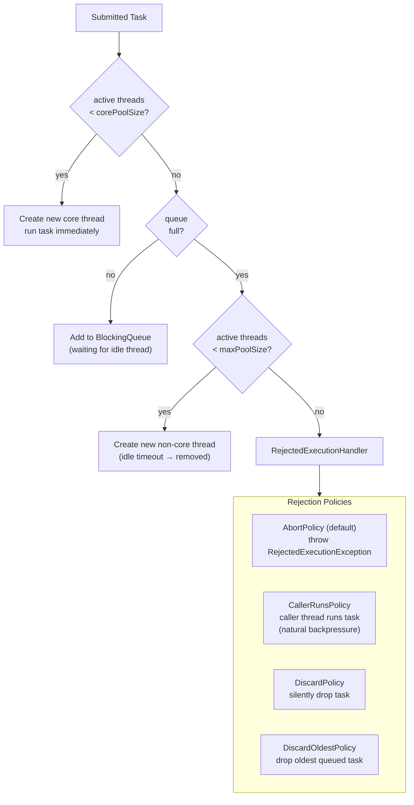

Thread pool tái sử dụng một tập thread worker cố định để thực thi task, tránh overhead tạo/hủy thread và giới hạn sử dụng tài nguyên.

## Điểm Chính

- Tham số core của <code>ThreadPoolExecutor</code>: <code>corePoolSize</code>, <code>maximumPoolSize</code>, <code>keepAliveTime</code>, <code>workQueue</code>.
- Factory method: <code>Executors.newFixedThreadPool(n)</code>, <code>newCachedThreadPool()</code>, <code>newSingleThreadExecutor()</code>.
- Tránh <code>newCachedThreadPool()</code> trong production — tạo thread không giới hạn khi tải cao.
- Ưu tiên <code>ThreadPoolExecutor</code> trực tiếp để kiểm soát loại queue và rejection policy.
- Rejection policy: <code>AbortPolicy</code> (ném exception), <code>CallerRunsPolicy</code> (chạy trong caller), <code>DiscardPolicy</code>, <code>DiscardOldestPolicy</code>.
- Luôn đặt tên thread qua <code>ThreadFactory</code> để thread dump có ý nghĩa.

## Ví Dụ Code

*ThreadPoolExecutor: named threads, bounded queue, CallerRunsPolicy, metrics, graceful shutdown*

```java
import java.util.concurrent.*;
import java.util.concurrent.atomic.*;

// ---- Production-ready ThreadPoolExecutor for Order processing ----
public class OrderProcessingPool {

    private final ThreadPoolExecutor pool;

    public OrderProcessingPool() {
        AtomicInteger threadNumber = new AtomicInteger(1);

        this.pool = new ThreadPoolExecutor(
            4,                              // corePoolSize: always keep 4 threads alive
            8,                              // maximumPoolSize: burst up to 8 under load
            60L, TimeUnit.SECONDS,          // keepAliveTime: idle threads above core shrink after 60s
            new LinkedBlockingQueue<>(200), // bounded queue: max 200 tasks waiting
                                            // NEVER use unbounded queue in production — OOM risk
            r -> {                          // ThreadFactory: named threads for thread dumps
                Thread t = new Thread(r, "order-worker-" + threadNumber.getAndIncrement());
                t.setDaemon(true);          // daemon: JVM can exit without waiting for these
                t.setUncaughtExceptionHandler((thread, ex) ->
                    log.error("Unhandled exception in {}", thread.getName(), ex));
                return t;
            },
            new ThreadPoolExecutor.CallerRunsPolicy()
            // CallerRunsPolicy: when queue full, CALLER thread runs the task
            // This provides natural backpressure — slows down the producer
            // Alternatives:
            //   AbortPolicy (default): throws RejectedExecutionException
            //   DiscardPolicy: silently drops task (data loss!)
            //   DiscardOldestPolicy: drops oldest queued task
        );

        // Allow core threads to time out too (reduce idle threads during off-peak)
        pool.allowCoreThreadTimeOut(true);
    }

    public Future<ProcessingResult> submitOrder(Order order) {
        return pool.submit(() -> {
            try {
                return processOrder(order);
            } catch (Exception e) {
                log.error("Failed to process order {}", order.getId(), e);
                throw e;  // propagated to Future.get() as ExecutionException
            }
        });
    }

    // ---- Health metrics for Micrometer / Prometheus ----
    public void exposeMetrics(MeterRegistry registry) {
        Gauge.builder("thread.pool.active",   pool, ThreadPoolExecutor::getActiveCount).register(registry);
        Gauge.builder("thread.pool.queued",   pool, p -> p.getQueue().size()).register(registry);
        Gauge.builder("thread.pool.size",     pool, ThreadPoolExecutor::getPoolSize).register(registry);
        Counter.builder("thread.pool.completed").register(registry);
    }

    // ---- Graceful shutdown ----
    public void shutdown() throws InterruptedException {
        pool.shutdown();                           // stop accepting new tasks
        if (!pool.awaitTermination(30, TimeUnit.SECONDS)) {
            log.warn("Pool did not terminate in 30s — forcing shutdown");
            pool.shutdownNow();                    // interrupt in-flight tasks
            if (!pool.awaitTermination(10, TimeUnit.SECONDS))
                log.error("Pool did not terminate after shutdownNow");
        }
    }
}
```

## Ứng Dụng Thực Tế

Trong Spring Boot, cấu hình bean <code>TaskExecutor</code> thay vì tạo pool thô. Dùng <code>@Async</code> với named executor. Monitor pool metrics (queue depth, active thread) với <code>ThreadPoolExecutor.getQueue().size()</code> expose qua Micrometer.

## Câu Hỏi Phỏng Vấn

<details>
<summary><strong>Công thức tính corePoolSize cho I/O-bound service?</strong></summary>

**A:** `N_threads = N_CPU × (1 + wait_time / compute_time)`. Ví dụ: 4 cores, avg DB call 100ms, xử lý response 10ms → wait_ratio = 10 → pool = 44. Lý do: khi thread đang chờ I/O (blocked), CPU idle — có thể chạy thread khác. Với CPU-bound: pool = N_CPU + 1 (1 extra cho OS scheduling). Đây là starting point — fine-tune bằng load test. Dùng `Runtime.getRuntime().availableProcessors()` để lấy CPU count dynamically.

</details>

<details>
<summary><strong>Tại sao Executors.newFixedThreadPool() không được khuyến khích trong production?</strong></summary>

**A:** `newFixedThreadPool(n)` dùng unbounded LinkedBlockingQueue — queue tăng vô hạn khi tasks arrive nhanh hơn xử lý, eventual OOM. `newCachedThreadPool()` tạo thread mới không giới hạn → có thể spawn hàng nghìn thread, OOM hoặc context-switch hell. Best practice: dùng `ThreadPoolExecutor` trực tiếp với bounded ArrayBlockingQueue và explicit rejection handler. Spring's `ThreadPoolTaskExecutor` cũng cho phép configure đầy đủ các parameter.

</details>

<details>
<summary><strong>CallerRunsPolicy rejection handler hoạt động thế nào?</strong></summary>

**A:** Khi ThreadPool queue đầy và đạt maxPoolSize, thay vì throw exception hay drop task, CallerRunsPolicy khiến caller thread (thread submit task) tự execute task đó. Tác dụng: tự nhiên slow down producer — producer phải xử lý task trước khi submit task tiếp theo. Backpressure tự nhiên không cần mechanism riêng. Trade-off: caller thread bị block trong thời gian đó. Thích hợp cho batch processing. Với AbortPolicy (default): throw RejectedExecutionException — caller quyết định retry hoặc drop.

</details>

## Sơ Đồ ThreadPoolExecutor Internals


