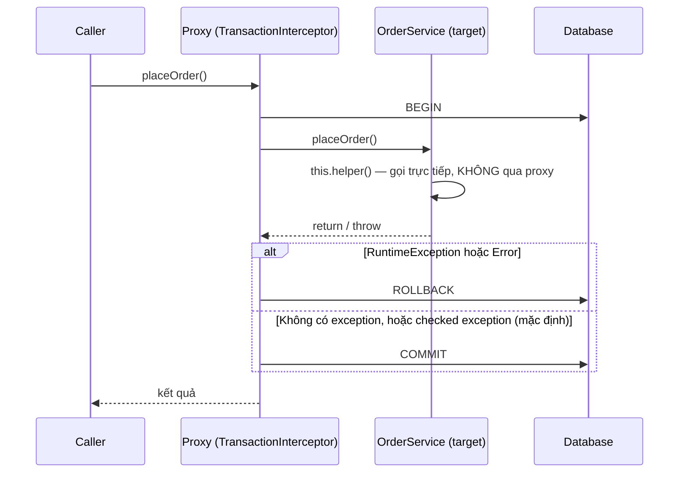
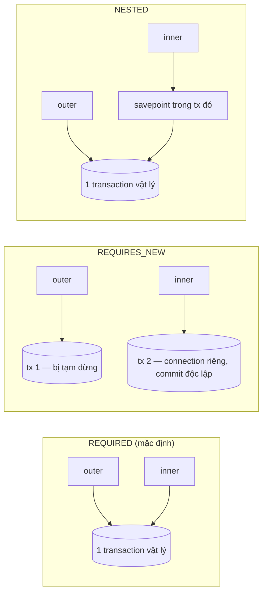

`@Transactional` trông đơn giản nhưng là nguồn bug phổ biến nhất của backend Spring: transaction không được tạo (self-invocation), không rollback (checked exception), hoặc rollback ngoài ý muốn (`UnexpectedRollbackException`). Nắm 5 quy tắc dưới đây là đủ tránh gần hết các lỗi đó.

## Điểm Chính

- <strong>Hoạt động qua proxy</strong>: Spring bọc bean trong một proxy; transaction chỉ được mở khi lời gọi <em>đi từ bên ngoài qua proxy</em>. Method trong cùng class gọi nhau (<em>self-invocation</em>) sẽ <strong>không</strong> có transaction, dù có annotation.
- <strong>Rollback mặc định chỉ với unchecked</strong>: `RuntimeException` và `Error` → rollback. <strong>Checked exception (`IOException`, exception nghiệp vụ extends `Exception`) → vẫn COMMIT</strong>. Muốn rollback: `rollbackFor = Exception.class` hoặc cho exception nghiệp vụ extends `RuntimeException`.
- <strong>Exception bị nuốt = không rollback</strong>: Spring quyết định rollback dựa trên exception <em>bay ra khỏi</em> method transactional. `catch` rồi log mà không ném lại → transaction commit.
- <strong>Propagation</strong> quyết định method tham gia transaction hiện có hay tạo mới. Mặc định `REQUIRED` (dùng chung transaction vật lý). `REQUIRES_NEW` tạm dừng transaction ngoài và mở transaction độc lập (connection riêng). `NESTED` dùng savepoint trong cùng transaction.
- <strong>Visibility</strong>: từ Spring 6.0, method `protected`/package-private cũng transactional được với class-based proxy (CGLIB — mặc định của Spring Boot); với interface-based proxy thì phải `public` và khai báo trong interface. Method `private` không bao giờ được proxy chặn.
- <strong>`readOnly = true` là hint</strong>, không phải cơ chế chặn ghi: với JPA/Hibernate, Spring có thể chuyển flush mode sang không tự flush (bỏ qua dirty checking khi commit) và đặt read-only trên JDBC connection — giúp nhanh hơn, nhưng không đảm bảo ghi sẽ bị từ chối.
- <strong>Side effect ra ngoài (gửi email, publish Kafka) chỉ nên chạy sau commit</strong>: dùng `@TransactionalEventListener` (mặc định phase `AFTER_COMMIT`) hoặc outbox pattern.

## Ví Dụ Code

*Lỗi 1 — self-invocation: transaction không tồn tại*

```java
@Service
public class OrderService {

    public void placeOrders(List<OrderRequest> requests) {
        for (var req : requests) {
            placeOrder(req);          // ❌ gọi qua `this`, KHÔNG qua proxy → không có transaction
        }
    }

    @Transactional
    public void placeOrder(OrderRequest req) {
        orderRepository.save(...);
        inventoryRepository.decrement(...);   // lỗi ở đây → save phía trên KHÔNG bị rollback
    }
}

// ✅ Cách sửa phổ biến nhất: tách sang bean khác để lời gọi đi qua proxy
@Service
@RequiredArgsConstructor
public class OrderBatchService {
    private final OrderService orderService;       // inject proxy

    public void placeOrders(List<OrderRequest> requests) {
        requests.forEach(orderService::placeOrder); // ✅ mỗi order một transaction
    }
}
```

*Lỗi 2 — checked exception không rollback, exception bị nuốt*

```java
public class PaymentDeclinedException extends Exception { }   // checked

@Transactional
public void checkout(Cart cart) throws PaymentDeclinedException {
    orderRepository.save(Order.from(cart));
    paymentGateway.charge(cart);   // ném PaymentDeclinedException
}
// ❌ Order VẪN được commit dù thanh toán thất bại — checked exception không trigger rollback

@Transactional(rollbackFor = Exception.class)   // ✅ cách 1: khai báo rõ
public void checkout(Cart cart) throws PaymentDeclinedException { ... }

public class PaymentDeclinedException extends RuntimeException { }  // ✅ cách 2: unchecked

@Transactional
public void importUsers(List<UserDto> users) {
    try {
        users.forEach(userRepository::save);
    } catch (DataIntegrityViolationException e) {
        log.error("Import failed", e);   // ❌ nuốt exception → các user đã save vẫn COMMIT
    }
}
```

*Propagation — `REQUIRED` vs `REQUIRES_NEW` vs `NESTED`*

```java
@Service
@RequiredArgsConstructor
public class TransferService {
    private final AuditService auditService;

    @Transactional                                   // REQUIRED (mặc định)
    public void transfer(Long from, Long to, BigDecimal amount) {
        accountRepository.debit(from, amount);
        accountRepository.credit(to, amount);
        auditService.log("TRANSFER", from, to);      // xem 2 cấu hình bên dưới
        if (amount.signum() <= 0) throw new IllegalArgumentException("amount");
    }
}

@Service
public class AuditService {
    // REQUIRES_NEW: transaction RIÊNG (lấy connection thứ 2 từ pool).
    // Audit được commit ngay khi method này kết thúc — KHÔNG bị rollback nếu transfer lỗi sau đó.
    @Transactional(propagation = Propagation.REQUIRES_NEW)
    public void log(String action, Long from, Long to) { auditRepository.save(...); }
}

// ⚠️ Nếu log() dùng REQUIRED (mặc định) và ném RuntimeException mà transfer() catch lại:
//    inner scope đã đánh dấu rollback-only trên transaction vật lý dùng chung
//    → khi transfer() commit, Spring ném UnexpectedRollbackException.
```

```java
// NESTED: cùng transaction vật lý, rollback về SAVEPOINT — outer vẫn tiếp tục được
@Transactional(propagation = Propagation.NESTED)
public void tryApplyVoucher(Long orderId, String code) { ... }

// Chỉ chạy được với transaction JDBC (DataSourceTransactionManager / JdbcTransactionManager).
// JpaTransactionManager: nestedTransactionAllowed mặc định = false, và savepoint chỉ áp dụng cho
// JDBC connection — KHÔNG rollback trạng thái trong EntityManager (JPA không hỗ trợ nested tx).
```

*Side effect sau commit với `@TransactionalEventListener`*

```java
@Transactional
public Order placeOrder(OrderRequest req) {
    Order order = orderRepository.save(Order.from(req));
    events.publishEvent(new OrderPlacedEvent(order.getId()));   // chưa gửi gì cả
    return order;
}

@Component
class OrderNotifier {
    @TransactionalEventListener   // mặc định phase = AFTER_COMMIT
    void onPlaced(OrderPlacedEvent e) {
        emailClient.sendConfirmation(e.orderId());   // chỉ chạy khi order đã commit thật
    }
    // Nếu publish ngoài transaction → listener KHÔNG chạy, trừ khi đặt fallbackExecution = true
}
```

*Đặt `@Transactional` ở đâu*

```java
@Service
@Transactional(readOnly = true)          // mặc định cho mọi method: chỉ đọc
public class ProductService {

    public Product findById(Long id) { ... }            // kế thừa readOnly = true

    @Transactional                                     // method-level ghi đè class-level
    public Product update(Long id, ProductUpdate cmd) { ... }
}
// ✅ Đặt ở tầng service (ranh giới use case) — không đặt ở controller, không cần ở repository
//    (Spring Data repository method đã có transaction riêng).
// ❌ Không gọi API ngoài chậm (HTTP, Kafka ack) bên trong transaction: giữ DB connection lâu
//    → cạn connection pool khi tải cao.
```

## Ứng Dụng Thực Tế

Ba lỗi hay gặp nhất khi review code: (1) method `@Transactional` được gọi từ method khác cùng class, (2) exception nghiệp vụ là checked exception nên dữ liệu dở dang vẫn commit, (3) `catch` exception trong method transactional rồi log. Khi debug "sao dữ liệu không rollback", bật `logging.level.org.springframework.transaction.interceptor=TRACE` để thấy transaction thực sự được mở/đóng ở đâu.

`REQUIRES_NEW` hữu ích cho audit log hoặc ghi trạng thái "đã thử" cần tồn tại kể cả khi nghiệp vụ chính thất bại — nhưng mỗi lần dùng chiếm thêm một connection trong khi connection của transaction ngoài vẫn bị giữ; nếu nhiều request cùng lúc làm vậy, pool có thể cạn và các request chờ nhau (deadlock ở tầng pool).

Với side effect ra hệ thống khác, `@TransactionalEventListener(AFTER_COMMIT)` giải quyết "gửi email cho order đã rollback", nhưng nếu process chết ngay sau commit thì event mất — cần đảm bảo tuyệt đối thì dùng outbox pattern.

## Câu Hỏi Phỏng Vấn

<details>
<summary><strong>Tại sao gọi method @Transactional từ method khác trong cùng class lại không có transaction?</strong></summary>

**A:** Spring áp transaction bằng proxy (mặc định là proxy mode, với Spring Boot là CGLIB subclass). Client gọi vào proxy → proxy mở transaction → gọi target. Nhưng khi code bên trong target gọi `this.otherMethod()`, lời gọi đi thẳng vào object thật, không qua proxy, nên advice transaction không chạy. Docs Spring ghi rõ: *"only external method calls coming in through the proxy are intercepted"*. Cách xử lý: (1) tách method sang bean khác (phổ biến và rõ ràng nhất), (2) inject chính bean đó (self-injection, qua `@Lazy` hoặc `ObjectProvider`), (3) dùng `TransactionTemplate` lập trình, (4) chuyển sang AspectJ mode (weaving) — ít dùng. Cũng vì proxy mà không nên dựa vào transaction trong `@PostConstruct`.

</details>

<details>
<summary><strong>Checked exception có làm transaction rollback không?</strong></summary>

**A:** Không, theo mặc định. Spring chỉ rollback khi exception bay ra là `RuntimeException` hoặc `Error`; checked exception → transaction vẫn commit. Lý do lịch sử: kế thừa quy ước của EJB, coi checked exception là "tình huống nghiệp vụ có thể xử lý". Muốn rollback: `@Transactional(rollbackFor = Exception.class)`, hoặc thiết kế exception nghiệp vụ là unchecked. Ngược lại `noRollbackFor` để không rollback với một số runtime exception. Khi có cả `rollbackFor` và `noRollbackFor`, rule khớp chính xác nhất (gần nhất trong cây kế thừa) thắng.

</details>

<details>
<summary><strong>UnexpectedRollbackException xảy ra khi nào?</strong></summary>

**A:** Khi outer method và inner method cùng dùng `REQUIRED` — tức là hai *logical scope* ánh xạ vào **một** transaction vật lý. Inner method ném `RuntimeException` → inner scope đánh dấu transaction là rollback-only. Outer method `catch` exception đó và tiếp tục như bình thường, rồi cố commit. Lúc này transaction đã bị đánh dấu rollback, nên Spring rollback và ném `UnexpectedRollbackException` để caller không lầm tưởng dữ liệu đã được commit. Cách xử lý: nếu inner thực sự độc lập, dùng `REQUIRES_NEW`; nếu muốn rollback một phần mà outer vẫn tiếp tục, dùng `NESTED` (JDBC savepoint); hoặc đừng catch — để exception lan ra.

</details>

<details>
<summary><strong>REQUIRES_NEW và NESTED khác nhau thế nào?</strong></summary>

**A:** **REQUIRES_NEW**: tạm dừng transaction ngoài, mở transaction vật lý mới với connection riêng. Commit/rollback độc lập hoàn toàn: inner commit rồi thì outer rollback cũng không ảnh hưởng. Tốn thêm một connection trong lúc outer vẫn giữ connection của nó. **NESTED**: vẫn một transaction vật lý, inner bắt đầu bằng một savepoint; inner lỗi → rollback về savepoint, outer tiếp tục; outer rollback → mất luôn phần của inner (vì chưa commit riêng). NESTED chỉ chạy với transaction JDBC (`DataSourceTransactionManager`); với `JpaTransactionManager` tính năng này tắt mặc định và savepoint không rollback trạng thái trong persistence context.

</details>

<details>
<summary><strong>readOnly = true có tác dụng gì thật sự?</strong></summary>

**A:** Là **hint** cho transaction subsystem, không phải lớp bảo vệ: docs Spring nói nó *"will not necessarily cause failure of write access attempts"*. Tác dụng thực tế phụ thuộc tầng dưới: với JPA/Hibernate, Spring áp cờ read-only thành flush mode — Hibernate không tự flush và bỏ dirty checking khi commit, giảm CPU/bộ nhớ khi đọc nhiều entity; có thể set `Connection.setReadOnly(true)` cho JDBC driver (một số DB/driver tối ưu, hoặc routing sang replica nếu dùng routing DataSource). Thực hành tốt: `@Transactional(readOnly = true)` ở class service, ghi đè `@Transactional` cho method ghi.

</details>

<details>
<summary><strong>Làm sao đảm bảo chỉ gửi email/publish event khi transaction đã commit?</strong></summary>

**A:** Publish application event trong transaction và xử lý bằng `@TransactionalEventListener` — phase mặc định là `AFTER_COMMIT`, nên nếu transaction rollback thì listener không chạy. Các phase khác: `BEFORE_COMMIT`, `AFTER_ROLLBACK`, `AFTER_COMPLETION`. Nếu publish khi không có transaction, listener không được gọi trừ khi `fallbackExecution = true`. Giới hạn: event nằm trong bộ nhớ — process chết ngay sau commit thì event mất. Khi cần đảm bảo tuyệt đối (ví dụ publish Kafka), ghi event vào bảng outbox trong cùng transaction rồi có tiến trình riêng đọc và gửi (outbox pattern).

</details>

## Sơ Đồ Proxy & Propagation




