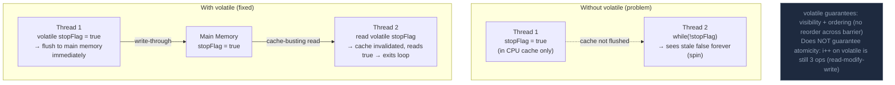

<code>volatile</code> đảm bảo visibility (ghi lập tức hiển thị với tất cả thread) và ngăn instruction reordering, nhưng KHÔNG đảm bảo atomicity cho thao tác compound.

## Điểm Chính

- Không có volatile: thread có thể đọc giá trị cũ từ CPU cache (L1/L2) thay vì main memory.
- Ghi <code>volatile</code>: flush ra main memory. Đọc <code>volatile</code>: đọc từ main memory.
- Thiết lập happens-before: ghi vào volatile field happens-before bất kỳ đọc nào tiếp theo của field đó.
- KHÔNG atomic cho compound op: <code>count++</code> là read-modify-write; volatile không làm nó an toàn — dùng <code>AtomicInteger</code>.
- Trường hợp dùng: status flag, stop signal, lazy initialization singleton (với DCL pattern).

## Ví Dụ Code

*volatile: visibility for flags + why count++ is broken + single-writer pattern*

```java
import java.util.concurrent.*;

// ---- volatile: visibility guarantee for single-writer, multi-reader ----

// Use case 1: status flag shared between control thread and worker threads
public class OrderBatchWorker implements Runnable {
    // volatile: writes flushed to main memory; reads bypass CPU cache
    private volatile boolean running  = true;
    private volatile boolean paused   = false;

    @Override
    public void run() {
        while (running) {        // running read fresh from main memory each iteration
            if (paused) {
                Thread.yield();  // give up CPU while paused
                continue;
            }
            processNextBatch();
        }
        System.out.println("Worker stopped cleanly");
    }

    // Control methods: called from a different thread (e.g., admin endpoint)
    public void stop()   { running = false; }  // volatile write: immediately visible to run()
    public void pause()  { paused  = true;  }
    public void resume() { paused  = false; }
}

// ---- volatile vs synchronized ----
// volatile: visibility only — NOT atomic for compound ops
// synchronized: visibility + atomicity + mutual exclusion

// ---- WRONG: volatile does NOT make i++ atomic ----
public class BadOrderCounter {
    private volatile int count = 0;

    public void increment() {
        count++;   // NOT atomic: 3 separate ops: read count → add 1 → write count
        // Two threads can read the same 'count', both increment, both write same value
        // Result: lost updates
    }
}

// ---- CORRECT for single-writer scenario: volatile is sufficient ----
// Only ONE thread writes; many threads read → volatile is enough
public class OrderStatusPublisher {
    private volatile OrderStatus currentStatus = OrderStatus.PENDING;

    // Only the order-processing thread calls this
    public void updateStatus(OrderStatus newStatus) {
        this.currentStatus = newStatus;         // single write — volatile ensures visibility
    }

    // Any thread can call this safely
    public OrderStatus getCurrentStatus() {
        return currentStatus;                   // always reads from main memory
    }
}

// ---- CORRECT for multiple writers: use AtomicInteger ----
import java.util.concurrent.atomic.*;
public class OrderCounter {
    private final AtomicInteger count = new AtomicInteger(0);
    public void increment() { count.incrementAndGet(); }  // CAS — truly atomic
    public int  getCount()  { return count.get(); }
}
```

## Ứng Dụng Thực Tế

Dùng <code>volatile</code> cho flag single-writer, multi-reader. Với counter có concurrent increment, dùng <code>AtomicLong</code>. Với thay đổi state phức tạp, dùng <code>synchronized</code> hoặc <code>ReentrantLock</code>.

## Câu Hỏi Phỏng Vấn

<details>
<summary><strong>volatile đảm bảo gì và KHÔNG đảm bảo gì?</strong></summary>

**A:** Đảm bảo: (1) **Visibility** — write từ thread này được visible ngay với tất cả thread khác (không cache stale trong CPU cache). (2) **Ordering** — không reorder instruction qua volatile read/write barrier. KHÔNG đảm bảo: **Atomicity** — `i++` trên volatile int vẫn là 3 operations (read → modify → write), không atomic. Dùng `AtomicInteger` cho compound operation. volatile đủ cho: flag boolean, published reference, singleton double-checked locking.

</details>

<details>
<summary><strong>volatile có phải alternative cho synchronized không?</strong></summary>

**A:** Không hoàn toàn. volatile và synchronized đều đảm bảo visibility. Nhưng synchronized còn đảm bảo atomicity (mutual exclusion) — chỉ một thread execute critical section tại một thời điểm. volatile chỉ phù hợp khi: (1) chỉ một thread write, nhiều thread read, (2) operation là atomic by nature (assignment của reference, long/double trên 64-bit JVM). Nếu cần compound operation (check-then-act, read-modify-write) → phải dùng synchronized hoặc Atomic class.

</details>

## Sơ Đồ volatile Keyword


